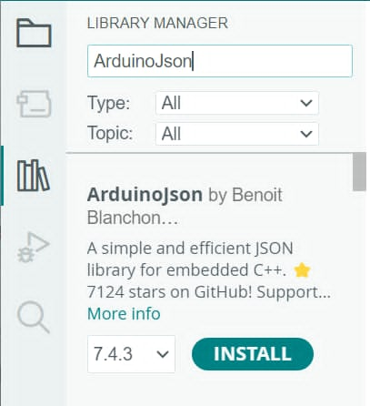
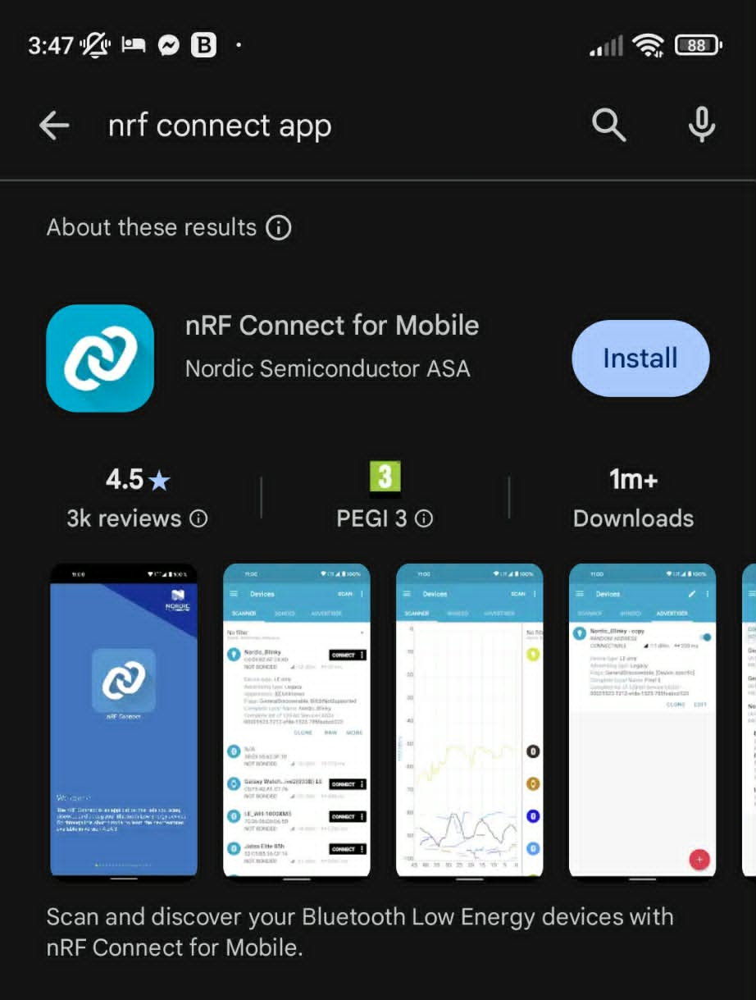
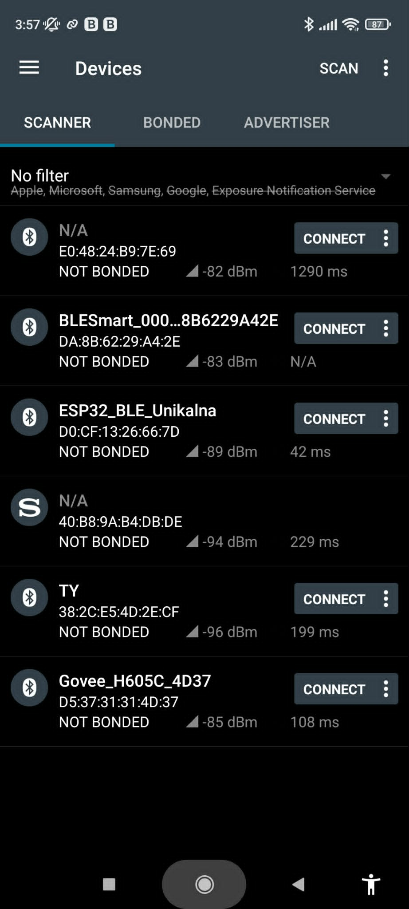
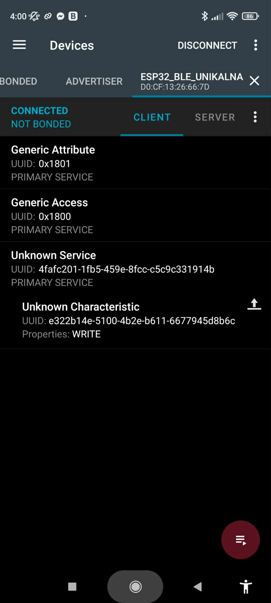
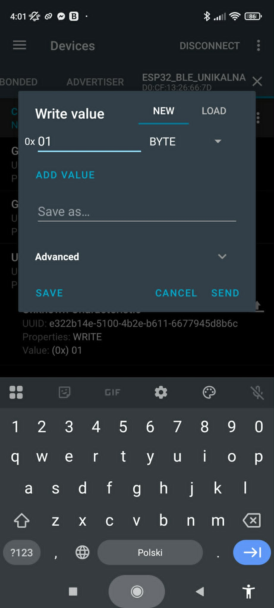
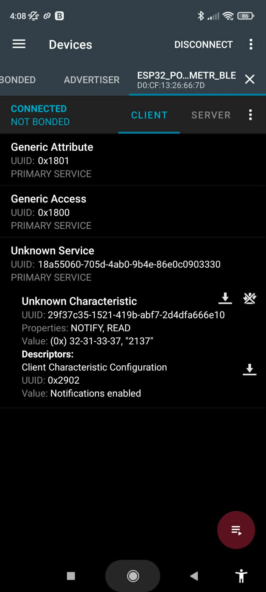

# Technologie Bezprzewodowe: <br> ESP-NOW, Wi-Fi oraz BLE
---
Niniejsza sekcja została przygotowana z myślą o osobach, które opanowały już podstawy programowania mikrokontrolerów i chcą poznać techniki komunikacji bezprzewodowej w systemach wbudowanych (*embedded systems*). 

Podczas realizacji poniższych modułów będziemy korzystać z naszej płytki edukacyjnej z układem **ESP32-C6**, który posiada bogate, wbudowane wsparcie dla standardów radiowych. Skupimy się na trzech technologiach: bezpośredniej komunikacji w protokole ESP-NOW, budowie interfejsów sieciowych i klientów REST API z użyciem Wi-Fi, oraz niskoenergetycznej komunikacji w standardzie Bluetooth Low Energy (BLE).

---

## MODUŁ 1: Komunikacja bezpośrednia ESP-NOW

### Ćwiczenie 1: Bezprzewodowa wymiana danych przez ESP-NOW
Gdy chcemy połączyć dwa mikrokontrolery bez użycia kabli (w przeciwieństwie do interfejsu UART z poprzednich zajęć) i bez pośrednictwa domowego routera Wi-Fi, z pomocą przychodzi autorski protokół firmy Espressif – **ESP-NOW**.

#### Czym jest ESP-NOW?
ESP-NOW to protokół komunikacji bezpośredniej (peer-to-peer), który pozwala na błyskawiczne i energooszczędne przesyłanie krótkich pakietów danych (do 250 bajtów) pomiędzy układami z rodziny ESP. Działa to w oparciu o unikalne fizyczne adresy kart sieciowych – **adresy MAC**. Nie wymaga to logowania do żadnej lokalnej sieci Wi-Fi, dzięki czemu opóźnienia są minimalne, a połączenie jest niezwykle stabilne i szybkie w zestawieniu.

> [!IMPORTANT] Klucz do komunikacji: Adres MAC
> Każdy układ ESP32 posiada wbudowany, unikalny adres MAC (składający się z 6 bajtów, np. `24:DC:C3:A1:B2:C0`). Aby Płytka A mogła wysłać wiadomość do Płytki B, musi znać jej adres MAC!

#### Krok 1: Jak odczytać adres MAC odbiornika?
Zanim przystąpisz do pisania głównego programu komunikacyjnego, musisz poznać adres MAC płytki, która będzie pełniła rolę Odbiornika. W tym celu wgraj na nią poniższy, krótki program pomocniczy:

```cpp
#include <WiFi.h>

void setup() {
  Serial.begin(115200);
  // Ustawienie modułu Wi-Fi w tryb stacji (STA)
  WiFi.mode(WIFI_STA);
  
  Serial.println("=== Informacje o urzadzeniu ===");
  Serial.print("Adres MAC tej plytki: ");
  Serial.println(WiFi.macAddress());
}

void loop() {
  // Pętla pozostaje pusta
}
```

{ .center }

> [!TIP] Zapisz adres MAC!
> Otwórz Monitor Szeregowy, skopiuj wyświetlony adres MAC i zapisz go sobie (np. w notatniku). Będzie on niezbędny do uzupełnienia kodu Nadajnika w kolejnym kroku.

---

#### Krok 2: Struktura danych (C-struct)
W protokole ESP-NOW najwygodniej przesyłać ustrukturyzowane pakiety danych zamiast pojedynczych, luźnych bajtów. Używamy do tego struktur (`struct`), które pozwalają spakować różne zmienne (np. liczby całkowite, zmiennoprzecinkowe lub tekst) w jedną spójną paczkę. 

Zdefiniujmy wspólną strukturę, którą umieścimy w kodzie zarówno Nadajnika, jak i Odbiornika:

```cpp
// Struktura przesyłanej wiadomości
typedef struct struct_message {
  char polecenie[10]; // Tekstowe polecenie, np. "MIGANIE"
  int wartosc;        // Dowolna wartość liczbowa
} struct_message;

// Tworzymy zmienną "dane" o typie naszej struktury
struct_message dane;
```

---

#### Krok 3: Kod Nadajnika (Płytka A)
Poniższy kod konfiguruje ESP-NOW, rejestruje odbiornik (tzw. *peer*) za pomocą jego adresu MAC i cyklicznie wysyła pakiet danych.

Uzupełnij w kodzie adres MAC Odbiornika, który odczytałeś w Kroku 1 (zastępując przykładowe wartości `0xFF` odpowiednimi bajtami w formacie szesnastkowym z przedrostkiem `0x`):

```cpp
#include <esp_now.h>
#include <WiFi.h>

// UZUPEŁNIJ: Wpisz tutaj odczytany adres MAC Odbiornika (Płytki B)
// Pamiętaj o przedrostku 0x przed każdą wartością, np. {0x24, 0xDC, 0xC3, 0xA1, 0xB2, 0xC0}
uint8_t adresOdbiornika[] = {0xFF, 0xFF, 0xFF, 0xFF, 0xFF, 0xFF};

typedef struct struct_message {
  char polecenie[10];
  int wartosc;
} struct_message;

struct_message wysylaneDane;

// Informacje o zarejestrowanym urządzeniu (peer)
esp_now_peer_info_t peerInfo;

// Funkcja wywoływana automatycznie po próbie wysłania wiadomości
void onDataSent(const uint8_t *mac_addr, esp_now_send_status_t status) {
  Serial.print("Status ostatniej transmisji: ");
  Serial.println(status == ESP_NOW_SEND_SUCCESS ? "Sukces (Dostarczono)" : "Blad dostarczenia");
}

void setup() {
  Serial.begin(115200);
  WiFi.mode(WIFI_STA);

  // Inicjalizacja protokołu ESP-NOW
  if (esp_now_init() != ESP_OK) {
    Serial.println("Blad inicjalizacji ESP-NOW");
    return;
  }

  // Rejestracja funkcji wywoływanej po wysłaniu pakietu
  esp_now_register_send_cb((esp_now_send_cb_t)onDataSent);

  // Konfiguracja i dodanie odbiornika (peera)
  memcpy(peerInfo.peer_addr, adresOdbiornika, 6);
  peerInfo.channel = 0;     // Domyślny kanał Wi-Fi
  peerInfo.encrypt = false; // Brak szyfrowania w celach edukacyjnych

  if (esp_now_add_peer(&peerInfo) != ESP_OK) {
    Serial.println("Nie udalo sie dodac odbiornika");
    return;
  }
}

void loop() {
  // Przygotowanie danych do wysłania
  strcpy(wysylaneDane.polecenie, "MIGANIE");
  wysylaneDane.wartosc = random(10, 100); // Losowa wartość dla demonstracji

  Serial.println("Wysylanie pakietu danych...");
  
  // Wysłanie pakietu przez ESP-NOW
  esp_err_t wynik = esp_now_send(adresOdbiornika, (uint8_t *) &wysylaneDane, sizeof(wysylaneDane));
  
  if (wynik == ESP_OK) {
    Serial.println("Wyslano polecenie do odbiornika!");
  } else {
    Serial.println("Blad podczas wysylania.");
  }

  delay(2000); // Wysyłaj pakiet co 2 sekundy
}
```

---

#### Krok 4: Kod Odbiornika (Płytka B)
Odbiornik stale nasłuchuje w tle nadchodzących pakietów. Gdy pojawi się nowa wiadomość, automatycznie wywoływana jest funkcja zwrotna (tzw. *callback*), która pozwala natychmiastowo przetworzyć odebrane dane.

```cpp
#include <esp_now.h>
#include <WiFi.h>

const int PIN_LED = 2; // Dioda D3 na naszej płytce

typedef struct struct_message {
  char polecenie[10];
  int wartosc;
} struct_message;

struct_message odebraneDane;

// Funkcja wywoływana automatycznie w momencie odebrania pakietu danych
void onDataRecv(const esp_now_recv_info_t *recv_info, const uint8_t *incomingData, int len) {
  // Kopiowanie surowych bajtów do naszej czytelnej struktury
  memcpy(&odebraneDane, incomingData, sizeof(odebraneDane));
  
  Serial.print("Odebrano pakiet od adresu MAC: ");
  for (int i = 0; i < 6; i++) {
    Serial.printf("%02X", recv_info->src_addr[i]);
    if (i < 5) Serial.print(":");
  }
  Serial.println();
  
  Serial.print("Rozmiar danych: ");
  Serial.print(len);
  Serial.println(" bajtow");
  
  Serial.print("Polecenie: ");
  Serial.println(odebraneDane.polecenie);
  Serial.print("Wartosc: ");
  Serial.println(odebraneDane.wartosc);
  Serial.println("-----------------------------");

  // Przykładowa reakcja na odebrane polecenie
  if (strcmp(odebraneDane.polecenie, "MIGANIE") == 0) {
    // Krótkie błyśnięcie diodą sygnalizujące odbiór danych
    digitalWrite(PIN_LED, HIGH);
    delay(50);
    digitalWrite(PIN_LED, LOW);
  }
}

void setup() {
  Serial.begin(115200);
  pinMode(PIN_LED, OUTPUT);
  digitalWrite(PIN_LED, LOW);
  
  // Ustawienie Wi-Fi w tryb stacji
  WiFi.mode(WIFI_STA);

  if (esp_now_init() != ESP_OK) {
    Serial.println("Blad inicjalizacji ESP-NOW");
    return;
  }
  
  // Rejestracja funkcji odbierającej dane
  esp_now_register_recv_cb((esp_now_recv_cb_t)onDataRecv);
  
  Serial.println("Odbiornik ESP-NOW gotowy i nasluchuje...");
}

void loop() {
  // Odbieranie pakietów realizowane jest w tle (asynchronicznie) przez funkcje onDataRecv.
  // Pętla loop() pozostaje całkowicie wolna do realizacji innych zadan!
}
```

> [!NOTE] Ważne dla układów ESP32-C6 (Core v3.x)
> Zwróć uwagę na nagłówek funkcji `onDataRecv`. W najnowszych wersjach biblioteki dla układów ESP32 opartych na rdzeniu Arduino w wersji 3.x (czyli m.in. dla ESP32-C6), pierwszym argumentem funkcji zwrotnej jest wskaźnik na strukturę `const esp_now_recv_info_t *recv_info`, z której w wygodny sposób odczytujemy pełne metadane o nadawcy.

---

#### Zadanie do samodzielnego wykonania (Bezprzewodowy kontroler ruchu):
Połącz wiedzę z poprzednich ćwiczeń i stwórz zaawansowany projekt zdalnego sterowania!

1. **Nadajnik:** Podłącz do Płytki A czujnik **MPU6050** (magistrala I2C). Zmodyfikuj przesyłaną strukturę tak, aby zawierała odczytane wartości kąta nachylenia (np. `float katX; float katY;`). W pętli `loop()` odczytuj bieżący kąt z czujnika i wysyłaj go bezprzewodowo przez ESP-NOW do Odbiornika dziesięć razy na sekundę (`delay(100)`).
2. **Odbiornik:** Płytka B odbiera paczkę z danymi o nachyleniu. Zaprogramuj ją tak, aby w zależności od przechyłu Płytki A (np. gdy `katX > 30.0` stopni) włączała odpowiednią diodę LED na płytce. W ten sposób uzyskasz w pełni bezprzewodowy, gestowy kontroler ruchu!

<details>
<summary>Wskazówka do modyfikacji struktury</summary>
Pamiętaj, że struktura w kodzie Nadajnika i Odbiornika musi być <b>dokładnie identyczna</b>. Zmień definicję na:
<pre><code>typedef struct struct_message {
  float katX;
  float katY;
} struct_message;
</code></pre>
</details>

---

## MODUŁ 2: Wi-Fi – Access Point, mDNS i Klient HTTP (REST API)

Mikrokontroler ESP32-C6 posiada wbudowany moduł sieci bezprzewodowej Wi-Fi. 

Układ może pracować w dwóch podstawowych trybach:

1. **Tryb Stacji (`WIFI_STA` - Station):** Mikrokontroler łączy się z zewnętrznym routerem (np. w Twoim domu) i staje się klientem w istniejącej sieci, uzyskując dostęp do Internetu.
2. **Tryb Punktu Dostępowego (`WIFI_AP` - Access Point):** Mikrokontroler sam staje się routerem i tworzy własną, nową sieć Wi-Fi, do której mogą podłączać się inne urządzenia (smartfony, laptopy).

Podczas pierwszej części zajęć wykorzystamy tryb **Access Point (`WIFI_AP`)**. Dzięki temu połączysz się z płytką bezpośrednio ze swojego telefonu, tworząc całkowicie niezależny system sterowania.

### Czym jest usługa DNS i protokół mDNS?
W standardowej komunikacji sieciowej urządzenia identyfikują się za pomocą liczbowych adresów IP (np. `192.168.4.1`). Z punktu widzenia człowieka zapamiętywanie ciągów liczb jest bardzo niewygodne. W Internecie problem ten rozwiązuje globalna usługa **DNS (Domain Name System)**, która działa jak potężna rozproszona książka telefoniczna – tłumaczy przyjazne nazwy domenowe (np. `google.com`) na odpowiadające im liczbowe adresy IP serwerów.

W małych, lokalnych sieciach Wi-Fi (gdzie nie ma centralnego serwera DNS) wykorzystuje się protokół **mDNS (Multicast DNS)**. Pozwala on urządzeniom w sieci lokalnej rozgłaszać swoją przyjazną nazwę hosta. Dzięki temu, zamiast wpisywać w przeglądarce surowy adres IP mikrokontrolera, możemy połączyć się z nim wpisując adres z końcówką `.local` (w naszym przypadku będzie to `http://esp32.local`).

### Serwowanie strony WWW z poziomu kodu C++
Aby wyświetlić interfejs graficzny w przeglądarce internetowej, mikrokontroler musi odesłać klientowi kod strony w języku HTML oraz style CSS. 

Kompletny kod strony zapiszemy bezpośrednio w pliku źródłowym w postaci stałego ciągu znaków. Służy do tego konstrukcja tzw. **surowego literału (Raw String Literal)** o składni `R"rawliteral(...)rawliteral"`, która pozwala wygodnie wklejać wielolinijkowy kod HTML zawierający cudzysłowy bez konieczności ich uciążliwego echowania.

### Ćwiczenie 2: Bezprzewodowy włącznik diody z obsługą mDNS
Stworzymy prosty serwer WWW z estetycznym interfejsem graficznym oraz aktywną usługą mDNS. Strona zawiera przyciski, po kliknięciu których przeglądarka wyśle do mikrokontrolera żądanie pod określony adres URL (np. `/on` lub `/off`), co spowoduje fizyczną zmianę stanu wyjścia GPIO.

#### Uzupełnij kod i wgraj na płytkę:
```cpp
#include <WiFi.h>
#include <WebServer.h>
#include <ESPmDNS.h> // Biblioteka niezbędna do obsługi przyjaznych nazw mDNS

const int PIN_LED = 2;

// Konfiguracja naszej sieci Wi-Fi
// WAŻNE: Zmień nazwę sieci na własną, unikalną (np. dodaj swoje imię lub numer stacji)!
// W przeciwnym razie sieci różnych uczestników w jednej sali będą się zakłócać.
const char* nazwaSieci = "ESP32_Siec_Unikalna";
const char* hasloSieci = "12345678"; // Hasło musi mieć minimum 8 znaków

// Tworzymy serwer nasłuchujący na porcie 80 (standardowy port HTTP)
WebServer server(80);

// Surowy literał zawierający pełny kod naszej strony HTML i CSS
const char STRONA_HTML[] PROGMEM = R"rawliteral(
<!DOCTYPE html>
<html lang="pl">
<head>
  <meta charset="UTF-8">
  <meta name="viewport" content="width=device-width, initial-scale=1.0">
  <title>Serwer ESP32</title>
  <style>
    body {
      background-color: #1e1e2f;
      color: #ffffff;
      font-family: sans-serif;
      text-align: center;
      padding-top: 50px;
    }
    .karta {
      background: #2a2a3d;
      margin: 0 auto;
      max-width: 350px;
      padding: 30px;
      border-radius: 16px;
      box-shadow: 0 8px 20px rgba(0,0,0,0.5);
    }
    button {
      background-color: #ff6b6b;
      color: white;
      border: none;
      padding: 15px 30px;
      font-size: 18px;
      border-radius: 8px;
      cursor: pointer;
      margin: 10px;
      width: 80%;
    }
    button:hover { background-color: #ff5252; }
    .btn-off { background-color: #4d4d63; }
    .btn-off:hover { background-color: #3b3b4f; }
  </style>
</head>
<body>
  <div class="karta">
    <h2>Sterowanie ESP32</h2>
    <p>Wybierz akcję poniżej:</p>
    <!-- Kliknięcie przekierowuje przeglądarkę na odpowiednią podstronę -->
    <button onclick="location.href='/on'">Włącz Diodę</button>
    <button class="btn-off" onclick="location.href='/off'">Wyłącz Diodę</button>
  </div>
</body>
</html>
)rawliteral";

void setup() {
  Serial.begin(115200);
  pinMode(PIN_LED, OUTPUT);
  digitalWrite(PIN_LED, LOW);

  // Uruchom sieć Wi-Fi w trybie Access Point (softAP)
  WiFi.softAP(nazwaSieci, hasloSieci);
  
  Serial.print("Sieć utworzona! Połącz się z Wi-Fi: ");
  Serial.println(nazwaSieci);
  Serial.print("Adres IP strony WWW: ");
  Serial.println(WiFi.softAPIP());

  // Uruchomienie usługi mDNS z nazwą hosta "esp32"
  if (MDNS.begin("esp32")) {
    Serial.println("Usługa mDNS aktywna! Strona dostępna pod adresem: http://esp32.local");
  }

  // --- Konfiguracja tras (routingów) serwera ---

  // 1. Wyświetlenie strony głównej po wejściu na czysty adres IP lub domenę .local
  server.on("/", []() {
    server.send(200, "text/html", STRONA_HTML);
  });

  // 2. Obsługa włączenia diody po wejściu na link /on
  server.on("/on", []() {
    digitalWrite(PIN_LED, HIGH);
    
    // Po wykonaniu akcji odsyłamy klienta z powrotem na stronę główną
    server.sendHeader("Location", "/");
    server.send(303); 
  });

  // 3. Obsługa wyłączenia diody po wejściu na link /off
  // UZUPEŁNIJ: Dopisz obsługę metody server.on dla ścieżki "/off", która gasi diodę
  server.on(
    
  );

  // Uruchomienie serwera HTTP
  server.begin();
}

void loop() {
  // Obsługa nadchodzących połączeń od przeglądarek
  server.handleClient();
}
```

> [!WARNING] mDNS i Android
> Usługa mDNS (adresy z końcówką `.local`) często nie działa w przeglądarkach na systemie **Android**. Jeśli adres `http://esp32.local` nie otwiera strony:
> - Spróbuj połączyć się z komputera – większość systemów desktopowych obsługuje mDNS bez problemu.
> - Na smartfonie połącz się wpisując bezpośredni adres IP mikrokontrolera (standardowo `http://192.168.4.1`), który wyświetli się w Monitorze Szeregowym po uruchomieniu serwera.

#### Zadanie do samodzielnego wykonania:
Zmodyfikuj kod strony HTML oraz logikę serwera w C++, aby dodać obsługę **drugiej diody** znajdującej się na płytce (GPIO3).

1. Dopisz w kodzie HTML kolejne dwa przyciski (np. *Włącz Diodę 2* i *Wyłącz Diodę 2*), kierujące na trasy `/on2` oraz `/off2`.
2. Zarejestruj w funkcji `setup()` odpowiednie procedury `server.on(...)` obsługujące te nowe ścieżki.

---

### Architektura REST API i praca w trybie Stacji (STA)
Do tej pory nasz mikrokontroler pełnił rolę Serwera, który czekał na żądania od przeglądarki. W świecie Internetu Rzeczy równie często zależy nam na odwrotnej sytuacji: mikrokontroler staje się **klientem**, który aktywnie łączy się z zewnętrznymi serwisami w Internecie, aby pobrać dane (np. aktualną prognozę pogody, dokładny czas z serwera NTP czy kursy walut) lub wysłać pomiary z czujników do chmury.

Wykorzystuje się do tego architekturę **REST API** oraz powszechny protokół HTTP. Dane w nowoczesnych serwisach najczęściej wymieniane są w lekkim, ustrukturyzowanym formacie **JSON** (*JavaScript Object Notation*) lub jako czysty tekst.

Aby mikrokontroler uzyskał dostęp do globalnej sieci Internet, musimy przełączyć go w tryb **Stacji (`WIFI_STA`)** i podać mu dane logowania do istniejącego routera z wyjściem na świat (np. przenośnego punktu dostępowego / hotspotu udostępnionego z Twojego smartfona).

### Ćwiczenie 3: Klient HTTP – Pobieranie i parsowanie danych z REST API
W tym ćwiczeniu połączymy się z ogólnodostępnym, darmowym API serwującym losowe ciekawostki w formacie JSON. Użyjemy wbudowanej biblioteki `HTTPClient` do pobrania danych, a następnie za pomocą biblioteki **ArduinoJson** sparsujemy odpowiedź, aby wyciągnąć z niej wyłącznie interesujący nas tekst.

#### Instalacja biblioteki ArduinoJson:
Zanim wgrasz kod, musisz zainstalować w środowisku narzędzie do obsługi formatu JSON.

1. W Arduino IDE wybierz: **Szkic -> Dołącz bibliotekę -> Zarządzaj bibliotekami...**
2. Wyszukaj: **ArduinoJson** (autor: Benoit Blanchon).
3. Kliknij **Zainstaluj**.

{ .center }

> [!IMPORTANT] Konfiguracja Hotspotu
> Przed wgraniem kodu włącz w swoim smartfonie funkcję **Przenośny punkt dostępowy (Hotspot Wi-Fi)**. Wpisz nazwę swojej udostępnionej sieci (SSID) oraz hasło w odpowiednich zmiennych w poniższym kodzie.

#### Kod do uzupełnienia i wgrania na płytkę:
```cpp
#include <WiFi.h>
#include <HTTPClient.h>
#include <ArduinoJson.h> // Biblioteka do parsowania formatu JSON

// UZUPEŁNIJ: Wpisz dane logowania do hotspotu w swoim telefonie
const char* ssid = "Nazwa_Twojego_Hotspotu";
const char* password = "Haslo_Do_Hotspotu";

// Adres publicznego API serwującego losowy fakt w formacie JSON
const char* urlAPI = "https://uselessfacts.jsph.pl/api/v2/facts/random";

void setup() {
  Serial.begin(115200);
  
  // Przełączenie w tryb stacji (klienta)
  WiFi.mode(WIFI_STA);
  WiFi.begin(ssid, password);
  
  Serial.print("Laczenie z siecia Wi-Fi");
  
  // Oczekiwanie na poprawne połączenie z routerem
  while (WiFi.status() != WL_CONNECTED) {
    delay(500);
    Serial.print(".");
  }
  
  Serial.println("\nPolaczono z Wi-Fi!");
  Serial.print("Przypisany adres IP: ");
  Serial.println(WiFi.localIP());
}

void loop() {
  // Sprawdzamy, czy połączenie z siecią jest nadal aktywne
  if (WiFi.status() == WL_CONNECTED) {
    HTTPClient http;
    
    Serial.println("\nWysylanie zapytania do REST API...");
    
    // Konfiguracja docelowego adresu URL
    http.begin(urlAPI);
    
    // Wykonanie zapytania metodą GET
    int kodOdpowiedzi = http.GET();
    
    // Kod 200 (HTTP_CODE_OK) oznacza standardowy sukces HTTP
    if (kodOdpowiedzi > 0) {
      Serial.print("Kod odpowiedzi HTTP: ");
      Serial.println(kodOdpowiedzi);
      
      if (kodOdpowiedzi == HTTP_CODE_OK) {
        // Pobranie pełnej treści odpowiedzi z serwera jako ciąg znaków (String)
        String odpowiedz = http.getString();
        Serial.println("Odebrano surowy JSON z serwera:");
        Serial.println(odpowiedz);

        // --- PARSOWANIE JSON ---
        // Tworzymy dokument JSON
        JsonDocument doc;
        
        // Deserializacja (parsowanie) odebranego tekstu
        DeserializationError error = deserializeJson(doc, odpowiedz);

        if (error) {
          Serial.print("Blad parsowania JSON: ");
          Serial.println(error.c_str());
        } else {
          // Wyciągamy interesujące nas pole "text" ze sparsowanego obiektu
          const char* trescFaktu = doc["text"];
          
          Serial.println("\n========================================");
          Serial.print("Wylosowany fakt: ");
          Serial.println(trescFaktu);
          Serial.println("========================================\n");
        }
      }
    } else {
      Serial.print("Blad zapytania HTTP: ");
      Serial.println(http.errorToString(kodOdpowiedzi).c_str());
    }
    
    // Zamknięcie połączenia i zwolnienie zasobów
    http.end();
  } else {
    Serial.println("Rozlaczono z siecia Wi-Fi!");
  }
  
  // Odczekaj 10 sekund przed kolejnym zapytaniem
  delay(10000);
}
```

#### Zadanie do samodzielnego wykonania:
Odwiedź repozytorium gromadzące darmowe, publiczne interfejsy z całego świata:  
🔗 **[Public APIs na GitHubie](https://github.com/public-apis/public-apis)**

Wybierz z listy dowolne, interesujące Cię API (najlepiej takie, które w kolumnie **Auth** nie wymaga autoryzacji – wartość `No`). 

1. Sprawdź w przeglądarce, jak wygląda zwracana przez to API struktura JSON.
2. Podmień w kodzie zmienną `urlAPI` na adres wybranego serwisu.
3. Zmodyfikuj sekcję parsowania `doc[...]` tak, aby program poprawnie wyciągał i wyświetlał interesujące pola z Twojego wybranego API.

---

## MODUŁ 3: Bluetooth Low Energy (BLE) – Podstawy protokołu

W świecie nowoczesnego Internetu Rzeczy (IoT) **klasyczny Bluetooth (Bluetooth Classic)** powoli odchodzi do lamusa. Ze względu na konieczność ciągłego podtrzymywania prądożernego połączenia, standard ten ustąpił miejsca technologii **Bluetooth Low Energy (BLE)**.

Protokół BLE został zoptymalizowany pod kątem minimalnego zużycia energii. Urządzenia przesyłają krótkie pakiety danych i natychmiast wracają do trybu uśpienia, co pozwala na wieloletnią pracę na małych bateriach.

### Struktura profilu GATT
Komunikacja w standardzie BLE opiera się na architekturze **GATT** (*Generic Attribute Profile*). W tym modelu nasza płytka pełni rolę **Serwera**, a łączący się z nią smartfon to **Klient**.

Struktura serwera wygląda następująco:

1. **Usługa (Service):** Główny kontener grupujący powiązane funkcjonalności w postaci charakterystyk.
2. **Charakterystyka (Characteristic):** Konkretny punkt wymiany danych wewnątrz usługi. Każda charakterystyka definiuje **właściwości**, określające dozwolone operacje:
   * **Read:** Zezwala klientowi na odczytanie wartości.
   * **Write:** Zezwala klientowi na przesłanie nowej wartości do serwera.
   * **Notify:** Serwer samoczynnie wysyła nową wartość do klienta w momencie jej zmiany.
3. **UUID (Universally Unique Identifier):** Unikalny identyfikator liczbowy przypisany do każdej usługi i charakterystyki, pozwalający jednoznacznie zidentyfikować jej przeznaczenie.

### Ćwiczenie 4: Odbieranie komend ze smartfona przez BLE
Skonfigurujemy ESP32-C6 jako serwer BLE udostępniający jedną usługę z charakterystyką zapisu (Write). Klientem będzie uniwersalna aplikacja narzędziowa **nRF Connect for Mobile** (dostępna bezpłatnie na systemy Android oraz iOS), z poziomu której prześlemy liczbowe komendy sterujące diodą.

{ width="250px" .center }

#### Kod do uzupełnienia i wgrania na płytkę:
```cpp
#include <BLEDevice.h>
#include <BLEServer.h>
#include <BLEUtils.h>

const int PIN_LED = 2;

// Definiujemy unikalne identyfikatory UUID dla naszej usługi i charakterystyki.
// Wskazówka: Aby uniknąć potencjalnych konfliktów w laboratorium, warto zmodyfikować 
// kilka znaków w poniższych identyfikatorach na własne.
#define SERVICE_UUID        "4fafc201-1fb5-459e-8fcc-c5c9c331914b"
#define CHARACTERISTIC_UUID "e322b14e-5100-4b2e-b611-6677945d8b6c"

// Klasa nasłuchująca zdarzeń zapisu z telefonu do charakterystyki
class ObslugaZapisu: public BLECharacteristicCallbacks {
    void onWrite(BLECharacteristic *pCharacteristic) {
      // Pobranie wartości przesłanej przez klienta
      String wartosc = pCharacteristic->getValue();

      if (wartosc.length() > 0) {
        Serial.print("Odebrano dane BLE (HEX): ");
        for (int i = 0; i < wartosc.length(); i++) {
          Serial.printf("%02X ", (uint8_t)wartosc[i]);
        }
        Serial.println();

        // Sprawdź, czy pierwszy odebrany bajt (wartosc[0]) to 1
        // Jeśli tak, włącz diodę. Jeśli to 0, wyłącz diodę.
        if (wartosc[0] == 1) {
          digitalWrite(PIN_LED, HIGH);
        } else if (wartosc[0] == 0) {
          digitalWrite(PIN_LED, LOW);
        }
      }
    }
};

void setup() {
  Serial.begin(115200);
  pinMode(PIN_LED, OUTPUT);

  // Inicjalizacja urządzenia BLE o widocznej nazwie.
  // WAŻNE: Zmień nazwę urządzenia, aby odróżnić swoją płytkę od płytek innych osób w sali!
  BLEDevice::init("ESP32_BLE_Unikalna");

  // Tworzenie serwera BLE
  BLEServer *pServer = BLEDevice::createServer();

  // Tworzenie usługi w serwerze za pomocą zdefiniowanego makra SERVICE_UUID
  BLEService *pService = pServer->createService(SERVICE_UUID);

  // Tworzenie charakterystyki z właściwością WRITE (Zapis).
  // Właściwość PROPERTY_WRITE nadaje uprawnienia pozwalające zewnętrznemu klientowi (aplikacji)
  // na aktywne przesyłanie i zapisywanie nowych komend do tej charakterystyki.
  BLECharacteristic *pCharacteristic = pService->createCharacteristic(
                                         CHARACTERISTIC_UUID,
                                         BLECharacteristic::PROPERTY_WRITE
                                       );

  // Przypisanie naszej klasy obsługującej zdarzenie zapisu
  pCharacteristic->setCallbacks(new ObslugaZapisu());

  // Uruchomienie usługi
  pService->start();

  // Konfiguracja i uruchomienie rozgłaszania (Advertising), aby płytka była widoczna
  BLEAdvertising *pAdvertising = BLEDevice::getAdvertising();
  pAdvertising->addServiceUUID(SERVICE_UUID);
  BLEDevice::startAdvertising();

  Serial.println("Serwer BLE gotowy! Otwórz aplikację nRF Connect.");
}

void loop() {
  // Komunikacja BLE realizowana jest asynchronicznie w tle
  delay(2000);
}
```

#### Instrukcja testowania:
1. Uruchom aplikację **nRF Connect for Mobile** na swoim smartfonie.
2. Wyszukaj urządzenie po nazwie i kliknij **CONNECT**.

{ width="250px" .center }

3. Rozwiń listę przy usłudze o identyfikatorze `4fafc201-...`.

{ width="250px" .center }

4. Przy widocznej charakterystyce kliknij ikonę **strzałki w górę** (Write).
5. Wybierz typ danych **BYTE** lub **UINT8**, wpisz wartość **`01`** i wyślij. Dioda natychmiast się włączy! Przesłanie wartości **`00`** wyłączy ją.

{ width="250px" .center }

> [!TIP] Filtrowanie urządzeń
> W górnej części aplikacji nRF Connect for Mobile znajduje się pasek wyszukiwania (Search). Możesz wpisać w nim **nazwę** rozgłaszanej płytki (np. "ESP32_BLE_Unikalna") lub jej adres **MAC**, aby odfiltrować listę i wyświetlić wyłącznie swoje urządzenie spośród wszystkich dostępnych w sali.

#### Zadanie do samodzielnego wykonania:
Zmień obsługę logiki w metodzie `onWrite`, aby płytka reagowała na inne, wybrane przez Ciebie wartości liczbowe (np. przesłanie bajtu `0x02` włącza drugą diodę podłączoną do GPIO3, a `0x03` gasi obie).

---

### Wysłanie danych w czasie rzeczywistym – Powiadomienia (Notify)
W poprzednim ćwiczeniu to aplikacja na smartfonie aktywnie przesyłała polecenia do mikrokontrolera (zapis). W systemach IoT opartych na pomiarach zależy nam na sytuacji odwrotnej: mikrokontroler samoczynnie informuje smartfon o nowym odczycie natychmiast po jego wykonaniu, bez konieczności ciągłego, ręcznego odpytywania (Read) ze strony użytkownika.

Służy do tego właściwość **Notify (Powiadomienia)**. Aby jednak klient (smartfon) mógł odbierać powiadomienia, musi najpierw wyrazić na to zgodę (tzw. subskrypcja). Technicznie realizowane jest to poprzez wpisanie odpowiedniej flagi do specjalnego rejestru konfiguracyjnego charakterystyki, nazywanego **Deskryptorem CCCD** (*Client Characteristic Configuration Descriptor*) o ustandaryzowanym identyfikatorze UUID **`0x2902`**.

W bibliotece BLE dla środowiska Arduino służy do tego dedykowana klasa `BLE2902`.

### Ćwiczenie 5: Przesyłanie odczytu z potencjometru do smartfona (Notify)
Skonfigurujemy mikrokontroler tak, aby odczytywał napięcie z potencjometru (GPIO4) i cyklicznie przesyłał zaktualizowany wynik do podłączonego smartfona w formie bezprzewodowego powiadomienia BLE.

> [!IMPORTANT] Pamiętaj o unikalnych UUID
> Aby nowa usługa nie weszła w konflikt z pamięcią podręczną (cache) aplikacji nRF Connect z poprzedniego ćwiczeniem, w poniższym kodzie zdefiniowaliśmy zupełnie nowe, odrębne identyfikatory UUID dla usługi i charakterystyki.

#### Uzupełnij kod i wgraj na płytkę:
```cpp
#include <BLEDevice.h>
#include <BLEServer.h>
#include <BLEUtils.h>
#include <BLE2902.h> // Biblioteka niezbędna do obsługi deskryptora powiadomień

const int PIN_POTENCJOMETR = 4;

// Nowe, unikalne identyfikatory dla usługi Notify
#define SERVICE_UUID_NOTIFY        "18a55060-705d-4ab0-9b4e-86e0c0903330"
#define CHARACTERISTIC_UUID_NOTIFY "29f37c35-1521-419b-abf7-2d4dfa666e10"

BLEServer* pServer = NULL;
BLECharacteristic* pCharacteristicNotify = NULL;
bool urzadzeniePolaczone = false;

// Klasa śledząca stan połączenia (czy klient podłączył się lub rozłączył)
class ObslugaSerwera: public BLEServerCallbacks {
    void onConnect(BLEServer* pServer) {
      urzadzeniePolaczone = true;
      Serial.println("Smartfon polaczony z serwerem BLE!");
    };

    void onDisconnect(BLEServer* pServer) {
      urzadzeniePolaczone = false;
      Serial.println("Smartfon rozlaczony. Automatyczne wznowienie rozglaszania...");
      // Wznowienie widoczności płytki po rozłączeniu klienta
      BLEDevice::startAdvertising();
    }
};

void setup() {
  Serial.begin(115200);

  // Inicjalizacja BLE z unikalną nazwą
  BLEDevice::init("ESP32_Potencjometr_BLE");

  // Tworzenie serwera i przypisanie obsługi zdarzeń połączenia
  pServer = BLEDevice::createServer();
  pServer->setCallbacks(new ObslugaSerwera());

  // Tworzenie usługi Notify
  BLEService *pService = pServer->createService(SERVICE_UUID_NOTIFY);

  // Tworzenie charakterystyki z właściwościami READ oraz NOTIFY
  pCharacteristicNotify = pService->createCharacteristic(
                            CHARACTERISTIC_UUID_NOTIFY,
                            BLECharacteristic::PROPERTY_READ   |
                            BLECharacteristic::PROPERTY_NOTIFY
                          );

  // Dodanie deskryptora CCCD (BLE2902) do charakterystyki, 
  // co pozwala smartfonowi włączyć subskrypcję powiadomień
  pCharacteristicNotify->addDescriptor(new BLE2902());

  // Uruchomienie usługi i aktywacja rozgłaszania
  pService->start();
  
  BLEAdvertising *pAdvertising = BLEDevice::getAdvertising();
  pAdvertising->addServiceUUID(SERVICE_UUID_NOTIFY);
  BLEDevice::startAdvertising();

  Serial.println("Serwer BLE Notify gotowy! Otworz aplikacje nRF Connect.");
}

void loop() {
  // Jeśli smartfon jest połączony, przesyłaj mu na bieżąco odczyty z potencjometru
  if (urzadzeniePolaczone) {
    int odczytADC = analogRead(PIN_POTENCJOMETR);

    // Konwersja liczby całkowitej na ciąg znaków (String)
    String wartoscTekstowa = String(odczytADC);

    // Aktualizacja wartości wewnątrz charakterystyce
    pCharacteristicNotify->setValue(wartoscTekstowa.c_str());

    // Natychmiastowe przesłanie zaktualizowanej wartości powiadomieniem do smartfona
    pCharacteristicNotify->notify();
    
    Serial.print("Wyslano powiadomienie BLE: ");
    Serial.println(wartoscTekstowa);
  }

  // Odczekaj pół sekundy przed kolejnym pomiarem
  delay(500);
}
```

#### Instrukcja testowania:
1. Połącz się z urządzeniem w aplikacji **nRF Connect**.
2. Odszukaj charakterystykę o identyfikatorze `29f37c35-...`.
3. Zauważysz przy niej ikonę **wielokrotnych strzałek w dół** (Notify). Kliknij ją, aby włączyć subskrypcję powiadomień (ikona zmieni kolor lub zniknie jej przekreślenie).

{ width="250px" .center }

4. Zaczynaj powoli kręcić potencjometrem na płytce. Na ekranie smartfona w czasie rzeczywistym będą pojawiać się odczytywane wartości napięcia bez konieczności klikania przycisku odświeżania!

#### Zadanie do samodzielnego wykonania:
Ciąłe wysyłanie pakietów radiowych co 500 ms, nawet gdy potencjometr leży całkowicie nieruchomo, niepotrzebnie zużywa energię baterii telefonu i mikrokontrolera. 

Zmodyfikuj kod w pętli `loop()` dodając statyczną lub globalną zmienną pomocniczą `ostatniOdczyt`. Zaprogramuj logikę tak, aby mikrokontroler wywoływał powiadomienie `notify()` **wyłącznie w sytuacji**, gdy aktualny odczyt z potencjometru różni się od poprzedniego pomiaru o co najmniej 50 jednostek.

---

> [!NOTE] Dla ciekawskich
> **Standaryzacja usług i identyfikatory Assigned Numbers**
> W naszym kodzie użyliśmy długich, 128-bitowych identyfikatorów UUID wygenerowanych losowo. Warto wiedzieć, że organizacja certyfikująca *Bluetooth SIG* posiada ścisłą listę ustandaryzowanych, krótkich (16-bitowych) identyfikatorów dla powszechnych typów usług i charakterystyk (np. oficjalny profil *Heart Rate Service* ma zawsze identyfikator `0x180D`, a poziom baterii to `0x180F`) oraz oficjalne kody identyfikujące poszczególnych producentów sprzętu.
> 
> Dzięki temu Twój smartfon automatycznie wie, jaki jest poziom naładowania baterii w podłączonych słuchawkach bezprzewodowych – ponieważ format i identyfikator tej informacji są globalnie ustandaryzowane.
> 
> Pełny wykaz tych zdefiniowanych wartości można znaleźć w oficjalnej dokumentacji standardu:  
> 🔗 **[Oficjalny spis Assigned Numbers w BLE (PDF)](https://www.bluetooth.com/wp-content/uploads/Files/Specification/HTML/Assigned_Numbers/out/en/Assigned_Numbers.pdf)**
>
> **Kurs Nordic Semiconductor**  
> Jeśli chcesz dogłębnie zgłębić architekturę i zaawansowane mechanizmy protokołu BLE, to polecamy ukończenie darmowego kursu od wiodącego producenta układów radiowych:  
> 👉 **[Nordic Semiconductor Academy – Bluetooth Low Energy Fundamentals](https://academy.nordicsemi.com/courses/bluetooth-low-energy-fundamentals/)**  
> *Uwaga: Kurs ten jest prowadzony w oparciu o zaawansowany system operacyjny **Zephyr OS** (w ramach nRF Connect SDK), stanowiący potężną, przemysłową alternatywę dla środowiska Arduino.*
