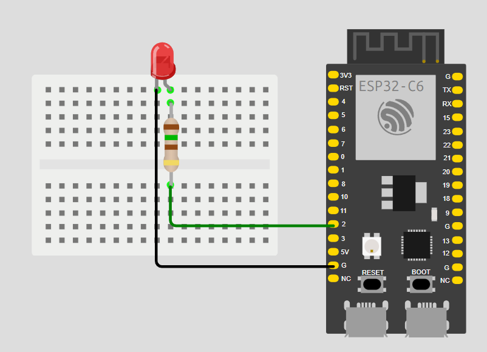
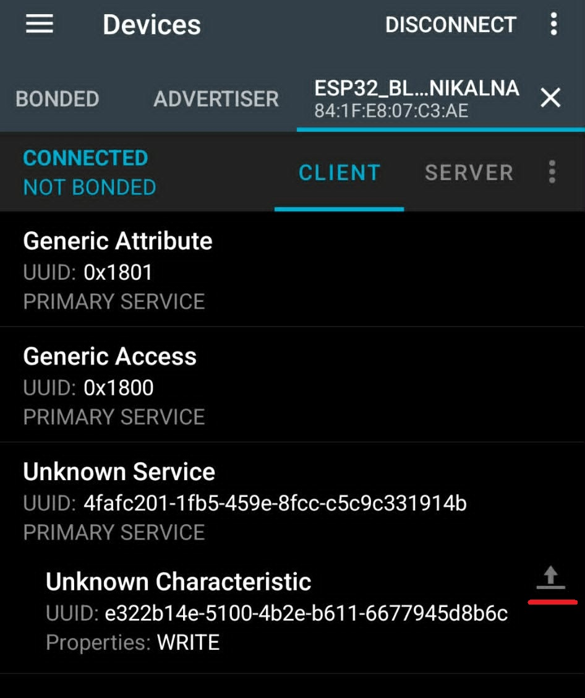
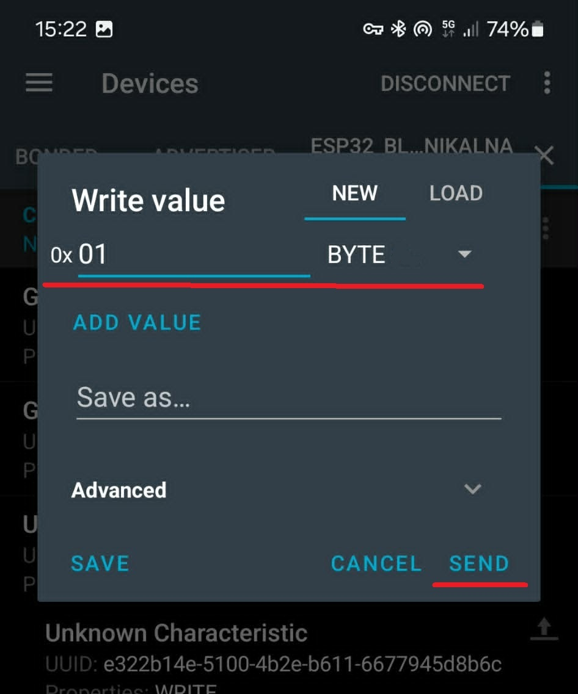
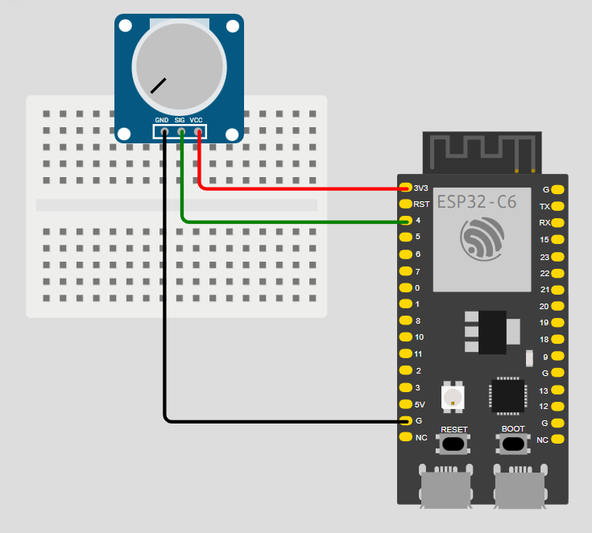
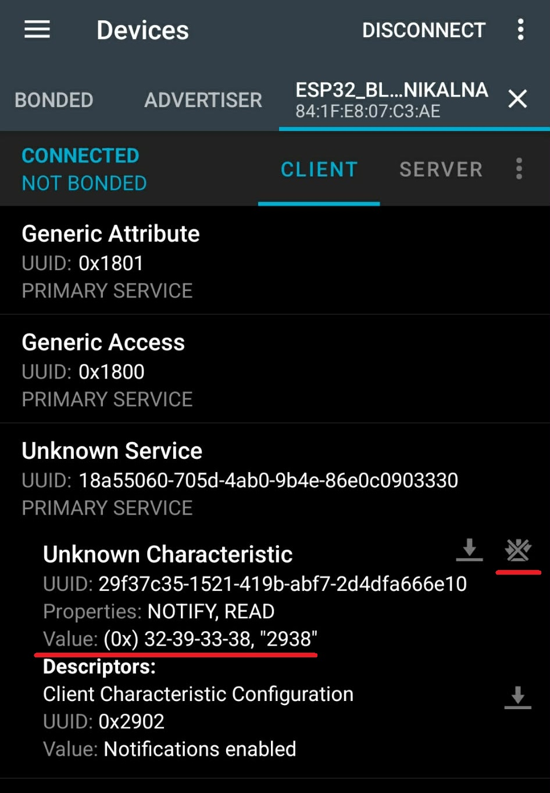
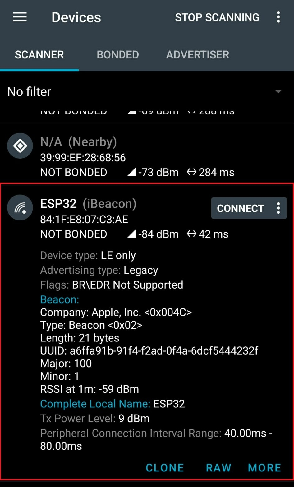

# Bluetooth Low Energy (BLE)

Bluetooth Low Energy (BLE) został zaprojektowany z myślą o minimalnym zużyciu energii. W przeciwieństwie do klasycznego Bluetooth, BLE przesyła dane w krótkich, rzadkich pakietach, co pozwala urządzeniom IoT pracować na baterii guzikowej przez wiele miesięcy lub lat.

---

## 🏛️ Stos protokołów BLE

Architektura BLE dzieli się na trzy główne poziomy (warstwy), z których każdy pełni określoną rolę w komunikacji:

- **Controller (Kontroler):** Warstwa sprzętowa i niskopoziomowa, realizowana zazwyczaj bezpośrednio przez układ radiowy:
  - **PHY (Warstwa fizyczna):** Odpowiada za nadawanie fal radiowych GFKS w paśmie 2.4 GHz podzielonym na 40 kanałów.
  - **LL (Link Layer - Warstwa łącza):** Zarządza stanami radiowymi urządzenia (rozgłaszanie - *advertising*, skanowanie, inicjowanie i utrzymywanie połączenia) oraz określa role urządzeń (*Central / Peripheral*).
- **Host:** Warstwa logiczna pośrednicząca między sprzętem a aplikacją:
  - **L2CAP:** Odpowiada za multipleksację danych i ich podział na pakiety o odpowiednim rozmiarze (MTU).
  - **GAP (Generic Access Profile):** Definiuje widoczność urządzenia w eterze, zarządza procesem parowania i określa rolę urządzenia przed nawiązaniem połączenia.
  - **ATT (Attribute Protocol):** Protokół wymiany prostych atrybutów danych. Przypisuje każdemu punktowi danych unikalny uchwyt (Handle) oraz identyfikator UUID.
  - **GATT (Generic Attribute Profile):** Narzuca hierarchiczną strukturę danych na warstwę ATT, umożliwiając organizowanie danych w Usługi i Charakterystyki.
  - **SMP (Security Manager Protocol):** Odpowiada za bezpieczeństwo, generowanie kluczy szyfrujących oraz autoryzację.
- **Application (Aplikacja):** Kod użytkownika w środowisku Arduino, który definiuje logiczne zachowanie urządzenia, reaguje na połączenia, aktualizuje dane w charakterystykach i reaguje na zapisy ze strony klienta.

---

## 📡 Kanały radiowe w BLE i unikanie zakłóceń

Bluetooth Low Energy, tak samo jak klasyczny Bluetooth, Wi-Fi oraz ESP-NOW, operuje w paśmie częstotliwości **2.4 GHz** (dokładnie od 2402 MHz do 2480 MHz). Aby zminimalizować interferencje z innymi sieciami oraz umożliwić jednoczesne działanie setek urządzeń w bliskim sąsiedztwie, pasmo to zostało podzielone na **40 kanałów fizycznych** o szerokości 2 MHz każdy:

- **Kanały rozgłoszeniowe (Advertising Channels):** Są to dokładnie trzy kanały: **37** (2402 MHz), **38** (2426 MHz) oraz **39** (2480 MHz). Zostały one celowo ulokowane w takich miejscach pasma, aby znajdowały się w przerwach pomiędzy trzema najpopularniejszymi, nienakładającymi się kanałami sieci Wi-Fi (kanały 1, 6 i 11). Kanały reklamowe służą do rozgłaszania sygnałów beacona, wyszukiwania urządzeń w eterze oraz inicjowania połączeń.
- **Kanały danych (Data Channels):** Pozostałe **37 kanałów** (od 0 do 36) służy wyłącznie do przesyłania informacji po nawiązaniu dwukierunkowego, stabilnego połączenia.

### 🔄 Skakanie po częstotliwościach (Adaptive Frequency Hopping)

Podczas trwania połączenia (np. kiedy wysyłasz odczyty z sensora do smartfona), urządzenia nie nadają cały czas na jednej częstotliwości. Zamiast tego stosują technikę **skakania po częstotliwościach** (Frequency Hopping):

1. Urządzenia wspólnie zmieniają kanał danych według z góry ustalonego algorytmu, nawet kilkaset razy w ciągu jednej sekundy.
2. Jeśli na wybranym kanale występują silne zakłócenia (np. z powodu pobliskiego routera Wi-Fi intensywnie przesyłającego pakiety), kontroler BLE automatycznie oznacza ten kanał jako uszkodzony i omija go w kolejnych cyklach skoków (**Adaptive Frequency Hopping - AFH**).
3. Dzięki temu transmisja BLE jest niezwykle odporna na zakłócenia, nawet w bardzo zaszumionych środowiskach (takich jak targi technologiczne czy biura).

---

## 📊 Hierarchia danych GATT

Profil GATT organizuje dane w hierarchiczną strukturę, która ułatwia ich odczyt i interpretację przez urządzenia klienckie (np. smartfon):

- **Profil (Profile):** Zbiór usług definiujący całe przeznaczenie urządzenia (np. Profil Pulsometru).
- **Usługa (Service):** Logiczna grupa powiązanych danych (np. Usługa pomiaru tętna). Każda usługa posiada swój unikalny, 128-bitowy lub 16-bitowy identyfikator **UUID**.
- **Charakterystyka (Characteristic):** Konkretna wartość (np. aktualna wartość pulsu w uderzeniach na minutę). Charakterystyka zawiera:
  - **Value (Wartość):** Same dane (np. tablica bajtów).
  - **Properties (Właściwości):** Uprawnienia dostępu, takie jak *Read* (odczyt), *Write* (zapis), *Notify* (asynchroniczne powiadomienie bez potwierdzenia) lub *Indicate* (potwierdzane powiadomienie).
- **Deskryptor (Descriptor):** Opcjonalne dodatkowe informacje opisujące charakterystykę (np. jednostka miary). Kluczowym deskryptorem jest **CCCD** (*Client Characteristic Configuration Descriptor*), który w kodzie Arduino jest reprezentowany przez klasę `BLE2902`. Pozwala on smartfonowi na włączenie lub wyłączenie subskrypcji powiadomień *Notify*.

---

## 🎯 Ćwiczenie 1: Sterowanie LED ze smartfona (BLE Write)

W tym ćwiczeniu smartfon (klient) będzie wysyłał komendy sterujące do naszej płytki (serwer). Zaimportujemy klasę callbacku obsługi zapisu, która będzie odbierać pakiety danych i reagować na nie w czasie rzeczywistym.

### Przykładowe połączenia:

{: .center}

### Kod:

```cpp
#include <BLEDevice.h>
#include <BLEServer.h>
#include <BLEUtils.h>

const int PIN_LED = 2;

// ZMIEŃ kilka znaków UUID aby uniknąć konfliktów w sali
#define SERVICE_UUID        "4fafc201-1fb5-459e-8fcc-c5c9c331914b"
#define CHARACTERISTIC_UUID "e322b14e-5100-4b2e-b611-6677945d8b6c"

class ObslugaZapisu : public BLECharacteristicCallbacks {
  void onWrite(BLECharacteristic *pChar) {
    String wartosc = pChar->getValue();
    if (wartosc.length() > 0) {
      Serial.printf("Odebrano BLE (HEX): %02X\n", (uint8_t)wartosc[0]);
      // Bajt 0x01 → włącz, 0x00 → wyłącz
      if (wartosc[0] == 1)      digitalWrite(PIN_LED, HIGH);
      else if (wartosc[0] == 0) digitalWrite(PIN_LED, LOW);
    }
  }
};

void setup() {
  Serial.begin(115200);
  pinMode(PIN_LED, OUTPUT);

  // ZMIEŃ nazwę aby odróżnić swoją płytkę od innych w sali!
  BLEDevice::init("ESP32_BLE_Unikalna");

  BLEServer  *pServer  = BLEDevice::createServer();
  BLEService *pService = pServer->createService(SERVICE_UUID);

  BLECharacteristic *pChar = pService->createCharacteristic(
    CHARACTERISTIC_UUID,
    BLECharacteristic::PROPERTY_WRITE
  );
  pChar->setCallbacks(new ObslugaZapisu());

  pService->start();
  BLEDevice::getAdvertising()->addServiceUUID(SERVICE_UUID);
  BLEDevice::startAdvertising();

  Serial.println("Serwer BLE gotowy! Otwórz nRF Connect.");
}

void loop() {
  delay(2000);
}
```

### Jak testować?

1. Otwórz **nRF Connect** → Scan → znajdź `ESP32_BLE_Unikalna` → **CONNECT**
2. Rozwiń usługę `4fafc201-...`
3. Przy charakterystyce kliknij ikonę **strzałki w górę** (Write)
{: .center width="250" }
4. Typ: **BYTE**, wartość `01` → dioda się zapala; `00` → gaśnie
{: .center width="250" }

> [!TIP] Filtrowanie urządzeń
> W polu Search wpisz nazwę swojej płytki (`ESP32_BLE_Unikalna`) aby odfiltrować listę spośród wszystkich urządzeń BLE w okolicy.

## 🛠️ Zadanie: Rozbudowa komend sterujących

Zmień logikę wewnątrz metody `onWrite` tak, aby odebranie bajtu o wartości `0x02` włączało drugą diodę LED (podłączoną do `GPIO3`), natomiast odebranie wartości `0x03` powodowało zgaszenie obu diod jednocześnie.

<details>
<summary>Pokaż rozwiązanie</summary>

```cpp
#include <BLEDevice.h>
#include <BLEServer.h>
#include <BLEUtils.h>

const int PIN_LED1 = 2;
const int PIN_LED2 = 3;

#define SERVICE_UUID        "4fafc201-1fb5-459e-8fcc-c5c9c331914b"
#define CHARACTERISTIC_UUID "e322b14e-5100-4b2e-b611-6677945d8b6c"

class ObslugaZapisu : public BLECharacteristicCallbacks {
  void onWrite(BLECharacteristic *pChar) {
    String wartosc = pChar->getValue();
    if (wartosc.length() > 0) {
      uint8_t komenda = (uint8_t)wartosc[0];
      Serial.printf("Odebrano BLE: 0x%02X\n", komenda);
      
      if (komenda == 0x01) {
        digitalWrite(PIN_LED1, HIGH);
      } else if (komenda == 0x00) {
        digitalWrite(PIN_LED1, LOW);
      } else if (komenda == 0x02) {
        digitalWrite(PIN_LED2, HIGH);
      } else if (komenda == 0x03) {
        digitalWrite(PIN_LED1, LOW);
        digitalWrite(PIN_LED2, LOW);
      }
    }
  }
};

void setup() {
  Serial.begin(115200);
  pinMode(PIN_LED1, OUTPUT);
  pinMode(PIN_LED2, OUTPUT);

  BLEDevice::init("ESP32_BLE_Sterowanie");
  BLEServer  *pServer  = BLEDevice::createServer();
  BLEService *pService = pServer->createService(SERVICE_UUID);

  BLECharacteristic *pChar = pService->createCharacteristic(
    CHARACTERISTIC_UUID,
    BLECharacteristic::PROPERTY_WRITE
  );
  pChar->setCallbacks(new ObslugaZapisu());

  pService->start();
  BLEDevice::getAdvertising()->addServiceUUID(SERVICE_UUID);
  BLEDevice::startAdvertising();

  Serial.println("Serwer BLE gotowy!");
}

void loop() {
  delay(2000);
}
```
</details>

---

## 🎯 Ćwiczenie 2: Przesyłanie danych do smartfona (BLE Notify)

W poprzednim ćwiczeniu smartfon wysyłał komendy do płytki. Teraz odwrócimy kierunek: płytka **samoczynnie** informuje smartfon o nowych pomiarach.

Właściwość **Notify** wymaga od klienta subskrypcji – technicznie realizowanej przez deskryptor **CCCD (BLE2902)**.

### Przykładowe połączenia:

{: .center}

### Kod:

```cpp
#include <BLEDevice.h>
#include <BLEServer.h>
#include <BLEUtils.h>
#include <BLE2902.h>  // Deskryptor dla Notify

const int PIN_POT = 4;

#define SERVICE_UUID_N        "18a55060-705d-4ab0-9b4e-86e0c0903330"
#define CHARACTERISTIC_UUID_N "29f37c35-1521-419b-abf7-2d4dfa666e10"

BLEServer*         pServer  = NULL;
BLECharacteristic* pCharN   = NULL;
bool urzadzeniePolaczone     = false;

class ObslugaSerwera : public BLEServerCallbacks {
  void onConnect(BLEServer* s)    { urzadzeniePolaczone = true;  Serial.println("Smartfon połączony!"); }
  void onDisconnect(BLEServer* s) { urzadzeniePolaczone = false; BLEDevice::startAdvertising(); Serial.println("Rozłączono – wznawiam rozgłaszanie..."); }
};

void setup() {
  Serial.begin(115200);

  BLEDevice::init("ESP32_Potencjometr_BLE");
  pServer = BLEDevice::createServer();
  pServer->setCallbacks(new ObslugaSerwera());

  BLEService *pService = pServer->createService(SERVICE_UUID_N);

  pCharN = pService->createCharacteristic(
    CHARACTERISTIC_UUID_N,
    BLECharacteristic::PROPERTY_READ | BLECharacteristic::PROPERTY_NOTIFY
  );
  pCharN->addDescriptor(new BLE2902()); // Wymagane dla Notify!

  pService->start();
  BLEDevice::getAdvertising()->addServiceUUID(SERVICE_UUID_N);
  BLEDevice::startAdvertising();

  Serial.println("Serwer Notify gotowy!");
}

void loop() {
  if (urzadzeniePolaczone) {
    int odczyt = analogRead(PIN_POT);
    String wartosc = String(odczyt);

    pCharN->setValue(wartosc.c_str());
    pCharN->notify(); // Wyślij powiadomienie do smartfona

    Serial.println("Notify: " + wartosc);
  }
  delay(500);
}
```

### Jak testować?

1. Połącz się z `ESP32_Potencjometr_BLE` w nRF Connect.
2. Przy charakterystyce `29f37c35-...` kliknij ikonę **strzałek w dół** (Subscribe/Notify).
3. Kręć potencjometrem – wartości aktualizują się na żywo!

{: .center width="250" }

## 🛠️ Zadanie: Optymalizacja transmisji (Histereza)

Zoptymalizuj kod nadawczy tak, aby powiadomienie o nowym pomiarze (metoda `pCharN->notify()`) było wysyłane do smartfona wyłącznie wtedy, gdy aktualnie odczytana wartość z potencjometru zmieni się o więcej niż 50 jednostek względem ostatnio wysłanego pomiaru. Zaimplementowanie takiego filtrowania (histerezy) znacząco odciąży pasmo radiowe.

<details>
<summary>Pokaż rozwiązanie</summary>

```cpp
#include <BLEDevice.h>
#include <BLEServer.h>
#include <BLEUtils.h>
#include <BLE2902.h>

const int PIN_POT = 4;

#define SERVICE_UUID_N        "18a55060-705d-4ab0-9b4e-86e0c0903330"
#define CHARACTERISTIC_UUID_N "29f37c35-1521-419b-abf7-2d4dfa666e10"

BLEServer*         pServer  = NULL;
BLECharacteristic* pCharN   = NULL;
bool urzadzeniePolaczone     = false;
int ostatniaWartosc          = -999; // Przechowuje ostatnio wysłany pomiar

class ObslugaSerwera : public BLEServerCallbacks {
  void onConnect(BLEServer* s)    { urzadzeniePolaczone = true;  Serial.println("Smartfon połączony!"); }
  void onDisconnect(BLEServer* s) { urzadzeniePolaczone = false; BLEDevice::startAdvertising(); Serial.println("Rozłączono – wznawiam rozgłaszanie..."); }
};

void setup() {
  Serial.begin(115200);

  BLEDevice::init("ESP32_Potencjometr_BLE");
  pServer = BLEDevice::createServer();
  pServer->setCallbacks(new ObslugaSerwera());

  BLEService *pService = pServer->createService(SERVICE_UUID_N);

  pCharN = pService->createCharacteristic(
    CHARACTERISTIC_UUID_N,
    BLECharacteristic::PROPERTY_READ | BLECharacteristic::PROPERTY_NOTIFY
  );
  pCharN->addDescriptor(new BLE2902());

  pService->start();
  BLEDevice::getAdvertising()->addServiceUUID(SERVICE_UUID_N);
  BLEDevice::startAdvertising();

  Serial.println("Serwer Notify gotowy!");
}

void loop() {
  if (urzadzeniePolaczone) {
    int odczyt = analogRead(PIN_POT);
    
    // Oblicz różnicę (wartość bezwzględną)
    if (abs(odczyt - ostatniaWartosc) > 50) {
      String wartosc = String(odczyt);
      pCharN->setValue(wartosc.c_str());
      pCharN->notify();
      
      ostatniaWartosc = odczyt; // Zapisz aktualną wartość jako ostatnią wysłaną
      Serial.println("Wysłano Notify: " + wartosc);
    }
  }
  delay(100); // Szybsze sprawdzanie zmian w pętli
}
```
</details>

> [!NOTE] Warto wiedzieć - BLE i standardy GATT
> Organizacja *Bluetooth SIG* definiuje standardowe UUID dla popularnych usług: poziom baterii (`0x180F`), tętno (`0x180D`) itd. Dzięki temu smartfon automatycznie rozumie dane ze słuchawek BLE bez specjalnej aplikacji. Pełna lista: [bluetooth.com – Assigned Numbers](https://www.bluetooth.com/wp-content/uploads/Files/Specification/HTML/Assigned_Numbers/out/en/Assigned_Numbers.pdf)

---

## 🎯 Ćwiczenie 3: Tworzenie beacona (BLE Advertising)

W poprzednich ćwiczeniach nawiązywaliśmy pełne, dwukierunkowe połączenie między smartfonem a ESP32. Protokół BLE pozwala jednak na przesyłanie danych bez nawiązywania połączenia (tzw. **bezpołączeniowy broadcast**). Takie urządzenia nieustannie rozgłaszają w eterze pakiety reklamowe. Nazywamy je **beaconami**. 

### Jak działa rozgłaszanie (Advertising) w BLE?

1. Urządzenie rozgłaszające (Broadcaster/Peripheral) co określony czas (np. co 100 ms) wysyła pakiet reklamowy na trzech specjalnych kanałach radiowych (37, 38 i 39). Kanały te leżą poza zakresem najpopularniejszych kanałów Wi-Fi, co minimalizuje zakłócenia.
2. Urządzenie skanujące (Scanner/Central, np. smartfon) nasłuchuje na tych kanałach i odbiera pakiety bez konieczności nawiązywania dwukierunkowej sesji.
3. Tradycyjny pakiet reklamowy BLE 4.x może pomieścić maksymalnie **31 bajtów** danych użytkownika.

### Format iBeacon

Najpopularniejszym standardem beaconów jest **iBeacon** (opracowany przez Apple). Wykorzystuje on pole danych producenta (*Manufacturer Specific Data*) do przesłania następujących informacji:

- **UUID (16 bajtów):** Unikalny identyfikator reprezentujący np. sieć sklepów danej marki.
- **Major (2 bajty):** Liczba identyfikująca podgrupę urządzeń (np. konkretny sklep w Warszawie).
- **Minor (2 bajty):** Liczba identyfikująca konkretną lokalizację (np. półka z napojami).
- **Measured Power (1 bajt):** Skalibrowana siła sygnału (RSSI) mierzona w odległości 1 metra od nadajnika (np. `-59 dBm`). Pozwala to smartfonowi na zgrubne oszacowanie aktualnej odległości od beacona.

```cpp
#include <BLEDevice.h>
#include <BLEUtils.h>
#include <BLEBeacon.h> // Wbudowany pomocnik do formatu iBeacon

// Wygenerowany losowo UUID beacona
#define BEACON_UUID "2f234454-cf6d-4a0f-adf2-f4911ba9ffa6"

void setup() {
  Serial.begin(115200);

  // Inicjalizacja stosu BLE bez nazwy (beacony nie muszą rozgłaszać nazwy w pakiecie skanowania)
  BLEDevice::init("");

  // 1. Tworzenie obiektu beacona i ustawianie parametrów iBeacon
  BLEBeacon oBeacon = BLEBeacon();
  oBeacon.setManufacturerId(0x4C00); // Identyfikator Apple ID (0x4C00) wymagany przez standard iBeacon
  oBeacon.setProximityUUID(BLEUUID(BEACON_UUID));
  oBeacon.setMajor(100);
  oBeacon.setMinor(1);
  oBeacon.setSignalPower(0xC5); // 0xC5 to -59 dBm w kodzie U2 (Measured Power kalibrowany przy 1 metrze)

  // 2. Przygotowanie pakietu reklamowego
  BLEAdvertisementData oAdvertisementData = BLEAdvertisementData();
  oAdvertisementData.setFlags(0x04); // Wyłączenie obsługi klasycznego Bluetooth (BR_EDR_NOT_SUPPORTED)

  // Ręczne zapakowanie nagłówków iBeacon zgodnie ze specyfikacją Bluetooth SIG
  String strServiceData = "";
  strServiceData += (char)26;     // Długość rekordu (2 bajty Company ID + 24 bajty iBeacon payload)
  strServiceData += (char)0xFF;   // Typ pola: Manufacturer Specific Data (0xFF)
  strServiceData += oBeacon.getData(); // Surowe dane z obiektu beacona
  oAdvertisementData.addData(strServiceData);

  // 3. Konfiguracja i uruchomienie modułu Advertising
  BLEAdvertising *pAdvertising = BLEDevice::getAdvertising();
  pAdvertising->setAdvertisementData(oAdvertisementData);
  
  pAdvertising->start();
  Serial.println("Beacon BLE nadaje! Otwórz nRF Connect i przejdź do zakładki Scanner.");
}

void loop() {
  // W trybie beacona główna pętla programu może być całkowicie pusta lub mikrokontroler może spać
  delay(5000);
}
```

### 🔍 Zrozumieć „magiczne bajty” w ramce reklamowej

Aby poprawnie skonstruować ramkę iBeacon bez pełnego stosu połączeniowego, musimy przekazać do sterownika radiowego zestaw ściśle określonych parametrów. Oto co one oznaczają:

* **Moc sygnału `0xC5` (Measured Power przy 1 metrze):** 
  Specyfikacja iBeacon wymaga, aby siła sygnału (Measured Power / TX Power) była skalibrowana i zmierzona w odległości **dokładnie 1 metra** od urządzenia. Jest to standardowa odległość odniesienia. Smartfon odbierając pakiet, porównuje jego rzeczywistą siłę sygnału (RSSI) z tą wartością referencyjną i na tej podstawie (korzystając z logarytmicznego modelu tłumienia fal w przestrzeni) szacuje odległość.
  Wartość `0xC5` to zapis szesnastkowy liczby `-59` jako 8-bitowej liczby całkowitej ze znakiem w kodzie uzupełnień do dwójki (U2: $256 - 59 = 197 = \text{0xC5}$). Moc sygnału -59 dBm jest typową wartością dla nadajników BLE o niskiej mocy w odległości 1 metra wewnątrz budynków.
* **Flaga `0x04` (`setFlags`):**
  Pakiety reklamowe BLE zawierają flagi informujące o trybie wykrywania urządzenia. Flaga `0x04` odpowiada bitowi `BR_EDR_NOT_SUPPORTED`. Informuje ona skanujące odbiorniki (np. smartfony), że to urządzenie obsługuje wyłącznie standard Bluetooth Low Energy i nie wspiera klasycznego, szerokopasmowego Bluetooth (Classic BR/EDR).
* **Typ rekordu `0xFF`:**
  Zgodnie ze specyfikacją Bluetooth SIG, każdy rekord w pakiecie reklamowym zaczyna się od bajtu określającego typ danych. Wartość `0xFF` oznacza **Manufacturer Specific Data** (dane specyficzne dla producenta). Umożliwia to markom (takim jak Apple w przypadku iBeacon) osadzanie własnych, niestandardowych struktur danych bezpośrednio w pakiecie reklamowym.
* **Długość `26`:**
  Określa całkowitą długość bajtów, które znajdą się w polu danych producenta. Składa się na to:
  * **2 bajty** Company Identifier (identyfikator Apple to `0x004C`, który w transmisji radiowej Little Endian wysyłany jest jako `0x4C00`).
  * **24 bajty** właściwego payloadu iBeacon (1 bajt podtypu `0x02`, 1 bajt długości payloadu `0x15` (21 dec), 16 bajtów UUID, 2 bajty Major, 2 bajty Minor oraz 1 bajt Measured Power). Total: $2 + 24 = 26$ bajtów.

> [!NOTE] Dokumentacja i specyfikacja iBeacon
> Więcej informacji o licencjonowaniu i oficjalne wytyczne znajdziesz na stronie [Apple Developer - iBeacon](https://developer.apple.com/ibeacon/).

### Jak testować?

1. Otwórz **nRF Connect** na smartfonie i przejdź do zakładki **Scanner**.
2. Rozpocznij skanowanie. Znajdziesz urządzenie z etykietą **iBeacon**.
3. Aplikacja nRF Connect automatycznie zinterpretuje strukturę pakietu i wyświetli wartości:
   - **Company:** `Apple, Inc.`
   - **UUID:** `2f234454-...`
   - **Major:** `100`
   - **Minor:** `1`
   - **TX Power:** `-59 dBm`
  
{: .center width="250" }

## 🛠️ Zadanie: Personalizacja identyfikatorów beacona

Zmień wartości parametrów Major i Minor na dowolnie wybrane. Uruchom program i zaobserwuj w aplikacji skanującej nRF Connect, czy wartości zaktualizowały się poprawnie na żywo.

