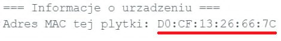

# ESP-NOW: Komunikacja bezpośrednia

> [!WARNING] 👥 Wymagania sprzętowe
> Protokół ESP-NOW służy do bezpośredniej komunikacji bezprzewodowej. Do przetestowania przykładów w tej lekcji potrzebne są **dwie płytki ESP32-C6**.

ESP-NOW to protokół opracowany przez firmę Espressif, pozwalający na bezpośrednią wymianę danych między układami ESP bez pośrednictwa routera Wi-Fi. Opóźnienia transmisji są minimalne (rzędu kilku milisekund), a zasięg w otwartym terenie dochodzi do 200 metrów.

---

## 📻 Jak pod spodem działa ESP-NOW?

ESP-NOW współdzieli ten sam fizyczny układ radiowy 2.4 GHz (transceiver) oraz antenę, z których korzysta standardowe Wi-Fi. Istnieje jednak zasadnicza różnica w sposobie transmisji:

- **Klasyczne Wi-Fi:** Wymaga nawiązania połączenia z punktem dostępowym (AP), autoryzacji oraz obsługi pełnego stosu sieciowego TCP/IP. Generuje to duży narzut danych i energii, a nawiązywanie połączenia po wybudzeniu mikrokontrolera ze snu trwa od kilkuset milisekund do kilku sekund.
- **ESP-NOW:** Działa bezpośrednio na warstwie łącza danych (MAC), omijając wyższe warstwy stosu sieciowego (brak IP, brak TCP/UDP). Dane są pakowane bezpośrednio w tzw. ramki typu *Vendor Specific Action Frames* (zgodne z IEEE 802.11). Dzięki temu pakiet może zostać wysłany natychmiast po wybudzeniu urządzenia w czasie poniżej 1 milisekundy.

### ⚠️ Ważne ograniczenie: Współdzielenie kanału radiowego

Ponieważ oba protokoły korzystają z tego samego radia, układ ESP32 może w danej chwili nasłuchiwać tylko na jednej częstotliwości (jednym kanale Wi-Fi).

Jeżeli ESP32 działa wyłącznie w trybie ESP-NOW, kanał radiowy jest dobierany automatycznie. Jeśli jednak Twoje ESP32 jest jednocześnie połączone z routerem Wi-Fi (np. wysyła dane do chmury), router ten narzuca układowi konkretny kanał pracy (np. kanał 6). W takiej sytuacji drugie urządzenie komunikujące się przez ESP-NOW **musi pracować na tym samym kanale radiowym**, w przeciwnym razie układy "rozminą się" częstotliwościami i komunikacja nie będzie możliwa.

---

## 👥 Tryb Peer-to-Peer (Punkt-Punkt)

W standardowej komunikacji Peer-to-Peer urządzenia identyfikują się za pomocą adresów fizycznych **MAC** kart sieciowych. Aby Nadajnik (Płytka A) mógł wysłać dane do Odbiornika (Płytka B), musi znać jego adres MAC i zarejestrować go w systemie jako partnera (*peer*).

### Krok 1: Odczyt adresu MAC odbiornika
Wgraj poniższy program na **Płytkę B** (Odbiornik) i odczytaj jej adres MAC z Monitora Szeregowego:

```cpp
#include <WiFi.h>

void setup() {
  Serial.begin(115200);
  delay(1000); // Czas na nawiązanie połączenia szeregowego (USB CDC)
  
  WiFi.mode(WIFI_STA);
  delay(100);  // Czas na inicjalizację sterownika Wi-Fi w tle
  
  Serial.print("Adres MAC tej płytki: ");
  Serial.println(WiFi.macAddress());
}

void loop() {}
```

Przykładowy wynik w Monitorze Szeregowym:

{.center}

> [!TIP] Zapisz adres MAC
> Skopiuj wyświetlony adres (np. `D0:CF:13:16:66:7C`) do notatnika. Będziesz go potrzebował w kodzie Nadajnika w formacie tablicy bajtów szesnastkowych: `{0xD0, 0xCF, 0x13, 0x16, 0x66, 0x7C}`.

### Krok 2: Kod Nadajnika (Płytka A)

Wgraj ten kod na **Płytkę A**, podstawiając uprzednio spisany adres MAC Płytki B:

```cpp
#include <esp_now.h>
#include <WiFi.h>

// UZUPEŁNIJ: wpisz adres MAC Płytki B (Odbiornika)
uint8_t adresOdbiornika[] = {0xD0, 0xCF, 0x13, 0x16, 0x66, 0x7C};

// Definicja struktury przesyłanych danych (musi być identyczna na obu płytkach)
typedef struct struct_message {
  char polecenie[12];
  int wartosc;
} struct_message;

struct_message wysylaneDane;
esp_now_peer_info_t peerInfo;

// Callback informujący o statusie wysłania pakietu
void onDataSent(const uint8_t *mac_addr, esp_now_send_status_t status) {
  Serial.print("Status transmisji: ");
  Serial.println(status == ESP_NOW_SEND_SUCCESS ? "Sukces" : "Nie dostarczono pakietu");
}

void setup() {
  Serial.begin(115200);
  
  // Wymagane do działania radia
  WiFi.mode(WIFI_STA);

  // Inicjalizacja protokołu ESP-NOW
  if (esp_now_init() != ESP_OK) {
    Serial.println("Błąd inicjalizacji ESP-NOW");
    return;
  }
  
  // Rejestracja callbacku statusu wysyłania
  esp_now_register_send_cb((esp_now_send_cb_t)onDataSent);

  // Rejestracja partnera (odbiornika)
  memcpy(peerInfo.peer_addr, adresOdbiornika, 6);
  peerInfo.channel = 0;  // Użyj bieżącego kanału Wi-Fi
  peerInfo.encrypt = false;

  if (esp_now_add_peer(&peerInfo) != ESP_OK) {
    Serial.println("Nie udało się dodać odbiornika");
    return;
  }
}

void loop() {
  strcpy(wysylaneDane.polecenie, "MIGANIE");
  wysylaneDane.wartosc = random(10, 100);

  // Wysłanie danych do partnera
  esp_now_send(adresOdbiornika, (uint8_t *)&wysylaneDane, sizeof(wysylaneDane));
  Serial.println("Wysłano pakiet!");
  
  delay(2000);
}
```

### Krok 3: Kod Odbiornika (Płytka B)

Wgraj ten kod z powrotem na **Płytkę B** (Odbiornik):

```cpp
#include <esp_now.h>
#include <WiFi.h>

const int PIN_LED = 2;

typedef struct struct_message {
  char polecenie[12];
  int wartosc;
} struct_message;

struct_message odebraneDane;

// Callback wywoływany w tle w momencie odebrania danych
void onDataRecv(const esp_now_recv_info_t *recv_info, const uint8_t *incomingData, int len) {
  memcpy(&odebraneDane, incomingData, sizeof(odebraneDane));
  
  Serial.print("Odebrano od MAC: ");
  for (int i = 0; i < 6; i++) {
    Serial.printf("%02X", recv_info->src_addr[i]);
    if (i < 5) Serial.print(":");
  }
  Serial.printf(" | Polecenie: %s | Wartość: %d\n",
                odebraneDane.polecenie, odebraneDane.wartosc);

  if (strcmp(odebraneDane.polecenie, "MIGANIE") == 0) {
    digitalWrite(PIN_LED, HIGH);
    delay(50);
    digitalWrite(PIN_LED, LOW);
  }
}

void setup() {
  Serial.begin(115200);
  pinMode(PIN_LED, OUTPUT);
  
  WiFi.mode(WIFI_STA);

  if (esp_now_init() != ESP_OK) {
    Serial.println("Błąd inicjalizacji ESP-NOW");
    return;
  }
  
  // Rejestracja callbacku odbioru danych
  esp_now_register_recv_cb((esp_now_recv_cb_t)onDataRecv);
  Serial.println("Odbiornik gotowy. Oczekuję na pakiety...");
}

void loop() {
  // loop pozostaje puste - obsługa odbywa się zdarzeniowo w tle (callback)
}
```

---

## 📡 Transmisja rozgłoszeniowa (Broadcast)

W trybie Peer-to-Peer musisz znać adres MAC odbiornika. Jeśli jednak chcesz wysłać informację do wielu urządzeń w zasięgu jednocześnie, lub nie znasz ich adresów MAC, możesz wykorzystać **transmisję rozgłoszeniową (Broadcast)**.

W tym trybie dane są wysyłane na specjalny, zarezerwowany adres MAC: `FF:FF:FF:FF:FF:FF`. Każde urządzenie w zasięgu, które ma zainicjalizowany protokół ESP-NOW na tym samym kanale radiowym, odbierze taką wiadomość.

### Krok 1: Kod Nadajnika (Broadcast)

Wgraj ten kod na płytkę nadawczą. Nie musisz tu podawać konkretnego adresu MAC odbiornika:

```cpp
#include <esp_now.h>
#include <WiFi.h>

// Adres rozgłoszeniowy (Broadcast)
uint8_t adresBroadcast[] = {0xFF, 0xFF, 0xFF, 0xFF, 0xFF, 0xFF};

typedef struct struct_message {
  char polecenie[12];
  int licznik;
} struct_message;

struct_message daneBroadcast;
esp_now_peer_info_t peerInfo;

void setup() {
  Serial.begin(115200);
  WiFi.mode(WIFI_STA);

  if (esp_now_init() != ESP_OK) {
    Serial.println("Błąd inicjalizacji ESP-NOW");
    return;
  }

  // Dodajemy adres rozgłoszeniowy jako partnera
  memcpy(peerInfo.peer_addr, adresBroadcast, 6);
  peerInfo.channel = 0;
  peerInfo.encrypt = false;

  if (esp_now_add_peer(&peerInfo) != ESP_OK) {
    Serial.println("Nie udało się dodać partnera rozgłoszeniowego");
    return;
  }
  
  Serial.println("Nadajnik Broadcast gotowy!");
}

void loop() {
  static int i = 0;
  strcpy(daneBroadcast.polecenie, "BROADCAST");
  daneBroadcast.licznik = i++;

  // Wysyłanie pakietu w eter do każdego odbiornika
  esp_err_t wynik = esp_now_send(adresBroadcast, (uint8_t *)&daneBroadcast, sizeof(daneBroadcast));
  
  if (wynik == ESP_OK) {
    Serial.printf("Rozgłoszono pakiet nr: %d\n", daneBroadcast.licznik);
  } else {
    Serial.println("Błąd wysyłania");
  }

  delay(2000);
}
```

### Krok 2: Kod Odbiornika (Broadcast)

Odbiornik dla trybu broadcast jest identyczny jak dla trybu Peer-to-Peer. Nie musi rejestrować żadnych partnerów – wystarczy, że nasłuchuje na zdarzenia:

```cpp
#include <esp_now.h>
#include <WiFi.h>

const int PIN_LED = 2;

typedef struct struct_message {
  char polecenie[12];
  int licznik;
} struct_message;

struct_message odebraneDane;

void onDataRecv(const esp_now_recv_info_t *recv_info, const uint8_t *incomingData, int len) {
  memcpy(&odebraneDane, incomingData, sizeof(odebraneDane));
  
  Serial.print("Odebrano pakiet broadcast od MAC: ");
  for (int i = 0; i < 6; i++) {
    Serial.printf("%02X", recv_info->src_addr[i]);
    if (i < 5) Serial.print(":");
  }
  Serial.printf(" | Polecenie: %s | Licznik: %d\n", 
                odebraneDane.polecenie, odebraneDane.licznik);

  // Sygnalizacja odebrania pakietu mignięciem diody
  digitalWrite(PIN_LED, HIGH);
  delay(100);
  digitalWrite(PIN_LED, LOW);
}

void setup() {
  Serial.begin(115200);
  pinMode(PIN_LED, OUTPUT);
  WiFi.mode(WIFI_STA);

  if (esp_now_init() != ESP_OK) {
    Serial.println("Błąd inicjalizacji ESP-NOW");
    return;
  }

  esp_now_register_recv_cb((esp_now_recv_cb_t)onDataRecv);
  Serial.println("Odbiornik Broadcast gotowy – nasłuchuję...");
}

void loop() {}
```

---

## 🛠️ Zadanie: Bezprzewodowy kontroler gestów (P2P)

Połączmy komunikację radiową ESP-NOW z obsługą magistrali I<sup>2</sup>C.

1. **Płytka A (Nadajnik):** Podłącz akcelerometr MPU6050 przez magistralę I<sup>2</sup>C. Stwórz strukturę przesyłającą dwie wartości zmiennoprzecinkowe: `float katX; float katY;`. W pętli głównej wysyłaj zaktualizowane pomiary kątów 10 razy na sekundę do Odbiornika.
2. **Płytka B (Odbiornik):** Po odebraniu pakietu przeanalizuj nachylenie kąta X. Jeśli `katX > 30.0`, włącz wbudowaną diodę LED. Jeśli `katX < -30.0`, wyłącz diodę LED.

<details>
<summary>Pokaż rozwiązanie</summary>

#### Kod Nadajnika (Płytka A)
```cpp
#include <esp_now.h>
#include <WiFi.h>
#include <Wire.h>
#include <MPU6050_light.h>

const int I2C_SDA = 6;
const int I2C_SCL = 7;

// UZUPEŁNIJ: wpisz adres MAC Płytki B (Odbiornika)
uint8_t adresOdbiornika[] = {0x24, 0xDC, 0xC3, 0xA1, 0xB2, 0xC0};

typedef struct struct_message {
  float katX;
  float katY;
} struct_message;

struct_message wysylaneDane;
esp_now_peer_info_t peerInfo;
MPU6050 mpu(Wire);

void onDataSent(const uint8_t *mac_addr, esp_now_send_status_t status) {
  Serial.print("Status wysyłania: ");
  Serial.println(status == ESP_NOW_SEND_SUCCESS ? "Sukces" : "Błąd");
}

void setup() {
  Serial.begin(115200);
  WiFi.mode(WIFI_STA);

  Wire.begin(I2C_SDA, I2C_SCL);
  if (mpu.begin() != 0) {
    Serial.println("Błąd MPU6050!");
    while (1);
  }
  delay(1000);
  mpu.calcOffsets();

  if (esp_now_init() != ESP_OK) {
    Serial.println("Błąd inicjalizacji ESP-NOW");
    return;
  }

  esp_now_register_send_cb((esp_now_send_cb_t)onDataSent);

  memcpy(peerInfo.peer_addr, adresOdbiornika, 6);
  peerInfo.channel = 0;
  peerInfo.encrypt = false;

  if (esp_now_add_peer(&peerInfo) != ESP_OK) {
    Serial.println("Nie udało się dodać partnera");
    return;
  }
}

void loop() {
  mpu.update();
  wysylaneDane.katX = mpu.getAngleX();
  wysylaneDane.katY = mpu.getAngleY();

  esp_now_send(adresOdbiornika, (uint8_t *)&wysylaneDane, sizeof(wysylaneDane));
  
  Serial.printf("Wysłano -> Kat X: %.1f, Kat Y: %.1f\n", wysylaneDane.katX, wysylaneDane.katY);
  delay(100); // 10 razy na sekundę
}
```

#### Kod Odbiornika (Płytka B)
```cpp
#include <esp_now.h>
#include <WiFi.h>

const int PIN_LED = 2;

typedef struct struct_message {
  float katX;
  float katY;
} struct_message;

struct_message odebraneDane;

void onDataRecv(const esp_now_recv_info_t *recv_info, const uint8_t *incomingData, int len) {
  memcpy(&odebraneDane, incomingData, sizeof(odebraneDane));
  
  Serial.printf("Odebrano -> Kat X: %.1f, Kat Y: %.1f\n", odebraneDane.katX, odebraneDane.katY);

  if (odebraneDane.katX > 30.0) {
    digitalWrite(PIN_LED, HIGH);
    Serial.println("Dioda LED WŁĄCZONA (katX > 30)");
  } else if (odebraneDane.katX < -30.0) {
    digitalWrite(PIN_LED, LOW);
    Serial.println("Dioda LED WYŁĄCZONA (katX < -30)");
  }
}

void setup() {
  Serial.begin(115200);
  pinMode(PIN_LED, OUTPUT);
  WiFi.mode(WIFI_STA);

  if (esp_now_init() != ESP_OK) {
    Serial.println("Błąd inicjalizacji ESP-NOW");
    return;
  }

  esp_now_register_recv_cb((esp_now_recv_cb_t)onDataRecv);
  Serial.println("Odbiornik gotowy. Steruj płytką nadawczą...");
}

void loop() {
  // Pętla pusta - obsługa w callbacku onDataRecv
}
```
</details>
