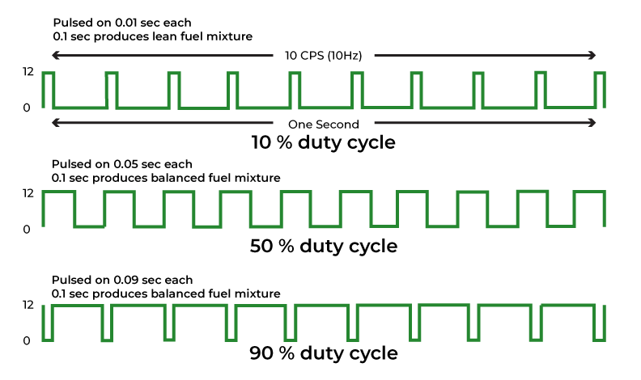
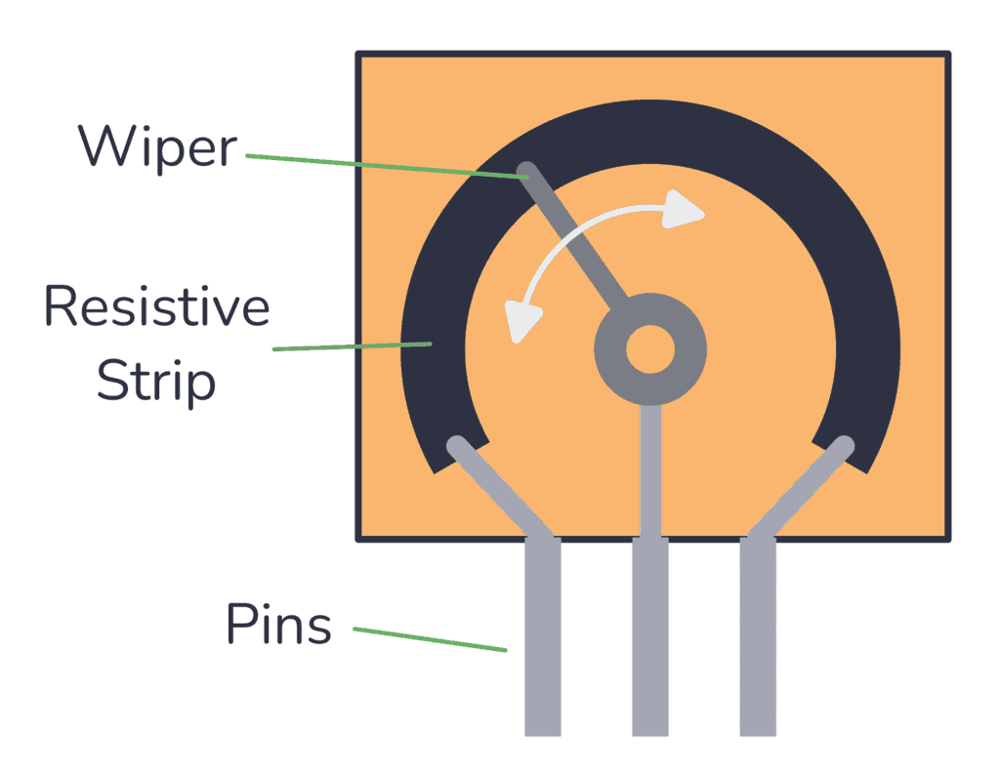

# Sygnały analogowe: PWM i ADC

Do tej pory operowaliśmy na dwóch stanach: 1 lub 0. Włączony lub wyłączony. Jednak nasz świat nie jest czarno-biały – światło ściemnia się płynnie, temperatura zmienia się co dziesiątą część stopnia, a głośność można regulować na obrotowym kółku.
W tej sekcji nauczymy się "udawać" sygnał ciągły oraz odbierać sygnał ciągły ze świata fizycznego!

## 📊 Czym jest PWM i jak działa?

Wyjście cyfrowe daje tylko dwa stany: włącz/wyłącz. Co jeśli chcemy płynnie regulować jasność diody? Z pomocą przychodzi technika **PWM**.

**PWM** (*Pulse Width Modulation* – Modulacja Szerokości Impulsu) to technika symulowania sygnału analogowego za pomocą bardzo szybkiego przełączania sygnału cyfrowego w czasie, z odpowiednimi proporcjami na bycie włączonym względem bycia wyłączonym w ciągu mikrosekund.
Pin jest bardzo szybko włączany i wyłączany (np. 10 000 razy na sekundę!), a bezwładność naszego oka powoduje, że widzimy płynną zmianę uśrednionej wartości jasności.

Kluczowy parametr to **wypełnienie (duty cycle)**:

{.center}

W Arduino domyślnie używamy ujednoliconej funkcji o nazwie `analogWrite(pin, wartość)`, która ustawia wypełnienie. Wartość to liczba z zakresu od **0** (całkowicie wyłączone) do **255** (pełna moc).

> [!NOTE] Dostępność wyjść PWM
> W wielu starszych mikrokontrolerach liczba pinów mogących generować sprzętowy sygnał PWM była mocno ograniczona (np. tradycyjne Arduino Uno miało tylko 6 takich pinów). W układach ESP32 sygnał PWM jest generowany przez dedykowany blok sprzętowy (kontroler LEDC), a za pomocą elastycznej matrycy połączeń (**GPIO Matrix**) sygnał ten można przekierować i wyprowadzić na niemal dowolny cyfrowy pin GPIO. Daje to ogromną elastyczność podczas projektowania i montowania obwodów.

---

### 🎯 Ćwiczenie 1: Płynna regulacja jasności (Breathing LED)

[**Link do symulacji w Wokwi**](https://wokwi.com/projects/464853358722851841){: style="display: block; text-align: center;" }

Napiszmy program realizujący efekt płynnego rozjaśniania i ściemniania diody LED:

```cpp
const int PIN_LED = 2;

void setup() {
  pinMode(PIN_LED, OUTPUT);
}

void loop() {
  // Pętla inkrementująca jasność (od 0 do 255):
  for (int jasnosc = 0; jasnosc <= 255; jasnosc++) {
    // /* WYŚLIJ PWM O WARTOŚCI jasnosc NA PIN_LED */
    delay(5); // Niewielkie opóźnienie sprawi, że cały proces rozjaśniania potrwa nieco ponad sekundę
  }

  // Pętla dekrementująca jasność (od 255 do 0):
  for (int jasnosc = 255; jasnosc >= 0; jasnosc--) {
     // /* WYŚLIJ PWM O WARTOŚCI jasnosc NA PIN_LED */
    delay(5);
  }
}
```

<details>
<summary>Pokaż rozwiązanie</summary>

```cpp
const int PIN_LED = 2;

void setup() {
  pinMode(PIN_LED, OUTPUT);
}

void loop() {
  for (int jasnosc = 0; jasnosc <= 255; jasnosc++) {
    analogWrite(PIN_LED, jasnosc);
    delay(5);
  }
  for (int jasnosc = 255; jasnosc >= 0; jasnosc--) {
    analogWrite(PIN_LED, jasnosc);
    delay(5);
  }
}
```

</details>

> [!NOTE] Ciekawostka: Nieliniowość ludzkiego oka
> Czy w trakcie testowania programu zauważyłeś, że podczas rozjaśniania diody LED wydaje się ona zwiększać jasność bardzo szybko na samym początku, a potem różnica jest już słabo dostrzegalna?
> 
> Ludzkie oko nie postrzega jasności w sposób liniowy, lecz logarytmiczny (zgodnie z prawem Webera-Fechnera). Jesteśmy znacznie bardziej wrażliwi na drobne zmiany natężenia światła w ciemności niż w jasnym otoczeniu. Z tego powodu zmiana wypełnienia PWM z 0% na 10% wydaje się nam ogromnym skokiem jasności, podczas gdy różnica między 80% a 90% jest prawie niezauważalna. W profesjonalnych urządzeniach (np. w oświetleniu domowym), aby uzyskać efekt płynnego ściemniania i rozjaśniania, stosuje się tzw. korekcję gamma (nieliniowe skalowanie wartości).

---

## 📈 Czym jest przetwornik ADC i jak działa?

Potrafimy już płynnie sterować poziomem sygnału wyjściowego. W jaki sposób możemy jednak odczytać wartości ciągłe z otoczenia? Na przykład sprawdzić kąt obrotu pokrętła potencjometru lub poziom wilgotności gleby?

Do tego celu służy przetwornik analogowo-cyfrowy, czyli **ADC** (*Analog-to-Digital Converter*).
Mikrokontroler ESP32-C6 wyposażony jest w 12-bitowy przetwornik ADC. Konwertuje on mierzone napięcie wejściowe z zakresu od 0 V do 3.3 V na odpowiadającą mu wartość cyfrową w skali od 0 do 4095:

- 0 V → 0
- 1.65 V → ok. 2047
- 3.3 V → 4095

> [!IMPORTANT] Dostępność wejść ADC w układzie ESP32-C6
> Pomiary analogowe nie są dostępne na wszystkich pinach GPIO. W mikrokontrolerze ESP32-C6 dedykowane kanały przetwornika ADC są przypisane do pinów: **GPIO0, GPIO1, GPIO2, GPIO3, GPIO4, GPIO5 oraz GPIO6** (można to odczytać ze [schematu wyprowadzeń](../start/sprzet.md#schemat-wyprowadzen-pinout) – szukaj oznaczeń **ADC**). W naszym ćwiczeniu potencjometr podłączymy do pinu **GPIO4**.

### Jak podłączyć potencjometr?
Potencjometr obrotowy posiada trzy wyprowadzenia:

{.center}

* **Skrajne nóżki**: Podłączamy odpowiednio do zasilania (**3.3 V**) oraz masy (**GND**).
* **Środkowa nóżka (suwak/zbierak)**: Wyprowadza napięcie wyjściowe, które zmienia się proporcjonalnie do kąta obrotu osi potencjometru. To wyprowadzenie łączymy z wejściem ADC mikrokontrolera (w naszym przypadku `GPIO4`).

Taka konfiguracja tworzy tzw. **regulowany dzielnik napięcia**. Obracając pokrętłem, płynnie zmieniamy napięcie na środkowej nóżce w zakresie od 0 V (gdy suwak jest najbliżej masy) do 3.3 V (gdy suwak jest najbliżej zasilania). Przetwornik ADC odczytuje to napięcie.

### Odczyt wartości z dzielnika

Do odczytu napięcia analogowego wykorzystujemy funkcje:

* **`analogRead(pin)`**: Odczytuje napięcie na podanym pinie i zwraca surową wartość całkowitą z zakresu od **`0`** do **`4095`** (dla rozdzielczości 12-bitowej).
* **`analogReadMilliVolts(pin)`**: Odczytuje napięcie na podanym pinie i zwraca od razu skalibrowaną wartość napięcia bezpośrednio w **miliwoltach** (np. ok. `3300` dla napięcia 3.3 V).

> [!WARNING] Rzeczywistość a teoria: Dlaczego przy 3.3 V nie dostajemy 4095?
> W teorii 12-bitowy przetwornik dla maksymalnego napięcia 3.3 V powinien zwrócić wartość 4095. W rzeczywistości w mikrokontrolerach z rodziny ESP32 (w tym ESP32-C6) przetwornik ADC ma wbudowane wewnętrzne **tłumienie (attenuation)** ustawione domyślnie na **11 dB**. 
>
> **Czym jest to tłumienie?** 
> Rdzeń przetwornika ADC w ESP32 potrafi fizycznie zmierzyć napięcie tylko do ok. 1.1 V (jest to jego wewnętrzne napięcie odniesienia – $V_{ref}$). Aby mikrokontroler mógł mierzyć wyższe napięcia (np. do 3.3 V), sygnał wejściowy musi zostać najpierw przepuszczony przez wewnętrzny dzielnik napięcia (tłumik). Tłumienie 11 dB pozwala rozszerzyć zakres pomiarowy do poziomu zasilania układu.
>
> Jednak przetwornik ADC w ESP32 charakteryzuje się sporą **nieliniowością** (szczególnie na krańcach zakresu, powyżej 2.6 V–3.0 V) oraz rozrzutem produkcyjnym napięcia odniesienia. Z tego powodu dla pełnego napięcia 3.3 V surowy odczyt z `analogRead()` zamiast 4095 wynosi w praktyce często **ok. 3400 - 3600**. 
>
> **Jak sobie z tym radzić?**
> 1. **Używać `analogReadMilliVolts(pin)`**: Funkcja ta korzysta z fabrycznej kalibracji wypalonej w pamięci eFuse Twojego konkretnego egzemplarza ESP32. Automatycznie przelicza ona surowy odczyt na rzeczywiste miliwolty (mV), dając o wiele dokładniejszy wynik.
> 2. **Kalibrować ręcznie w kodzie**: Zamiast zakładać, że 3.3 V to 4095, zmierz rzeczywistą wartość maksymalną i użyj jej w swoim programie.
> 3. **Zewnętrzny dzielnik napięcia**: Jeśli potrzebujesz dużej liniowości i dokładności w pełnym zakresie, najlepszym rozwiązaniem jest obniżenie mierzonego napięcia zewnętrznymi rezystorami i zmiana tłumienia ADC na mniejsze (np. 0 dB lub 2.5 dB).

> [!NOTE] Brak potrzeby konfiguracji pinMode()
> Zauważ, że w funkcji `setup()` poniższego programu nie wywołujemy `pinMode(PIN_POTENCJOMETR, INPUT)`. Wywołanie to nie jest wymagane dla odczytów analogowych, ponieważ funkcja `analogRead()` automatycznie rekonfiguruje wskazany pin GPIO do pracy w trybie wejścia analogowego (ADC) przy każdym wywołaniu.

---

### 🎯 Ćwiczenie 2: Odczyt potencjometru i sterowanie progowe

[**Link do symulacji w Wokwi**](https://wokwi.com/projects/464853537132826625){: style="display: block; text-align: center;" }

Napiszmy program, który mierzy wartość napięcia z potencjometru i wypisuje ją na port szeregowy:

```cpp
const int PIN_POTENCJOMETR = 4;

void setup() {
  Serial.begin(115200);
}

void loop() {
  // Odczyt wartości z potencjometru
  int pokretlo = /* TUTAJ WSTAW FUNKCJĘ ODPOWIADAJĄCĄ ZA POMIAR ANALOGOWY NA PINIE */
  
  Serial.println(pokretlo);
  delay(10);
}
```

> [!TIP] Wizualizacja danych: Serial Plotter
> Aby zaobserwować zmiany odczytów w czasie w formie graficznej, możesz skorzystać z narzędzia **Serial Plotter** wbudowanego w Arduino IDE i Wokwi. W przypadku Arduino IDE znajdziesz je w prawym górnym rogu okna (ikona wykresu obok lupy) lub w menu *Narzędzia -> Serial Plotter*. W przypadku Wokwi należy kliknąć ikonę wykresu w prawym dolnym rogu okna. Ruch pokrętła potencjometru zostanie przedstawiony na płynnym, rysowanym w czasie rzeczywistym wykresie.
{.center}

### 🛠️ Zadanie: Kontrola progowa

Częstym zastosowaniem pomiarów analogowych (np. temperatury, poziomu wody czy ciśnienia) jest reagowanie na przekroczenie określonej wartości progowej – na przykład w celu uruchomienia alarmu lub wyłączenia zasilania.

Zmodyfikuj swój program tak, aby:

1. Odczytywał wartość analogową z potencjometru.
2. **Jeśli odczyt przekroczy wartość 3000** (co odpowiada blisko 2.4V), włączał diodę LED podłączoną do pinu 2 za pomocą funkcji `digitalWrite()`.
3. **W przeciwnym wypadku** (gdy odczyt spadnie poniżej 3000), wyłączał tę diodę.

<details>
<summary>Pokaż rozwiązanie</summary>

```cpp
const int PIN_POTENCJOMETR = 4;
const int PIN_LED = 2;

void setup() {
  Serial.begin(115200);
  pinMode(PIN_LED, OUTPUT);
}

void loop() {
  int pokretlo = analogRead(PIN_POTENCJOMETR);
  Serial.println(pokretlo);

  if (pokretlo > 3000) {
     digitalWrite(PIN_LED, HIGH);
  } else {
     digitalWrite(PIN_LED, LOW);
  }

  delay(50);
}
```

</details>

---

## 🔄 Łączenie ADC z PWM

Chcemy teraz zrealizować praktyczny projekt: płynnie kontrolować jasność diody LED za pomocą obracania potencjometru.

Pojawia się tu jednak problem niedopasowania zakresów wartości:

* Przetwornik analogowo-cyfrowy (ADC) zwraca nam wartości od **0 do 4095**.
* Funkcja sterowania jasnością diody `analogWrite()` przyjmuje wartości wypełnienia PWM w zakresie od **0 do 255**.

Gdybyśmy bezpośrednio przekazali odczyt z potencjometru (np. 1000) do funkcji `analogWrite()`, wartość ta uległaby przepełnieniu (zostałaby zrzutowana na typ 8-bitowy), przez co dioda zamiast płynnie się rozjaśniać, kilkukrotnie zapalałaby się i gasła podczas jednego pełnego obrotu pokrętła.

Do rozwiązania tego problemu służy wbudowana funkcja:

* **`map(wartość, zMin, zMax, doMin, doMax)`**: Przeskalowuje podaną liczbę z jednego zakresu na inny. Przyjmuje ona 5 argumentów:

    1. `wartość` – zmienna, którą chcemy przeskalować (np. nasz odczyt z potencjometru).
    2. `zMin` – dolna granica obecnego zakresu (dla ADC: `0`).
    3. `zMax` – górna granica obecnego zakresu (dla ADC: `4095`).
    4. `doMin` – dolna granica docelowego zakresu (dla PWM: `0`).
    5. `doMax` – górna granica docelowego zakresu (dla PWM: `255`).

Przykład użycia w kodzie:
```cpp
int jasnosc_led = map(odczyt_potencjometru, 0, 4095, 0, 255);
```

### 🛠️ Zadanie: Płynny regulator jasności
Połącz wiedzę o ADC oraz PWM. Napisz program, który odczytuje wartość z potencjometru, odpowiednio ją skaluje za pomocą funkcji `map()`, a następnie płynnie steruje jasnością diody LED (od całkowitego zgaszenia do maksymalnej jasności) proporcjonalnie do obrotu osi potencjometru.

<details>
<summary>Pokaż rozwiązanie</summary>

```cpp
const int PIN_POT = 4;
const int PIN_LED = 2;

void setup() {
  Serial.begin(115200);
  pinMode(PIN_LED, OUTPUT);
}

void loop() {
  int pokretlo = analogRead(PIN_POT);
  Serial.println(pokretlo);

  // Skalowanie zakresu ADC (0-4095) do zakresu PWM (0-255)
  int docelowa_jasnosc = map(pokretlo, 0, 4095, 0, 255);
  
  analogWrite(PIN_LED, docelowa_jasnosc);
  
  delay(10);
}
```

</details>
