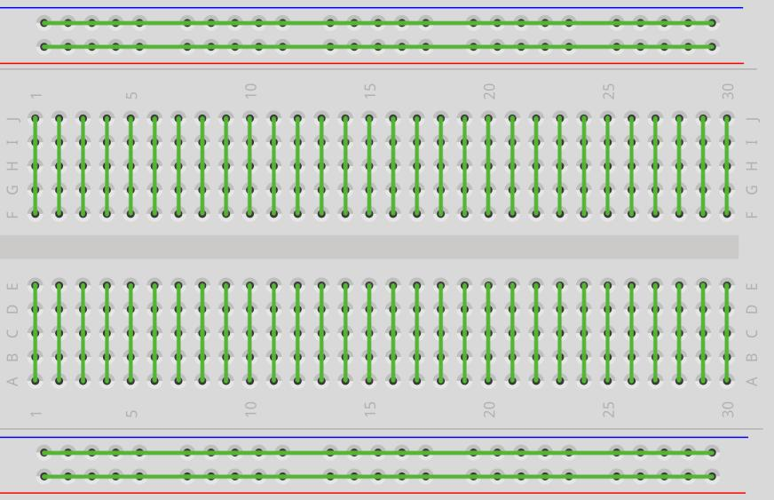

# Wstęp do IO: Cyfrowe wyjścia i wejścia

Witamy w sekcji praktycznej! W tym rozdziale dowiesz się, jak budować obwody na płytce stykowej, komunikować się z komputerem przez port szeregowy oraz w pełni kontrolować sygnały cyfrowe – czyli takie, które przyjmują tylko dwa możliwe stany: włączony (1) lub wyłączony (0).

---

## Płytka stykowa (Breadboard) i Elektronika

Zanim rozpoczniesz łączenie elementów elektronicznych na płytce stykowej, musisz zrozumieć jej wewnętrzną budowę oraz zasadę działania.
**Płytka stykowa (Breadboard)** pozwala łączyć elementy elektryczne bez konieczności lutowania. Posiada tory przewodzące umieszczone pod warstwą tworzywa sztucznego, które tworzą z poszczególnych otworów połączone elektrycznie węzły.

### Budowa płytki



Zasada jest prosta - zielone linie to połączenia:

1. **Każdy rząd 5 otworów** (np. od 1A do 1E) to połączony przewód. Wpięcie tam dwóch nóżek elementów to tak, jakbyś zlutował je razem.
2. Rowek pośrodku płytki to izolator – rząd 1A-1E **NIE JEST** połączony z rzędem 1F-1J.
3. Krawędzie to magistrale – łączą w długich rzędach całą kolumnę "plusową" i "minusową". Niezbędne by łatwo rozprowadzić wspólne zasilanie.

---

## Ćwiczenie 1 – Serial

Do komunikacji z komputerem służy wbudowany w mikrokontroler port szeregowy, reprezentowany w kodzie przez obiekt **`Serial`**. Aby móc z niego korzystać, musimy poznać podstawowe funkcje:

* **`Serial.begin(prędkość)`**: Uruchamia komunikację z komputerem. Prędkość (baud rate) określa, jak szybko płyną bity. Zazwyczaj stosujemy standardowe `115200`. Funkcję tę wywołujemy jednorazowo w bloku `setup()`.
* **`Serial.println(tekst)`**: Wysyła tekst lub wartość zmiennej do komputera i automatycznie przechodzi do nowej linii (dodaje znak Enter).
* **`Serial.print(tekst)`**: Działa identycznie jak `println()`, ale nie przechodzi do nowej linii – kolejny komunikat pojawi się bezpośrednio za nim.
* **`delay(czas_ms)`**: Wstrzymuje (zamraża) wykonywanie programu na określoną liczbę milisekund (1 sekunda = 1000 ms).

1. Podłącz czyste ESP32-C6 za pomocą USB do komputera.

```cpp
void setup() {
  // Otwarcie portu komunikacyjnego. Ważne: prędkość musi być równa 115200!
  Serial.begin(115200);

  // Ta funkcja wyśle się TYLKO RAZ po zasileniu, bo jest w bloku "setup"
  Serial.println("Wykonuję się tylko raz!");
}

void loop() {
  // Pętla 'loop' obraca się w nieskończoność
  Serial.println("Wykonuję się w pętli!");
  
  // Wymuszamy "pauzę" na działanie procesora o 1000 milisekund (1 sekunda)
  delay(1000);
}
```

Po upewnieniu się że masz wybrany odpowiedni port COM oraz model płytki wciśnij ikonę wgrywania (Ctrl + U), a w IDE z menu górnego wybierz **Lupa z prawej strony (Monitor Szeregowy)**. Skontroluj w rogu jego okienka czy prędkość (*baud rate*) jest ustawiona na `115200`.


> [!NOTE] Dla ciekawskich: Czym jest baud (baud rate)?
> **Baud** określa prędkość transmisji danych w komunikacji szeregowej. W standardowych połączeniach tego typu **1 bod (baud) odpowiada przesłaniu 1 bitu na sekundę**.
> 
> Ustawienie `115200` oznacza więc, że w ciągu jednej sekundy procesor wysyła lub odbiera dokładnie 115 200 bitów informacji. Jeśli po obu stronach połączenia (w mikrokontrolerze oraz na komputerze w programie Monitora) nie ustawimy dokładnie tej samej wartości, komputer błędnie zinterpretuje czas trwania każdego bitu. Zamiast tekstu zobaczysz wtedy nieczytelne, losowe znaki.

### Zadanie: Licznik
Zmodyfikuj kod. Dodaj na samym początku pliku zmienną globalną: `int licznik = 0;`.
Zrób z niej licznik odliczający sekundy i wypisujący go w Serial Monitorze wraz ze stałym komunikatem.

<details>
<summary>Pokaż rozwiązanie</summary>

```cpp
int licznik = 0;

void setup() {
  Serial.begin(115200);
  Serial.println("Rozpoczynam odliczanie!");
}

void loop() {
  licznik++; // Skrót od: licznik = licznik + 1
  
  Serial.print("Sekunda nr: "); // używamy .print aby nie stawiać znaku "entera"
  Serial.println(licznik);      // a przy wartości używamy .println aby po niej był "enter"
  
  delay(1000);
}
```

</details>

---

## Ćwiczenie 2 – Wyjście cyfrowe: LED

Aby sterować diodą LED, musimy wysłać napięcie z pinu GPIO. W tym celu korzystamy z dwóch kluczowych funkcji:

* **`pinMode(pin, tryb)`**: Konfiguruje dany pin do pracy. Jako tryb podajemy `OUTPUT` (wyjście, gdy chcemy sterować prądem) lub `INPUT` (wejście, gdy czytamy dane). Tę konfigurację wywołujemy raz w `setup()`.
* **`digitalWrite(pin, stan)`**: Ustawia stan napięcia na skonfigurowanym wyjściu. Możemy podać stan **`HIGH`** (podaje pełne napięcie 3.3V) lub **`LOW`** (podaje masę 0V, wyłączając zasilanie).

W ramach tego ćwiczenia zbudujemy fizyczny układ z diodą LED na płytce stykowej.

> [!NOTE] Polaryzacja diody LED
> Dioda elektroluminescencyjna (LED) jest elementem półprzewodnikowym o określonej polaryzacji – przewodzi prąd elektryczny i świeci tylko w jednym kierunku:
> * **Anoda (+)**: Dłuższe wyprowadzenie (nóżka) diody. Powinna być połączona z pinem GPIO mikrokontrolera (poprzez rezystor ograniczający prąd).
> * **Katoda (-)**: Krótsze wyprowadzenie diody (często oznaczone spłaszczeniem na krawędzi plastikowej obudowy). Powinno być połączone z masą układu (GND).

> [!WARNING] Prawo Ohma i rezystor szeregowy
> Nigdy nie podłączaj diody LED bezpośrednio do zasilania lub pinu GPIO bez rezystora szeregowego. Dioda w kierunku przewodzenia stawia minimalny opór elektryczny, co doprowadzi do przepływu prądu o zbyt wysokim natężeniu i w konsekwencji do natychmiastowego termicznego uszkodzenia diody lub portu mikrokontrolera.
> 
> Wartość rezystora szeregowego obliczamy na podstawie **prawa Ohma** ($R = \frac{U}{I}$):
> 
> $$R = \frac{U_{\text{zasilania}} - U_{\text{diody}}}{I_{\text{diody}}}$$
> 
> Gdzie:
> * $U_{\text{zasilania}} = 3{,}3\text{ V}$ (napięcie logiczne pinu GPIO w układzie ESP32-C6)
> * $U_{\text{diody}} \approx 2{,}0\text{ V}$ (typowy spadek napięcia na przewodzącej **czerwonej** diodzie LED)
> * $I_{\text{diody}} \approx 10\text{ mA} = 0{,}01\text{ A}$ (bezpieczny prąd diody, nieprzeciążający portu GPIO mikrokontrolera)
> 
> Podstawiając wartości do wzoru:
> 
> $$R = \frac{3{,}3\text{ V} - 2{,}0\text{ V}}{0{,}01\text{ A}} = \frac{1{,}3\text{ V}}{0{,}01\text{ A}} = 130\ \Omega$$
> 
> Ponieważ rezystory produkuje się w określonych szeregach wartości (np. E24), w praktyce wybieramy najbliższą większą dostępną wartość z szeregu, np. **$150\ \Omega$** lub bardzo popularny rezystor **$220\ \Omega$** (który ograniczy prąd do ok. 6 mA, co w zupełności wystarczy do jasnego świecenia diody).


🎯 **[Otwórz Wokwi dla tego obwodu - ZOBACZ JAK ZROBIONO TO NA BREADBOARDZIE]** *(tutaj pojawi się docelowy link z wirtualnym układem)*

```cpp
// Przypisanie numerowi 2 etykiety.
const int PIN_LED = 2;

void setup() {
  // Konfiguracja pinu GPIO jako wyjście – mikrokontroler będzie kontrolował stan napięcia na tym pinie.
  pinMode(PIN_LED, OUTPUT);
}

void loop() {
  // /* TUTAJ WSTAW FUNKCJE USTAWIAJACĄ STAN WYSOKI (HIGH) NA PIN */
  
  delay(500); 

  // /* TUTAJ WSTAW FUNKCJE USTAWIAJACĄ STAN NISKI (LOW) NA PIN */
  
  delay(500); 
}
```

### Zadanie: Naprzemienne światła alarmowe
Dołóż drugą diodę z jej osobnym rezystorem na nowym rzędzie breadboarda i podłącz jej anodę pod np. port `GPIO 3`.
Spraw, aby jedna dioda zapalała się tylko w momencie gdy druga gaśnie, przypominając sygnały ostrzegawcze na przejeździe kolejowym.

<details>
<summary>Pokaż rozwiązanie</summary>

```cpp
const int PIN_LED1 = 2;
const int PIN_LED2 = 3;

void setup() {
  pinMode(PIN_LED1, OUTPUT);
  pinMode(PIN_LED2, OUTPUT);
}

void loop() {
  digitalWrite(PIN_LED1, HIGH);
  digitalWrite(PIN_LED2, LOW);
  delay(300);
  
  digitalWrite(PIN_LED1, LOW);
  digitalWrite(PIN_LED2, HIGH);
  delay(300);
}
```

</details>

---

## Ćwiczenie 3 – Wejście cyfrowe: Przycisk

W poprzednich ćwiczeniach mikrokontroler sterował stanem wyjść (wysyłał napięcie). W tym rozdziale skonfigurujemy go do odczytu sygnałów zewnętrznych (wprowadzania danych). Aby odczytać stan fizycznego przycisku (przełącznika), potrzebujemy:

* **`pinMode(pin, INPUT_PULLUP)`**: Konfiguruje pin jako wejście i aktywuje wbudowany rezystor podciągający do linii 3,3 V.
* **`digitalRead(pin)`**: Odczytuje aktualny stan logiczny na danym pinie. Zwraca wartość `HIGH` (3,3 V) lub `LOW` (0 V).

> [!IMPORTANT] Rezystory Pull-up / Pull-down a stan nieustalony (floating)
> Wejście mikrokontrolera w trybie `INPUT` ma ekstremalnie duży opór elektryczny. Z jednej strony to zaleta (pobiera znikomy prąd), ale z drugiej sprawia, że odłączony pin zachowuje się jak czuła antena. Gdy przycisk nie jest wciśnięty, przewód „wisi w powietrzu”, a układ znajduje się w tzw. **stanie nieustalonym (floating)**. Zbiera wtedy zakłócenia z otoczenia, przez co `digitalRead()` odczytuje losowe zera i jedynki.
> 
> Aby zapewnić stabilny poziom napięcia, stosuje się rezystory:
> 1. **Pull-up (podciągający)**: Łączy pin z zasilaniem 3,3 V. W stanie spoczynku wymusza bezpieczny stan `HIGH` (3,3 V). Wciśnięcie przycisku zwiera pin do masy (`GND`), co daje odczyt `LOW` (0 V).
> 2. **Pull-down (ściągający)**: Łączy pin z masą (`GND`). W spoczynku wymusza stan `LOW` (0 V). Przycisk łączy pin z 3,3 V, więc jego wciśnięcie podaje stan `HIGH`.
> 
> **Fizyczny rezystor na płytce vs wbudowany w mikrokontroler:**
> Te układy możemy zrealizować na dwa sposoby:
> * **Zewnętrznie**: podłączając tradycyjny rezystor (np. 10 kΩ) na płytce stykowej.
> * **Wewnętrznie**: programowo aktywując rezystory wbudowane bezpośrednio w strukturę krzemową ESP32-C6. Nie jest to żadna wirtualna sztuczka programowa – wewnątrz chipu fizycznie znajdują się mikroskopijne rezystory o wartości ok. 30–40 kΩ. Deklarując w kodzie `INPUT_PULLUP` lub `INPUT_PULLDOWN`, dajemy mikrokontrolerowi sygnał, by za pomocą wewnętrznego przełącznika tranzystorowego podłączył ten wbudowany rezystor do pinu GPIO.
> 
> **Zasada BHP: Przed czym chroni nas ten rezystor?**
> * **Bezpieczeństwo**: Gdy wciskasz przycisk, prąd zasilania płynie do masy przez rezystor (np. 35 kΩ), co ogranicza natężenie do bezpiecznych 94 µA (3,3 V / 35 kΩ). Sam pin w trybie wejścia pobiera niemal zerowy prąd.
> * **Zwarcie linii zasilania (bez rezystora)**: Podłączenie przycisku bezpośrednio między 3,3 V a GND (bez żadnego rezystora) i wciśnięcie go spowoduje natychmiastowe zwarcie szyn zasilania, co zresetuje lub trwale uszkodzi stabilizator napięcia na płytce.
> * **Spalenie pinu GPIO (błąd programisty)**: Jeśli przez pomyłkę ustawisz pin jako wyjście (`OUTPUT`) w stanie `LOW` (0 V), a przycisk podłączysz pod 3,3 V bezpośrednio (bez opornika szeregowego), wciśnięcie przycisku zmusi wyjście do przyjęcia napięcia 3,3 V. Popłynie prąd o ogromnym natężeniu, który **nieodwracalnie spali port GPIO**.

W tym ćwiczeniu użyjemy wbudowanego podciągania `INPUT_PULLUP`. Przycisk podłączamy tak, aby jego wciśnięcie zwierało pin z masą (GND). Oznacza to, że logika przycisku w programie będzie odwrócona:

* Przycisk puszczony → odczytujemy stan **`HIGH`**
* Przycisk wciśnięty → odczytujemy stan **`LOW`**

🎯 **[Otwórz Wokwi z układem przycisku i LED]** *(tutaj pojawi się wirtualny układ)*

Zadanie - zadeklaruj, odczytuj w pętli `digitalRead(PIN_BTN)` i zapal diodę wtedy, kiedy jej odczyt spadnie do `LOW`:

```cpp
const int PIN_BTN = 9;   // Pin przycisku
const int PIN_LED = 2;   // Pin LED z poprzednich ćwiczeń

void setup() {
  pinMode(PIN_LED, OUTPUT);
  
  // Zamiast INPUT używamy INPUT_PULLUP, by załączyć wbudowany opornik podciągający do 3.3V
  pinMode(PIN_BTN, INPUT_PULLUP);
}

void loop() {
  // Odczyt aktualnego stanu logicznego z wejścia GPIO
  int aktualny_stan = digitalRead(PIN_BTN);

  if (aktualny_stan == LOW) {  // Pamiętaj! W Pullupie LOW oznacza naciśnięty!
     /* ZAPAL DIODE Z POPRZEDNIEGO ZADANIA */
  } else {
     /* ZGAS DIODE */
  }

  delay(20); // Drobne opóźnienie dla stabilności (odciąża procesor i ignoruje delikatnie drgające blaszki styku w przycisku).
}
```

### Zadanie: Przycisk jako przełącznik (ON/OFF)

Przerób powyższy kod tak, aby jedno naciśnięcie (i puszczenie) przycisku zapaliło diodę na stałe, a kolejne wciśnięcie całkowicie ją zgasiło (tak jak klasyczny włącznik światła w pokoju).

> [!IMPORTANT] Zjawisko drgania styków (Switch Bouncing)
> Wciśnięcie fizycznego przycisku wydaje się nam natychmiastowe, ale dla mikrokontrolera tak nie jest. Wewnątrz przycisku metalowe blaszki po zetknięciu wielokrotnie sprężyście odbijają się od siebie przez pierwsze kilka milisekund. 
> 
> Ponieważ pętla `loop()` wykonuje się błyskawicznie (tysiące razy na sekundę), mikrokontroler zinterpretuje te drgania jako kilkadziesiąt bardzo szybkich kliknięć w ułamku sekundy. Jeśli po prostu zaprogramujesz instrukcję typu `stan = !stan`, dioda zacznie migać w sposób losowy i niekontrolowany. Rozwiązaniem (nazywanym **debouncingiem**) jest odczytanie momentu wciśnięcia przycisku, a następnie chwilowe wstrzymanie programu (np. o 50 milisekund), aby blaszki zdążyły się uspokoić.

<details>
<summary>Pokaż rozwiązanie</summary>

Algorytm wymaga dwóch zmiennych w celu porównania stanu przycisku w obecnym oraz poprzednim cyklu pętli. Pozwala to na wykrycie samego momentu wciśnięcia (zbocza opadającego sygnału), a nie ciągłego odczytywania stanu trzymanego przycisku.

To tzw. zjawisko *zbocza opadającego*.

```cpp
const int PIN_BTN = 9;
const int PIN_LED = 2;

int poprzedni_stan = HIGH;  // przed odpaleniem w spoczynku jest HIGH (pullup)
int stan_diody = LOW;

void setup() {
  pinMode(PIN_BTN, INPUT_PULLUP);
  pinMode(PIN_LED, OUTPUT);
}

void loop() {
  int obecny_stan = digitalRead(PIN_BTN);
  
  // Jeśli przycisk w tym cyklu został wciśnięty (stan LOW), a w poprzednim był jeszcze zwolniony (stan HIGH):
  if (obecny_stan == LOW && poprzedni_stan == HIGH) {
      
      if (stan_diody == LOW) {
         stan_diody = HIGH;
      } else {
         stan_diody = LOW;
      }
      digitalWrite(PIN_LED, stan_diody);
      
      // Programowe zabezpieczenie przed drganiem styków (debouncing):
      delay(50);
  }
  
  poprzedni_stan = obecny_stan;
}
```

  > [!NOTE] Dla ciekawskich: Jak profesjonalnie radzić sobie z drganiem styków (debouncing)?
  > Zaprezentowany wyżej sposób z użyciem `delay(50)` jest najprostszy i w zupełności wystarczający na początku nauki. Ma on jednak wadę: na 50 milisekund całkowicie wstrzymuje (blokuje) działanie procesora. W zaawansowanych projektach takie blokowanie jest niedopuszczalne. 
  > 
  > W profesjonalnych systemach stosuje się inne podejścia:
  > * **Filtrowanie cyfrowe (uśrednianie odczytów)**: Zamiast polegać na pojedynczym pomiarze, program w bardzo szybkim tempie pobiera serię próbek (np. 20-30 odczytów). Stan przycisku uznaje się za stabilny dopiero, gdy np. zdecydowana większość próbek w serii ma tę samą wartość. Zapobiega to fałszywym odczytom spowodowanym zakłóceniami bez blokowania procesora.
  > * **Odczyt bezblokowy (czasowy)**: Używa się do tego funkcji pomiaru czasu `millis()`, którą poznasz w następnym module (*Sterowanie*). Program zapamiętuje czas ostatniego wciśnięcia i ignoruje kolejne drgania styków przez określony czas, pozwalając procesorowi na wykonywanie innych zadań.
  > * **Filtry sprzętowe**: Fizyczne wygładzenie sygnału za pomocą prostego układu RC (np. rezystora i małego kondensatora 100 nF wpiętego równolegle do przycisku). Dzięki temu napięcie zmienia się płynnie, drgania styków są eliminowane sprzętowo, a kod programu pozostaje prosty i wolny od opóźnień.

</details>
