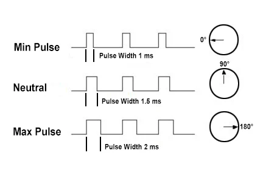

# Serwomechanizmy (PWM w praktyce)

W dziale o sygnałach analogowych nauczyłeś się regulować jasność diody LED za pomocą sygnału **PWM (Pulse Width Modulation)**. W tym rozdziale wykorzystamy ten sam sygnał w zupełnie innym celu – do precyzyjnego sterowania pozycją i ruchem elementów mechanicznych za pomocą **serwomechanizmu**.

Serwa modelarskie są powszechnie stosowane w robotyce (ramiona robotów, sterowanie kołami) oraz modelarstwie (sterowanie sterami w samolotach i łodziach).

---

## ⚙️ Jak działa serwomechanizm?

Standardowe serwo modelarskie (takie jak popularne mikro-serwo **SG90** w wersji 180°) nie obraca się bez końca jak zwykły silnik DC. Zamiast tego potrafi obrócić swój wał o określony kąt – najczęściej w zakresie **od 0° do 180°** (choć możesz się spotkać z serwami o zakresie 270°, a także serwami pracującymi w trybie ciągłym, które obracają się w nieskończoność) – i utrzymać zadaną pozycję pod obciążeniem.

Wewnątrz obudowy serwa kryje się mały silnik prądu stałego, przekładnia zębata, potencjometr (który mierzy aktualny kąt obrotu wału) oraz układ sterujący (komparator). 

### Kodowanie szerokością impulsu (PWM 50 Hz)

Sterowanie serwem odbywa się poprzez wysyłanie na przewód sygnałowy impulsu PWM o częstotliwości **50 Hz** (co odpowiada okresowi powtarzania sygnału wynoszącemu dokładnie **20 ms**). 

O pozycji wału decyduje **czas trwania stanu wysokiego (szerokość impulsu)** w każdym okresie:

* **Impuls ok. 1,0 ms** (1000 µs) ustawia wał w pozycji skrajnej lewej (**0°**).
* **Impuls ok. 1,5 ms** (1500 µs) ustawia wał w pozycji środkowej (**90°**).
* **Impuls ok. 2,0 ms** (2000 µs) ustawia wał w pozycji skrajnej prawej (**180°**).

{.center}

> [!WARNING] Rzeczywisty zakres impulsów dla tanich serw
> Teoretyczny standard czasów impulsów (1,0 ms – 2,0 ms) w przypadku tanich serw (np. SG90) w rzeczywistości często odbiega od normy i wynosi od ok. 0,5 ms (500 µs) do 2,4 ms (2400 µs). 
> Próba ustawienia kąta poza mechaniczne ograniczenia serwa (gdy silnik próbuje się przekręcić, ale blokuje go fizyczna zębatka) spowoduje głośne brzęczenie, pobór prądu rzędu kilkuset miliamperów, silne nagrzewanie i w konsekwencji szybkie uszkodzenie silnika. Zawsze dobieraj zakres bezpieczny dla konkretnego egzemplarza!

---

## 🔌 Podłączenie elektryczne i BHP serwa

Większość serw modelarskich wyprowadza trzy przewody w standardowych kolorach:

1. **Brązowy (lub czarny)**: Masa (GND) – łączymy z pinem `GND` mikrokontrolera.
2. **Czerwony**: Zasilanie (VCC) – łączymy z pinem `5V` (VBUS/USB).
3. **Pomarańczowy (lub żółty)**: Sygnał sterujący – łączymy z dowolnym wolnym GPIO (np. `GPIO2`).

> [!CAUTION] Zasilanie i prąd rozruchowy serwomechanizmów
> Silnik serwa w momencie startu lub pracy pod obciążeniem potrafi pobrać prąd o natężeniu **od 500 mA do nawet ponad 1 A**. 
> * **Nigdy** nie zasilaj serwa z pinu `3.3V` ESP32 – grozi to natychmiastowym przeciążeniem stabilizatora napięcia na płytce i restartem mikrokontrolera.
> * Zawsze podłączaj przewód czerwony do pinu `5V` (który jest bezpośrednio połączony z zasilaniem USB).
> * Przy sterowaniu większą liczbą serw (dwoma lub więcej) konieczne jest zastosowanie **zewnętrznego zasilacza 5V** (np. ładowarki USB), pamiętając o **wspólnym połączeniu mas (GND)** zewnętrznego zasilacza i mikrokontrolera.

---

## 💻 Sterowanie serwem w ESP32

Standardowa biblioteka `<Servo.h>` wbudowana w Arduino IDE została napisana pod architekturę AVR (np. Arduino Uno) i nie współpracuje z mikrokontrolerami ESP32. Na szczęście istnieje dedykowana biblioteka **ESP32Servo**, która sprzętowo konfiguruje kontroler PWM w układach ESP.

### Instalacja biblioteki
1. W Arduino IDE wybierz z menu po lewej stronie ikonę **Library Manager** (zarządzanie bibliotekami).
2. Wpisz w wyszukiwarkę **ESP32Servo** (autor: John K. Bennett).
3. Kliknij przycisk **Install**.

🎯 **[Otwórz Wokwi z układem wykorzystującym Serwomechanizm]** *(link zostanie zaktualizowany)*

### Kod: Cykliczny obrót (Sweep)

Poniższy kod realizuje płynny ruch wału serwa od 0 do 180 stopni i z powrotem:

```cpp
#include <ESP32Servo.h>

// Tworzymy obiekt reprezentujący nasze serwo
Servo moje_serwo;

// Deklarujemy pin sterujący
const int PIN_SERWA = 2; 

void setup() {
  // Przypisujemy pin do serwa oraz definiujemy zakres szerokości impulsów
  // dla standardowych mikroserw (SG90) to zazwyczaj 500 do 2400 mikrosekund
  moje_serwo.attach(PIN_SERWA, 500, 2400);
}

void loop() {
  // Ruch od 0 do 180 stopni:
  for (int kat = 0; kat <= 180; kat += 1) {
    moje_serwo.write(kat); // Ustawiamy serwo na zadany kąt
    delay(15);             // Czekamy chwilę, aby serwo zdążyło się obrócić
  }

  // Ruch z powrotem od 180 do 0 stopni:
  for (int kat = 180; kat >= 0; kat -= 1) {
    moje_serwo.write(kat);
    delay(15);
  }
}
```

> [!NOTE] Ciekawostka: Co się dzieje pod maską?
> Biblioteka `ESP32Servo` nie wykonuje opóźnień programowych do generowania impulsów. Pod spodem konfiguruje ona sprzętowy kontroler PWM (**LEDC** lub **MCPWM**) wbudowany w ESP32-C6. Generuje on sygnał całkowicie sprzętowo i asynchronicznie w tle – oznacza to, że raz ustawiony kąt będzie utrzymywany przez sprzęt bez udziału pętli `loop()`.

---

## 🛠️ Zadanie: Sterowanie pozycją serwa za pomocą potencjometru

Napisz program, który odczytuje wartość analogową z potencjometru i na tej podstawie płynnie ustawia kąt wychylenia wału serwomechanizmu.

### Wymagania:

1. Podłącz potencjometr do pinu analogowego (np. `GPIO0` - ADC1).
2. Odczytaj wartość napięcia (zakres ADC w ESP32-C6 to domyślnie 12 bitów, czyli wartości od `0` do `4095`).
3. Przeskaluj odczytaną wartość na zakres kątów pracy serwa (`0` do `180`) za pomocą funkcji `map()`.
4. Wyślij zmienioną wartość kąta do serwa.
5. Dodaj małe opóźnienie w pętli `loop()`, aby ustabilizować odczyty i ruch silnika.

<details>
<summary>Pokaż rozwiązanie</summary>

```cpp
#include <ESP32Servo.h>

Servo moje_serwo;

const int PIN_POTENCJOMETRU = 0; // GPIO0 (ADC)
const int PIN_SERWA = 2;         // GPIO2 (PWM)

void setup() {
  moje_serwo.attach(PIN_SERWA, 500, 2400);
  pinMode(PIN_POTENCJOMETRU, INPUT);
}

void loop() {
  // Odczyt z potencjometru (0 - 4095)
  int wartosc_adc = analogRead(PIN_POTENCJOMETRU);

  // Zmapowanie zakresu ADC na kąt obrotu serwa (0 - 180)
  int kat = map(wartosc_adc, 0, 4095, 0, 180);

  // Ustawienie pozycji serwa
  moje_serwo.write(kat);

  // Krótkie opóźnienie na ustabilizowanie pozycji serwa i przetwornika ADC
  delay(20);
}
```

</details>
