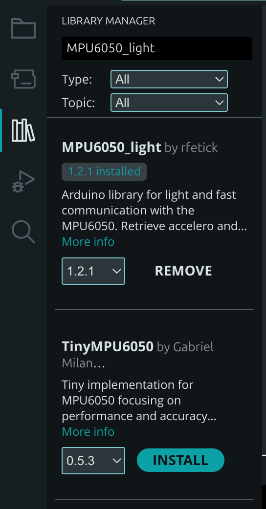

# Ćwiczenie 7 – I2C: czujnik MPU6050

**Potrzebujesz:** 🔌 Moduł MPU6050, breadboard, przewody jumper.

Gdy chcemy podłączyć zaawansowany czujnik cyfrowy, używamy magistrali **I2C**. Wystarczą tylko dwa przewody sygnałowe i można podłączyć wiele urządzeń jednocześnie.

---

## Magistrala I2C

I2C (*Inter-Integrated Circuit*) to dwuprzewodowa magistrala synchroniczna:

- **SDA** (*Serial Data*) – linia przesyłania danych
- **SCL** (*Serial Clock*) – linia zegarowa synchronizująca transmisję

Każde urządzenie na magistrali ma **unikalny adres** (7-bitowy). Master (ESP32) inicjuje komunikację i kieruje ją do konkretnego Slave po adresie. Na jednym SDA/SCL może pracować **wiele urządzeń** naraz.

---

## Podłączenie MPU6050

MPU6050 to moduł zawierający 3-osiowy akcelerometr i 3-osiowy żyroskop. Używany m.in. w dronach do stabilizacji lotu.

```
MPU6050    ESP32-C6 DevKit
────────────────────────────
VCC   ──── 3V3
GND   ──── GND
SDA   ──── GPIO6 (lub inny GPIO, zmień w kodzie)
SCL   ──── GPIO7 (lub inny GPIO, zmień w kodzie)
```

> [!IMPORTANT] Napięcie zasilania
> Moduł MPU6050 zasilaj z pinu **3V3** (3,3 V) – nie z 5V! ESP32-C6 pracuje na 3,3 V i wrażliwy na wyższe napięcia na pinach I2C.

---

## Instalacja biblioteki

1. W Arduino IDE: **Szkic → Dołącz bibliotekę → Zarządzaj bibliotekami…**
2. Wyszukaj: `MPU6050_light` (autor: rfetick)
3. Kliknij **Zainstaluj**

{ width="60%" }

---

## Kod: odczyt kątów nachylenia

```cpp
#include <Wire.h>
#include <MPU6050_light.h>

// Zmień piny na te, do których podłączyłeś SDA i SCL
const int I2C_SDA = 6;
const int I2C_SCL = 7;

MPU6050 mpu(Wire);

void setup() {
  Serial.begin(115200);

  // Inicjalizacja magistrali I2C na wybranych pinach
  Wire.begin(I2C_SDA, I2C_SCL);

  Serial.println("Inicjalizacja MPU6050...");
  byte status = mpu.begin();

  if (status != 0) {
    Serial.println("Błąd połączenia z MPU6050! Sprawdź połączenia i adres.");
    while (1); // Zatrzymaj program przy błędzie
  }

  Serial.println("Czujnik wykryty! Nie ruszaj płytką – trwa kalibracja...");
  delay(1000);
  mpu.calcOffsets(); // Kalibracja wg aktualnego położenia
  Serial.println("Kalibracja zakończona!");
}

void loop() {
  mpu.update(); // Odczytaj nowe dane z czujnika

  Serial.print("Kąt X: ");
  Serial.print(mpu.getAngleX());
  Serial.print("°\tKąt Y: ");
  Serial.print(mpu.getAngleY());
  Serial.println("°");

  delay(100);
}
```

> [!TIP] Szukanie adresu I2C
> Jeśli czujnik nie jest wykrywany, użyj skanera I2C, aby sprawdzić jego adres:
> ```cpp
> #include <Wire.h>
> void setup() {
>   Wire.begin(6, 7); Serial.begin(115200);
>   for (int addr = 1; addr < 127; addr++) {
>     Wire.beginTransmission(addr);
>     if (Wire.endTransmission() == 0)
>       Serial.printf("Znaleziono urządzenie pod adresem: 0x%02X\n", addr);
>   }
> }
> void loop() {}
> ```

---

## Zadanie do samodzielnego wykonania: wykrywacz wstrząsów

Biblioteka udostępnia metody `mpu.getAccX()`, `mpu.getAccY()`, `mpu.getAccZ()` (wartość `1.0` = 1g, standardowe przyspieszenie ziemskie).

Napisz program, który:
1. W pętli `loop()` sprawdza, czy przyspieszenie w osi X lub Y przekroczyło próg **2.0** (gwałtowny wstrząs).
2. Jeśli wstrząs zostanie wykryty, zapala diodę LED i wyświetla `"WSTRZĄS WYKRYTY!"` w Serial.
3. Dioda pozostaje zapalona aż do restartu płytki.
