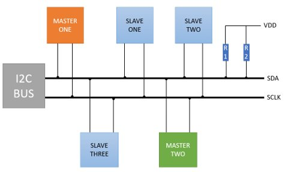
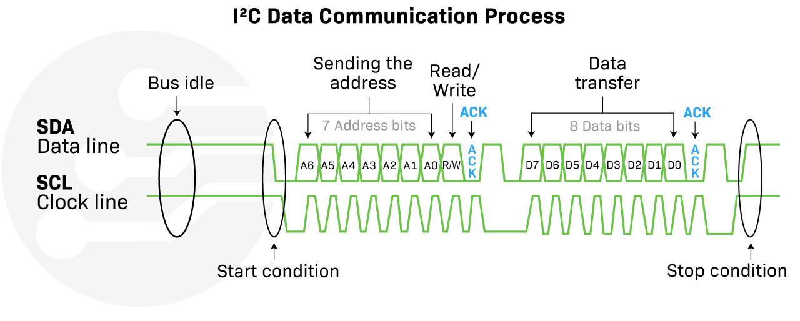

# Magistrala I<sup>2</sup>C: komunikacja z akcelerometrem

**I<sup>2</sup>C** (*Inter-Integrated Circuit*, wymawiane jako *I-kwadrat-C*) to synchroniczna, dwuprzewodowa magistrala szeregowa. Służy do łatwego i wygodnego podłączania prostych układów scalonych oraz czujników (np. temperatury, ciśnienia, akcelerometrów czy zegarów RTC) przesyłających niewielkie ilości danych. Umożliwia to realizację lokalnej komunikacji na krótkich dystansach – najczęściej w obrębie tej samej płytki drukowanej (PCB) – przy minimalnym obciążeniu linii GPIO mikrokontrolera.

Komunikacja opiera się na dwóch liniach sygnałowych:

* **SDA** (*Serial Data*) – linia danych służąca do dwukierunkowej transmisji.
* **SCL** (*Serial Clock*) – linia zegarowa synchronizująca transmisję bitów (generowana zawsze przez kontroler).

---

## 🔌 Charakterystyka fizyczna I<sup>2</sup>C: Konfiguracja Otwartych Drenów i Pull-Up

Jedną z najważniejszych cech I<sup>2</sup>C jest konstrukcja wyjść stopni elektrycznych urządzeń. Pracują one w konfiguracji **otrawtego drenu** (Open-Drain). Oznacza to, że żadne urządzenie nie potrafi aktywnie wymusić na magistrali stanu wysokiego ($3.3\text{ V}$). Układy mogą jedynie "ściągać" linię do masy ($0\text{ V}$), zwierając ją wewnętrznym tranzystorem.

Z tego powodu magistrala I<sup>2</sup>C wymaga zastosowania zewnętrznych **rezystorów podciągających (Pull-Up)** podłączonych między liniami SDA/SCL a zasilaniem VCC.

{.center}

#### Dlaczego zastosowano otwarty dren?
1. **Unikanie zwarć (Bus Contention)**: Gdyby jedno urządzenie próbowało ustawić stan wysoki (3.3V), a drugie stan niski (0V), doszłoby do zwarcia linii zasilania z masą. W konfiguracji Open-Drain, jeśli dwa układy nadają jednocześnie, stanem dominującym jest LOW (0V), co chroni mikrokontroler przed uszkodzeniem.
2. **Dwukierunkowość**: Ta sama linia SDA służy zarówno do nadawania, jak i odbierania danych.
3. **Kompatybilność napięciowa**: Układy o różnych napięciach zasilania (np. 3.3V i 5V) mogą bezpiecznie współpracować, pod warunkiem podciągnięcia rezystorów do niższego z napięć (zgodnie z tolerancją wejść).

> [!TIP] Wartość rezystorów Pull-Up
> Zazwyczaj stosuje się rezystory o wartości od $2.2\ \text{k}\Omega$ do $10\ \text{k}\Omega$. Mniejsze rezystory (np. $2.2\ \text{k}\Omega$) pozwalają na szybsze ładowanie pojemności pasożytniczej linii (szybsze zbocza narastające), co jest wymagane przy wysokich prędkościach (400 kHz) lub długich przewodach. Warto pamiętać, że gotowe moduły z czujnikami (np. płytki breakout z MPU6050) bardzo **często posiadają już fabrycznie wbudowane rezystory podciągające** na liniach SDA i SCL, dlatego w większości praktycznych projektów z gotowymi modułami **nie ma potrzeby dokładania dodatkowych rezystorów**.

---

## 📊 Logika I<sup>2</sup>C: Anatomia Transmisji

Transmisja danych w I<sup>2</sup>C opiera się na określonych stanach logicznych i sekwencjach:

1. **Warunek START (S)**: Linia SDA zmienia stan z wysokiego na niski, podczas gdy linia SCL znajduje się w stanie wysokim. Sygnalizuje to początek transmisji.
2. **Ważność danych**: Poza warunkami START i STOP, stan linii SDA musi być stabilny przez cały czas trwania stanu wysokiego linii SCL. Zmiany na linii danych mogą odbywać się tylko wtedy, gdy sygnał zegarowy SCL ma stan niski.
3. **Adresowanie i Bit R/W**: Kontroler wysyła najpierw 7-bitowy adres urządzenia (np. `0x68` dla czujnika MPU6050) oraz 8. bit określający kierunek: zapis (`0` - Write) lub odczyt (`1` - Read).
4. **Potwierdzenie ACK/NACK**: Po przesłaniu każdego bajtu (8 bitów), odbiorca musi potwierdzić jego odebranie. W dziewiątym takcie zegara odbiorca ściąga linię SDA do stanu niskiego (**ACK** - *Acknowledge*). Jeśli linia pozostanie wysoka, oznacza to brak potwierdzenia (**NACK** - *Not Acknowledge*).
5. **Warunek STOP (P)**: Linia SDA przechodzi ze stanu niskiego do wysokiego, podczas gdy linia SCL jest w stanie wysokim. Sygnalizuje to koniec transmisji.

{ align=center }

#### Prędkości pracy (I2C Speed Modes):

* **Standard Mode**: do $100\text{ kb/s}$
* **Fast Mode**: do $400\text{ kb/s}$ (najbardziej powszechny standard)
* **Fast Mode Plus (Fm+)**: do $1\text{ Mb/s}$

---

## 📦 Obsługa sprzętowa w ESP32-C6

Układ ESP32-C6 wyposażony jest w **dedykowany sprzętowy kontroler I<sup>2</sup>C**. Dzięki matrycy **GPIO Matrix**, linie SDA oraz SCL mogą być przypisane do dowolnych pinów GPIO. Kontroler sprzętowo realizuje całą maszynę stanów protokołu I<sup>2</sup>C (generowanie START, STOP, wysyłanie adresu, automatyczna weryfikacja bitów ACK).  

---

## 🎯 Ćwiczenie Praktyczne: Akcelerometr MPU6050

[**Link do symulacji w Wokwi**](https://wokwi.com/projects/464856436584059905){: style="display: block; text-align: center;" }

W tym ćwiczeniu użyjemy modułu czujnika inercyjnego **MPU6050** (zawierającego 3-osiowy akcelerometr i 3-osiowy żyroskop), komunikującego się za pomocą I2C.

> [!NOTE] Instalacja biblioteki
> Do obsługi MPU6050 wykorzystamy gotową bibliotekę **MPU6050_light** autorstwa *rfetick*. Instrukcja instalacji (krok po kroku) znajduje się [tutaj](../podstawy/serwa.md#instalacja-biblioteki-esp32servo).

### Kod programu: Odczyt orientacji
Wgraj poniższy program na płytkę. Wykonuje on automatyczną kalibrację czujnika przy uruchomieniu (żyroskop musi leżeć nieruchomo!), a następnie wypisuje kąty pochylenia na port szeregowy.

```cpp
#include <Wire.h>           // Biblioteka zarządzająca sprzętowym I2C
#include <MPU6050_light.h>  // Biblioteka obsługująca czujnik MPU6050

const int I2C_SDA = 6;
const int I2C_SCL = 7;

MPU6050 mpu(Wire);

void setup() {
  Serial.begin(115200);

  // Inicjalizacja magistrali I2C na zdefiniowanych pinach
  Wire.begin(I2C_SDA, I2C_SCL);

  Serial.println("Szukam czujnika MPU6050...");
  byte status = mpu.begin();

  if (status != 0) {
    Serial.println("Błąd połączenia z MPU6050. Sprawdź okablowanie i zasilanie.");
    while (1); // Zatrzymanie programu w nieskończonej pętli
  }

  Serial.println("Nie ruszaj układem – kalibruję...");
  delay(1000);
  mpu.calcOffsets(); // Obliczenie offsetów (zerowanie wskazań żyroskopu)
  Serial.println("Kalibracja zakończona pomyślnie!");
}

void loop() {
  mpu.update(); // Pobranie nowej ramki danych z czujnika I2C

  Serial.print("Kąt X: ");
  Serial.print(mpu.getAngleX());
  Serial.print("°\tKąt Y: ");
  Serial.println(mpu.getAngleY());

  delay(100); // Odczyt co 100 ms
}
```

---

## 🛠️ Zadanie: Wykrywacz wstrząsów

Zamiast odczytywać kąt pochylenia (który bazuje na fuzji danych z żyroskopu i akcelerometru), napisz aplikację reagującą na nagły ruch (wstrząs).
1. Zamiast metody `.getAngleX()`, użyj metody `.getAccX()` zwracającej przyspieszenie liniowe w osi X (mierzone w jednostkach przyspieszenia ziemskiego $G$, gdzie $1.0\text{ G} \approx 9.81\text{ m/s}^2$).
2. Skonfiguruj pin `GPIO2` jako wyjście dla wbudowanej diody LED.
3. Jeśli przyspieszenie w osi X przekroczy próg wstrząsu (wartość bezwzględna $|a_x| > 2.0\text{ G}$), włącz diodę LED i wyświetl ostrzeżenie na porcie szeregowym. Pamiętaj, że wstrząs może nastąpić w obu kierunkach osi X (przyspieszenie ujemne lub dodatnie).

<details>
<summary>Pokaż rozwiązanie zadania</summary>

```cpp
#include <Wire.h>
#include <MPU6050_light.h>

const int I2C_SDA = 6;
const int I2C_SCL = 7;
const int PIN_LED = 2; 

MPU6050 mpu(Wire);

void setup() {
  Serial.begin(115200);
  pinMode(PIN_LED, OUTPUT);
  Wire.begin(I2C_SDA, I2C_SCL);
  
  if (mpu.begin() != 0) {
    Serial.println("Błąd MPU6050!");
    while(1);
  }
  
  Serial.println("Kalibracja...");
  delay(1000);
  mpu.calcOffsets(); 
}

void loop() {
  mpu.update(); 

  // Pobranie wartości przyspieszenia liniowego w jednostkach G
  float przeciazenieX = mpu.getAccX();
  
  // Wykrycie wstrząsu (wartość bezwzględna większa niż 2.0 G)
  if (przeciazenieX > 2.0 || przeciazenieX < -2.0) {
      digitalWrite(PIN_LED, HIGH);
      Serial.print("WSTRZĄS DETEKCJA! Akceleracja X: ");
      Serial.print(przeciazenieX);
      Serial.println(" G");
  } else {
      digitalWrite(PIN_LED, LOW);
  }

  delay(10);
}
```
</details>
