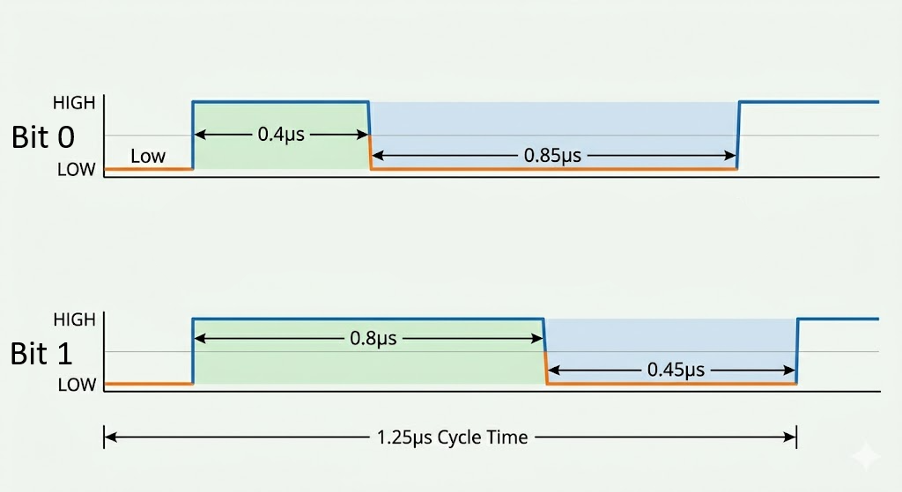

# Transmisja jednoprzewodowa: dioda ARGB (WS2812B)

W systemach wbudowanych stosuje się także protokoły przesyłu danych za pomocą **tylko jednego przewodu sygnałowego** (oraz wspólnej linii masy GND).

W tym rozdziale skupimy się na specyficznym, niezwykle popularnym protokole służącym do obsługi inteligentnych diod ARGB (WS2812B / NeoPixel), w które między innymi fabrycznie wyposażona jest nasza płytka deweloperska.

> [!NOTE] 1-Wire vs Single-Wire
> Choć pojęcia te bywają potocznie używane zamiennie, oznaczają dwa różne standardy:
> * **Dallas 1-Wire** – dwukierunkowa, relatywnie wolna magistrala z unikalnym 64-bitowym adresowaniem sprzętowym każdego układu, używana głownie do czujników (np. popularnego czujnika temperatury DS18B20).
> * **Custom Single-Wire (NZR)** – jednokierunkowy, szybki protokół kaskadowy bez sprzętowego adresowania, stosowany wyłącznie do sterowania matrycami i paskami LED (np. WS2812B). To właśnie nim zajmiemy się w tej lekcji.

---

## 🔌 Charakterystyka fizyczna

Protokół sterowania diodami WS2812B opiera się na szybkim przesyłaniu cyfrowego sygnału napięciowego w trybie **simplex** (tylko w jedną stronę: od kontrolera do odbiorników). 

Fizyczna struktura takiego układu opiera się na inteligentnych diodach. Dioda WS2812B (zazwyczaj w obudowie SMD 5050) nie jest zwykłą diodą LED. W jej wnętrzu zintegrowano:

1. **Trzy diody LED**: Czerwoną (R), Zieloną (G) i Niebieską (B).
2. **Układ scalony (kontroler)**: Odpowiada za odczyt i dekodowanie cyfrowego sygnału oraz sterowanie jasnością poszczególnych barw poprzez PWM.

### Kaskadowe łączenie i "adresowanie"
Transmisja nie używa fizycznych adresów jak I<sup>2</sup>C. Zamiast tego adresowanie odbywa się **geometrycznie**. 
Sygnał z mikrokontrolera trafia najpierw do pinu wejściowego **DI** (*Data In*) pierwszej diody w łańcuchu. Układ scalony tej diody "odcina" dla siebie pierwszy pakiet danych (swój kolor), a całą resztę przesyła dalej ze swojego pinu wyjściowego **DO** (*Data Out*) prosto do pinu **DI** kolejnej diody. Dzięki temu można sterować łańcuchem setek diod używając zaledwie jednego pinu w ESP32.

---

## 📊 Charakterystyka logiczna (Anatomia transmisji)

Z powodu braku dodatkowej linii zegarowej (SCLK), odbiorniki muszą odzyskiwać informację o czasie z samego sygnału danych. Protokół wykorzystuje standard **NZR** (*Non-Return-to-Zero*), w którym informacja o stanie logicznym bitu jest kodowana **czasem trwania** stanu wysokiego ($T_H$) i niskiego ($T_L$) w jednym, stałym cyklu bitowym.

Każda dioda oczekuje ramki składającej się z 24 bitów (po 8 bitów na składową koloru, co daje 24-bitową głębię kolorów, czyli 16,7 miliona barw). Bity zazwyczaj ułożone są w kolejności GRB (Zielony, Czerwony, Niebieski).

### Kodowanie impulsów czasowych:

* **Bit `0`**: krótki stan wysoki ($T_{0H} \approx 0.4\ \mu\text{s}$), po którym następuje długi stan niski ($T_{0L} \approx 0.85\ \mu\text{s}$).
* **Bit `1`**: długi stan wysoki ($T_{1H} \approx 0.8\ \mu\text{s}$), po którym następuje krótki stan niski ($T_{1L} \approx 0.45\ \mu\text{s}$).
* **Sygnał resetu (Zatrzask)**: utrzymanie stanu niskiego przez czas dłuższy niż $50\ \mu\text{s}$ powoduje zakończenie transmisji ramki. Układy scalone zatrzaskują wtedy odcięte dane w swoich rejestrach, co skutkuje natychmiastową, jednoczesną aktualizacją kolorów w całym łańcuchu.

{: .center }

---

## 📦 Obsługa sprzętowa w ESP32-C6

Ponieważ czasy trwania impulsów muszą być dotrzymane z dokładnością do kilkudziesięciu nanosekund, generowanie takiego sygnału programowo (*bit-banging* poprzez szybkie włączanie/wyłączanie pinu w kodzie) jest trudne i mocno obciąża procesor. Każde przerwanie systemowe zakłóciłoby strukturę czasową ramki, powodując migotanie diod lub błędne kolory.

Aby temu zapobiec, układy ESP32-C6 wykorzystują wbudowane bloki sprzętowe:

* **RMT (Remote Control)**: Nadajnik podczerwieni, który potrafi sprzętowo generować precyzyjne przebiegi czasowe na podstawie zdefiniowanych czasów trwania stanów wysokich i niskich.
* **SPI**: Wykorzystuje wysyłanie odpowiednio uformowanych bajtów danych z dużą częstotliwością tak, aby sekwencje bitów na linii MOSI udawały impulsy o szerokościach wymaganych przez WS2812B.

---

## 🎯 Ćwiczenie praktyczne: Wbudowana dioda ARGB

[**Link do symulacji w Wokwi**](https://wokwi.com/projects/464857174120989697){: style="display: block; text-align: center;" }

Standardowa płytka deweloperska **ESP32-C6 DevKit** posiada wbudowaną adresowalną diodę RGB podłączoną wewnętrznie do pinu **GPIO8**. 

Do jej obsłużenia wykorzystamy najpopularniejszą bibliotekę **Adafruit NeoPixel**.

> [!NOTE] Instalacja biblioteki
> W Arduino IDE wybierz z menu górnego **Szkic -> Dołącz bibliotekę -> Zarządzaj bibliotekami**. Wpisz w polu wyszukiwania **Adafruit NeoPixel** i zainstaluj najnowszą wersję.

### Kod programu: Cykliczna zmiana kolorów
Wgraj poniższy program na swoją płytkę. Program kolejno zapala diodę w kolorach podstawowych (Czerwony, Zielony, Niebieski).

```cpp
#include <Adafruit_NeoPixel.h>

#define PIN_LED      8  // Pin, do którego podłączona jest wbudowana dioda RGB
#define NUM_PIXELS   1  // Liczba diod w łańcuchu (wbudowana jest tylko jedna)

// Konfiguracja obiektu diody:
// - NUM_PIXELS: liczba diod
// - PIN_LED: pin sygnałowy
// - NEO_GRB + NEO_KHZ800: kolejność kolorów w ramce (GRB) i częstotliwość (800 kHz)
Adafruit_NeoPixel led(NUM_PIXELS, PIN_LED, NEO_GRB + NEO_KHZ800);

void setup() {
  led.begin();            // Inicjalizacja linii danych
  led.setBrightness(30);  // Ograniczenie jasności (zakres 0-255). Wbudowane diody świecą bardzo mocno!
}

void loop() {
  // Ustawienie koloru czerwonego (R=255, G=0, B=0)
  led.setPixelColor(0, led.Color(255, 0, 0));
  led.show();             // Wysłanie danych i aktualizacja fizycznego stanu diody
  delay(1000);

  // Ustawienie koloru zielonego (R=0, G=255, B=0)
  led.setPixelColor(0, led.Color(0, 255, 0));
  led.show();
  delay(1000);

  // Ustawienie koloru niebieskiego (R=0, G=0, B=255)
  led.setPixelColor(0, led.Color(0, 0, 255));
  led.show();
  delay(1000);
}
```

---

### 🛠️ Zadanie: Płynne "oddychanie" diody (Breathing Effect)
Napisz program, w którym wbudowana dioda płynnie rozjaśnia się i ściemnia (np. w kolorze fioletowym – kombinacja czerwonego i niebieskiego). Wykorzystaj pętle `for` oraz metodę `led.setBrightness(wartość)` do regulowania jasności świecenia diody. 

Pamiętaj, by po każdej zmianie jasności wywołać metodę `led.show()`, a maksymalna jasność nie przekraczała `100` ze względów bezpieczeństwa dla oczu.

<details>
<summary>Pokaż rozwiązanie</summary>

```cpp
#include <Adafruit_NeoPixel.h>

#define PIN_LED      8
#define NUM_PIXELS   1

Adafruit_NeoPixel led(NUM_PIXELS, PIN_LED, NEO_GRB + NEO_KHZ800);

void setup() {
  led.begin();
  // Ustawiamy stałą barwę (fioletowy: R=128, G=0, B=128)
  led.setPixelColor(0, led.Color(128, 0, 128));
}

void loop() {
  // Płynne rozjaśnianie:
  for (int jasnosc = 0; jasnosc <= 100; jasnosc++) {
    led.setBrightness(jasnosc);
    led.show();
    delay(10);
  }

  // Płynne ściemnianie:
  for (int jasnosc = 100; jasnosc >= 0; jasnosc--) {
    led.setBrightness(jasnosc);
    led.show();
    delay(10);
  }
}
```

</details>
