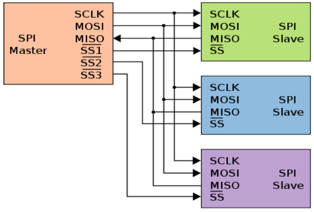
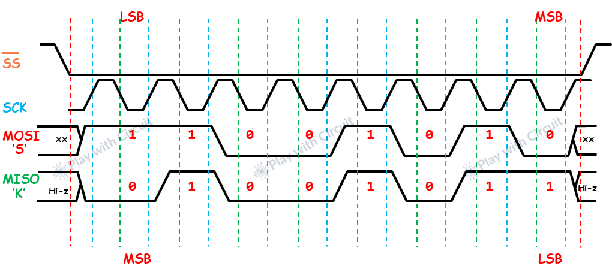

# Magistrala SPI: obsługa wyświetlacza TFT

Magistrala I<sup>2</sup>C, choć bardzo oszczędna pod kątem wyprowadzeń, posiada poważne ograniczenie: prędkość. Przy przesyłaniu dużych ilości danych, takich jak całe ramki obrazu dla kolorowych wyświetlaczy graficznych czy dane z kart pamięci SD, I<sup>2</sup>C okazuje się zbyt wolne. Rozwiązaniem tego problemu jest standard **SPI**.

**SPI** (*Serial Peripheral Interface*) to szybki, synchroniczny interfejs komunikacyjny pracujący w trybie **Full-Duplex** (pełen dupleks). Wymaga większej liczby przewodów (zazwyczaj 4 linie sygnałowe), lecz dzięki aktywnemu sterowaniu wyjściami (**Push-Pull**) oraz sprzętowemu adresowaniu pozwala osiągać prędkości rzędu kilkudziesięciu megabitów na sekundę (MHz).

---

## 🔌 Charakterystyka fizyczna SPI: Aktywne Sterowanie Push-Pull

W przeciwieństwie do otwartego drenu stosowanego w standardzie I<sup>2</sup>C, linie danych SPI są sterowane aktywnie w konfiguracji **Push-Pull** (symetryczne stopnie wyjściowe tranzystorowe, które aktywnie wymuszają na linii zarówno stan niski $0\text{ V}$, jak i wysoki $3.3\text{ V}$).

* **Zaleta**: Bardzo krótkie czasy narastania i opadania sygnału, co umożliwia stabilne taktowanie zegarem o częstotliwościach nawet $40\text{ MHz} - 80\text{ MHz}$.
* **Wada**: Brak możliwości łączenia wielu wyjść ze sobą bez użycia dedykowanej linii wyboru odbiornika.

#### Cztery linie sygnałowe SPI:

* **SCK** (*Serial Clock*) – sygnał zegarowy generowany przez mikrokontroler.
* **MOSI** (*Master Out Slave In*) – dane przesyłane z mikrokontrolera do odbiornika.
* **MISO** (*Master In Slave Out*) – dane przesyłane z odbiornika do mikrokontrolera.
* **CS / SS** (*Chip Select / Slave Select*) – linia wyboru odbiornika. Zazwyczaj stan aktywny to stan niski (LOW). Gdy linia CS jest w stanie wysokim (HIGH), odbiornik ignoruje sygnały na magistrali i odłącza swoją linię MISO w stan wysokiej impedancji (Hi-Z), umożliwiając innym układom korzystanie z tych samych linii danych.

{ align=center }

---

## 📊 Charakterystyka logiczna (Anatomia transmisji)

Komunikacja SPI opiera się na ciągłym przesuwaniu bitów w rejestrach przesuwnych Mastera i Slave'a (tworząc zamkniętą pętlę kołową). Aby poprawnie zsynchronizować transmisję, oba urządzenia muszą korzystać z tej samej konfiguracji parametrów czasowych sygnału.

{ align=center }

### Krok po kroku: Jak przebiega ramka?

1. **Wybór układu (CS -> LOW)**: Transmisja rozpoczyna się od ustawienia przez Mastera linii **CS** (*Chip Select*) wybranego układu Slave w stan niski. Aktywuje to interfejs wyjściowy Slave'a (w tym linię MISO).
2. **Generowanie taktowania (SCK)**: Master rozpoczyna generowanie impulsów zegarowych na linii **SCK**. Z każdym impulsem następuje przesłanie 1 bitu danych.
3. **Przesuwanie danych (MOSI / MISO)**: Dane są jednocześnie wystawiane na liniach **MOSI** (przez Mastera) i **MISO** (przez Slave'a) i zatrzaskiwane po stronie odbiornika. Najczęściej bity są przesyłane poczynając od najstarszego (**MSB First**).
4. **Zakończenie ramki (CS -> HIGH)**: Po przesłaniu określonej liczby bitów (zwykle wielokrotności 8, np. 1 bajt), Master kończy generowanie zegara SCK i ustawia linię **CS** w stan wysoki. Slave przechodzi wtedy w stan uśpienia, a linia MISO wraca do stanu wysokiej impedancji.

### Tryby pracy SPI (SPI Modes)
W zależności od konfiguracji sygnału zegarowego, wyróżnia się cztery tryby pracy SPI. Definiują je dwa parametry:

* **CPOL** (*Clock Polarity*) – określa stan linii zegara w spoczynku:

    * `CPOL = 0` – zegar w spoczynku ma stan niski (LOW).
    * `CPOL = 1` – zegar w spoczynku ma stan wysoki (HIGH).
* **CPHA** (*Clock Phase*) – określa, na którym zboczu zegara następuje odczyt (próbkowanie) danych:

    * `CPHA = 0` – dane są próbkowane na pierwszym zboczu zegara (zboczu aktywnym).
    * `CPHA = 1` – dane są próbkowane na drugim zboczu zegara (zboczu powrotnym).

| Tryb SPI | CPOL | CPHA | Próbkowanie danych | Stan zegara w spoczynku |
| :---: | :---: | :---: | :--- | :--- |
| **Mode 0** | 0 | 0 | Pierwsze zbocze (narastające) | Niski (LOW) |
| **Mode 1** | 0 | 1 | Drugie zbocze (opadające) | Niski (LOW) |
| **Mode 2** | 1 | 0 | Pierwsze zbocze (opadające) | Wysoki (HIGH) |
| **Mode 3** | 1 | 1 | Drugie zbocze (narastające) | Wysoki (HIGH) |

---

## 📦 Obsługa sprzętowa w ESP32-C6

ESP32-C6 integruje w sobie kontrolery SPI. Jeden z nich jest zarezerwowany dla komunikacji z wewnętrzną/zewnętrzną pamięcią Flash (SPI0/SPI1), natomiast drugi (**SPI2 / General Purpose SPI**) jest w pełni dostępny dla użytkownika. Może on pracować z taktowaniem do $80\text{ MHz}$, a jego piny mogą być dowolnie mapowane za pomocą GPIO Matrix.

---

## 🎯 Ćwiczenie praktyczne: Wyświetlacz TFT ILI9341

W tym ćwiczeniu użyjemy wyświetlacza graficznego TFT (320x240 pikseli, kolor 16-bit RGB) sterowanego układem **ILI9341**.

Ponieważ ekran jedynie przyjmuje dane o kolorach pikseli i nie odsyła informacji zwrotnych do ESP32, nie podłączamy linii MISO. Dodatkowo wyświetlacz wymaga dwóch pinów pomocniczych:

* **RESET (RES)** – służący do sprzętowego resetu sterownika ekranu.
* **Data/Command (D/C)** – określa typ wysyłanych danych: stan niski (LOW) oznacza komendę konfiguracyjną, a wysoki (HIGH) przesyłanie pikseli obrazu.
* **LED** - pin odpowiedzialny za podświetlenie wyświetlacza - logiczna 1 oznacza włączenie podświetlenia.

[**Link do symulacji w Wokwi**](https://wokwi.com/projects/464856960830135297){: style="display: block; text-align: center;" }

> [!NOTE] Instalacja biblioteki
> W Arduino IDE pobierz i zainstaluj z Menedżera Bibliotek dwie pozycje: **Adafruit GFX Library** (podstawowe rysowanie kształtów) oraz **Adafruit ILI9341** (sterownik konkretnego ekranu). Instrukcja instalacji (krok po kroku) znajduje się [tutaj](../podstawy/serwa.md#instalacja-biblioteki-esp32servo).

### Kod programu: Animowany pasek postępu
Poniższy kod konfiguruje ekran SPI i w pętli `loop` rysuje przesuwający się biały pasek. W przeciwieństwie do małych ekranów monochromatycznych, sterownik ILI9341 zapisuje piksele bezpośrednio do pamięci GRAM wyświetlacza – każda funkcja rysująca natychmiast zmienia stan fizyczny matrycy, bez konieczności wywoływania metody `display()`.

```cpp
#include <SPI.h>
#include <Adafruit_GFX.h>
#include <Adafruit_ILI9341.h>

#define TFT_SCK   6
#define TFT_MOSI  7
#define TFT_RES   4
#define TFT_DC    3
#define TFT_CS    2
#define TFT_MISO -1 // Brak linii MISO

// Inicjalizacja programowego/sprzętowego sterownika ekranu:
Adafruit_ILI9341 tft = Adafruit_ILI9341(TFT_CS, TFT_DC, TFT_MOSI, TFT_SCK, TFT_RES, TFT_MISO);

void setup() {
  Serial.begin(115200);

  tft.begin();
  tft.setRotation(1); // Orientacja pozioma (szerokość 320, wysokość 240)

  // Wyczyszczenie całego ekranu kolorem czarnym
  tft.fillScreen(ILI9341_BLACK);
  
  // Rysowanie tekstu
  tft.setTextSize(2);                  // Ustawienie wielkości czcionki
  tft.setTextColor(ILI9341_WHITE);    // Kolor czcionki
  tft.setCursor(10, 10);              // Współrzędne (X, Y)
  tft.println("ESP32-C6");
  
  tft.setTextSize(1);
  tft.setCursor(10, 35);
  tft.println("Kurs Arduino SPI (ILI9341)");
}

void loop() {
   static int szerokoscPaska = 0;
   szerokoscPaska++;
   
   // Nadpisanie poprzedniego obszaru paska kolorem czarnym (czyszczenie lokalne)
   tft.fillRect(10, 50, 300, 15, ILI9341_BLACK);
   
   // Rysowanie nowej szerokości paska (szerokość maksymalna to 300 px)
   tft.fillRect(10, 50, (szerokoscPaska % 300), 15, ILI9341_WHITE);
   
   delay(10);
}
```

---

## 🛠️ Zadanie: Integracja czujnika i wyświetlacza

Zbuduj miniaturowy system pomiarowy:

1. Połącz kody dla czujnika **MPU6050 (I<sup>2</sup>C)** oraz wyświetlacza **TFT ILI9341 (SPI)**.
2. Odczytuj w pętli `loop` wartości kątów pochylenia w osiach X i Y co 100 ms.
3. Wyświetlaj te wartości w czytelny sposób na ekranie TFT.
4. *Wskazówka optymalizacyjna*: Czyszczenie całego ekranu (`fillScreen`) przy każdym odczycie spowoduje silne migotanie tekstu ze względu na ograniczony czas transmisji. Zamiast tego czyść tylko obszar tekstu z wartością liczbową (np. rysując czarny prostokąt pod tekstem) lub nadpisuj stary tekst nowym kolorem czarnym przed wypisaniem nowej wartości.

<details>
<summary>Pokaż rozwiązanie</summary>

```cpp
#include <Wire.h>
#include <SPI.h>
#include <MPU6050_light.h>
#include <Adafruit_GFX.h>
#include <Adafruit_ILI9341.h>

// Definicje pinów I2C
const int I2C_SDA = 6;
const int I2C_SCL = 7;

// Definicje pinów SPI
#define TFT_SCK   6
#define TFT_MOSI  7
#define TFT_RES   4
#define TFT_DC    3
#define TFT_CS    2
#define TFT_MISO -1

MPU6050 mpu(Wire);
Adafruit_ILI9341 tft = Adafruit_ILI9341(TFT_CS, TFT_DC, TFT_MOSI, TFT_SCK, TFT_RES, TFT_MISO);

void setup() {
  Serial.begin(115200);
  
  // Uruchomienie I2C i SPI
  Wire.begin(I2C_SDA, I2C_SCL);
  tft.begin();
  tft.setRotation(1);
  tft.fillScreen(ILI9341_BLACK);
  
  tft.setTextSize(2);
  tft.setTextColor(ILI9341_WHITE);
  tft.setCursor(10, 10);
  tft.println("MONITOR MPU6050");
  
  if (mpu.begin() != 0) {
    tft.setTextColor(ILI9341_RED);
    tft.println("Blad MPU6050!");
    while(1);
  }
  
  tft.println("Kalibracja...");
  delay(1000);
  mpu.calcOffsets();
  tft.fillScreen(ILI9341_BLACK); // Ostateczne wyczyszczenie
}

void loop() {
  mpu.update();
  
  // Pobranie danych
  float katX = mpu.getAngleX();
  float katY = mpu.getAngleY();
  
  // Czyszczenie starego tekstu poprzez narysowanie czarnych prostokątów
  tft.fillRect(100, 50, 150, 50, ILI9341_BLACK);
  
  tft.setTextSize(2);
  tft.setTextColor(ILI9341_GREEN);
  
  tft.setCursor(10, 50);
  tft.print("Kat X: ");
  tft.print(katX);
  tft.print(" deg");
  
  tft.setCursor(10, 80);
  tft.print("Kat Y: ");
  tft.print(katY);
  tft.print(" deg");
  
  delay(100);
}
```
</details>
