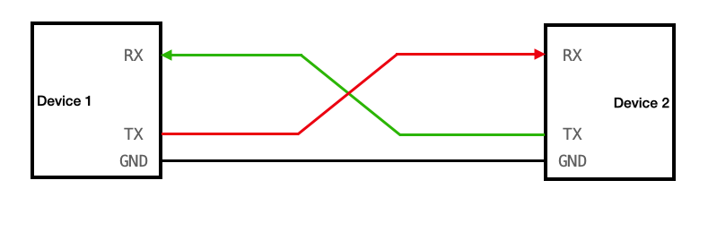
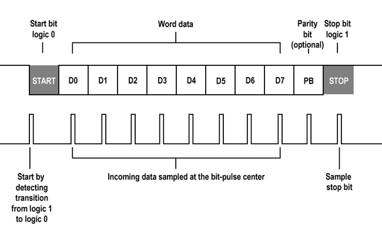

# UART: pętla zwrotna i parsowanie komend

**UART** (*Universal Asynchronous Receiver-Transmitter*) to jeden z najstarszych, najprostszych i najbardziej rozpowszechnionych protokołów komunikacji szeregowej w systemach wbudowanych. W przeciwieństwie do magistral takich jak I<sup>2</sup>C czy SPI, UART jest interfejsem typu **punkt-punkt** (point-to-point) służącym do łączenia dokładnie dwóch urządzeń.

---

## ⚡ Charakterystyka fizyczna i zasada działania

Transmisja UART jest **asynchroniczna**, co oznacza, że linia transmisyjna nie przesyła sygnału zegarowego (SCLK). Z tego powodu oba urządzenia muszą niezależnie generować częstotliwość taktowania transmisji i przed rozpoczęciem pracy mieć z góry skonfigurowaną identyczną prędkość transmisji (**Baud Rate**).

Do pełnej komunikacji dwukierunkowej (Full-Duplex) wymagane są tylko dwie linie sygnałowe (oraz wspólna masa GND):
* **TX** (*Transmit Data*) – linia nadawcza.
* **RX** (*Receive Data*) – linia odbiorcza.

{ align=center }

> [!IMPORTANT] Krzyżowanie linii TX/RX i wspólna masa (GND)
> Przy łączeniu dwóch niezależnych urządzeń (np. mikrokontrolera z sensorem GPS lub innej płytki deweloperskiej), musisz przestrzegać dwóch kluczowych zasad:
> 1. **Krzyżowanie połączeń**: Sygnał nadawany musi trafić do wejścia odbiorczego. Oznacza to, że łączysz **TX urządzenia A z RX urządzenia B** oraz **RX urządzenia A z TX urządzenia B**. Połączenie TX-TX i RX-RX jest częstym błędem i całkowicie blokuje transmisję.
> 2. **Wspólny punkt odniesienia (GND)**: Poza liniami danych musisz bezwzględnie połączyć ze sobą piny **GND obu urządzeń**. Bez wspólnego punktu odniesienia masy, odbiornik nie będzie w stanie prawidłowo zinterpretować poziomów napięć stanu wysokiego (3.3 V) i niskiego (0 V).

---

## 📊 Anatomia ramki UART

Ponieważ nadawca i odbiorca nie dzielą wspólnego zegara, dane przesyłane są w postaci małych paczek (ramek), najczęściej pakowanych po 8 bitów (1 bajt). 

W stanie spoczynku (gdy dane nie są przesyłane) na linii TX utrzymuje się stan wysoki (**Idle HIGH**). Transmisja pojedynczej ramki przebiega według następującego schematu:

{ align=center }


1. **Bit Startu (Start Bit)**: Nadawca ściąga stan linii w dół (do wartości logicznej `0` - LOW) na czas trwania jednego bitu. To zbocze opadające sygnalizuje odbiornikowi rozpoczęcie transmisji i pozwala mu zsynchronizować swój wewnętrzny zegar generatora baud rate.
2. **Bity Danych (Data Bits)**: Następuje przesłanie właściwych danych (najczęściej 8 bitów), zaczynając od bitu najmniej znaczącego (LSB - *Least Significant Bit*).
3. **Bit Parzystości (Parity Bit)** *(opcjonalny)*: Służy do prostej detekcji błędów transmisji. Może działać w trybie parzystym (*Even*) lub nieparzystym (*Odd*), uzupełniając sumę jedynek w ramce.
4. **Bity Stopu (Stop Bits)**: Nadawca ustawia linię z powrotem w stan wysoki (HIGH) na czas trwania 1, 1.5 lub 2 bitów, co oznacza zakończenie ramki i pozwala linii powrócić do stanu spoczynku.

### Matematyka prędkości (Baud Rate)
Baud rate określa liczbę bitów przesyłanych w ciągu sekundy. Czas trwania pojedynczego bitu ($T_{bit}$) obliczamy jako odwrotność prędkości:

$$T_{bit} = \frac{1}{\text{Baud Rate}}$$

* Dla prędkości **$9600\text{ baud}$**: $T_{bit} \approx 104.17\ \mu\text{s}$ (cała ramka 8N1 trwa około $1.04\text{ ms}$).
* Dla prędkości **$115200\text{ baud}$**: $T_{bit} \approx 8.68\ \mu\text{s}$ (cała ramka 8N1 trwa około $86.8\ \mu\text{s}$).

> [!NOTE] Nadpróbkowanie (Oversampling)
> Odbiornik UART nie mierzy stanu linii na samym początku bitu. Zamiast tego po wykryciu bitu startu próbkuje linię z częstotliwością np. 16-krotnie większą niż Baud Rate (16x oversampling) i odczytuje stan sygnału dokładnie w połowie szerokości każdego bitu (np. przy 8. próbce), co minimalizuje wpływ zakłóceń i jitteru zegara.

---

## 🔌 Standardy: TTL vs RS-232

* **Poziomy TTL (Transistor-Transistor Logic)**: Standard stosowany bezpośrednio w pinach mikrokontrolera (w ESP32-C6 stan niskie to $0\text{ V}$, a wysoki to $3.3\text{ V}$).
* **Standard RS-232**: Historyczny standard stosowany między innymi w portach szeregowych komputerów PC. Wykorzystuje wyższe napięcia oraz odwróconą logikę (logicznemu `1` odpowiada napięcie od $-3\text{ V}$ do $-15\text{ V}$, a `0` napięcie od $+3\text{ V}$ do $+15\text{ V}$).

> [!CAUTION] Niebezpieczeństwo uszkodzenia!
> **Nigdy nie podłączaj linii RS-232 z komputera PC bezpośrednio do pinów GPIO mikrokontrolera**. Napięcie rzędu $\pm12\text{ V}$ natychmiastowo zniszczy ESP32. W celu połączenia tych systemów wymagany jest konwerter poziomów logicznych (np. układ MAX3232).

---

## 📦 Obsługa sprzętowa w ESP32-C6

Mikrokontroler ESP32-C6 posiada **dwa niezależne sprzętowe kontrolery UART** (UART0 oraz UART1). Każdy z nich wyposażony jest w:
* Dedykowany sprzętowy bufor kołowy nadawczo-odbiorczy **FIFO o pojemności 128 bajtów**.
* Dzięki obecności **GPIO Matrix**, linie TX i RX mogą zostać zmapowane na dowolne wolne piny GPIO mikrokontrolera.

Gdy dane przychodzą na pin RX, kontroler sprzętowy UART automatycznie zapisuje je w buforze FIFO i wywołuje przerwanie w tle. Biblioteka Arduino przepisuje te dane do większego bufora programowego w pamięci RAM, z którego odczytujemy je za pomocą funkcji `Serial.read()`.

---

## 🛠️ Konfiguracja pętli zwrotnej (Loopback)

W tym ćwiczeniu przeprowadzisz eksperyment pętli zwrotnej (loopback) na jednym mikrokontrolerze: ESP32 wyśle dane przez port nadawczy UART i natychmiast odbierze je na swoim porcie odbiorczym, dzięki fizycznemu połączeniu linii TX i RX za pomocą przewodu.

Połącz za pomocą przewodu połączeniowego dwa piny na płytce stykowej:
* **GPIO4 (TX)** $\rightarrow$ **GPIO5 (RX)**

> [!NOTE] Wybór pinów GPIO
> Piny GPIO4 i GPIO5 zostały użyte jako przykład. Dzięki GPIO Matrix możesz wybrać dowolną inną parę wolnych pinów GPIO, pamiętając o zaktualizowaniu stałych w kodzie. Upewnij się jedynie, że wybrane piny nie pełnią specjalnych funkcji podczas rozruchu (tzw. Strapping Pins – szczegóły w sekcji [Płytka ESP32-C6](../start/sprzet.md)).

---

## 💻 Kod programu: Terminal komend

Poniższy program odbiera komendy wpisane przez użytkownika w Monitorze Szeregowym komputera, przesyła je przez zewnętrzny port UART (pętla zwrotna GPIO4 $\rightarrow$ GPIO5) i po odebraniu wykonuje odpowiednie akcje.

```cpp
const int UART_TX = 4;  // Pin nadawczy
const int UART_RX = 5;  // Pin odbiorczy (połączony fizycznie z TX)
const int PIN_LED = 2;

String buforKomendy = "";

void setup() {
  Serial.begin(115200);   // Inicjalizacja portu USB (Serial monitor na komputerze)

  // Inicjalizacja sprzętowego portu UART1 o prędkości 9600 bodów,
  // w konfiguracji 8N1 (8 bitów danych, brak parzystości, 1 bit stopu)
  // z mapowaniem pinów przez GPIO Matrix
  Serial1.begin(9600, SERIAL_8N1, UART_RX, UART_TX);

  pinMode(PIN_LED, OUTPUT);
  Serial.println("Terminal gotowy. Wpisz: LED_ON, LED_OFF lub STATUS");
}

void loop() {
  // --- KROK 1: Odczyt komend z klawiatury komputera i wysłanie przez TX ---
  while (Serial.available() > 0) {
    char znak = (char)Serial.read();

    if (znak == '\n' || znak == '\r') {
      if (buforKomendy.length() > 0) {
        Serial.print("Wysyłam przez UART TX (GPIO4): ");
        Serial.println(buforKomendy);
        
        Serial1.println(buforKomendy); // Wysłanie danych przez port TX Serial1
        buforKomendy = "";
      }
    } else {
      buforKomendy += znak; // Zapisywanie znaku w buforze
    }
  }

  // --- KROK 2: Odbiór danych z portu RX (loopback z GPIO5) ---
  while (Serial1.available() > 0) {
    // Odczyt linii tekstu aż do napotkania znaku końca linii \n
    String odebrana = Serial1.readStringUntil('\n');
    odebrana.trim(); // Usunięcie białych znaków (np. \r)

    Serial.print("Odebrano przez UART RX (GPIO5): ");
    Serial.println(odebrana);

    // Interpretacja odebranej komendy
    if (odebrana == "LED_ON") {
      digitalWrite(PIN_LED, HIGH);
      Serial.println("→ Akcja: Dioda WŁĄCZONA");
    } else if (odebrana == "LED_OFF") {
      digitalWrite(PIN_LED, LOW);
      Serial.println("→ Akcja: Dioda WYŁĄCZONA");
    } else if (odebrana == "STATUS") {
      bool stanLED = digitalRead(PIN_LED);
      Serial.print("→ Akcja: Stan diody to ");
      Serial.println(stanLED ? "ON" : "OFF");
    } else {
      Serial.println("→ Akcja: Nieznana komenda!");
    }
  }
}
```

> [!NOTE] Znaki końca linii (`\n` oraz `\r`) 
> Znaki `\n` (Line Feed - LF, wartość ASCII 10) oraz `\r` (Carriage Return - CR, wartość ASCII 13) określają koniec wiersza. System Windows stosuje domyślnie parę `\r\n` (CRLF), podczas gdy Unix/Linux używa samego `\n` (LF). Zastosowanie metody `odebrana.trim()` jest dobrą praktyką inżynierską – usuwa ona niewidoczne znaki kontrolne z obu końców napisu, zapobiegając błędom podczas porównywania ciągów znaków (np. `"LED_ON\r"` nie byłoby równe `"LED_ON"`).

---

## 🛠️ Zadanie do samodzielnego wykonania

Rozbuduj funkcjonalność parsowania komend o obsługę parametru liczbowego:
1. Dodaj komendę `PWM:X`, gdzie `X` to wartość wypełnienia sygnału PWM (od `0` do `255`), która ustawi zadaną jasność diody LED.
2. Dodaj komendę `RESET`, która zgasi diodę LED i wyświetli komunikat `"→ System zresetowany"`.

*Wskazówka: Wykorzystaj metodę `indexOf(':')` w celu wykrycia obecności znaku dwukropka oraz funkcję `substring()` do wyciągnięcia tekstu reprezentującego liczbę, a następnie przekonwertuj go za pomocą `toInt()`.*

<details>
<summary>Pokaż rozwiązanie</summary>

```cpp
    // Zastąp blok analizy odebranej komendy w pętli loop następującym kodem:

    if (odebrana == "LED_ON") {
      digitalWrite(PIN_LED, HIGH);
      Serial.println("→ Akcja: Dioda WŁĄCZONA");
    } else if (odebrana == "LED_OFF") {
      digitalWrite(PIN_LED, LOW);
      Serial.println("→ Akcja: Dioda WYŁĄCZONA");
    } else if (odebrana == "RESET") {
      digitalWrite(PIN_LED, LOW);
      Serial.println("→ Akcja: System zresetowany");
    } else if (odebrana.indexOf("PWM:") == 0) {
      // Wyodrębnienie wartości po słowie kluczowym "PWM:"
      String wartoscStr = odebrana.substring(4);
      int pwmVal = wartoscStr.toInt(); // Konwersja tekstu na int

      // Walidacja poprawności zakresu
      if (pwmVal >= 0 && pwmVal <= 255) {
        analogWrite(PIN_LED, pwmVal);
        Serial.print("→ Akcja: Ustawiono PWM na ");
        Serial.println(pwmVal);
      } else {
        Serial.println("→ Błąd: Wartość PWM poza zakresem [0-255]!");
      }
    } else {
      Serial.println("→ Akcja: Nieznana komenda!");
    }
```
</details>
