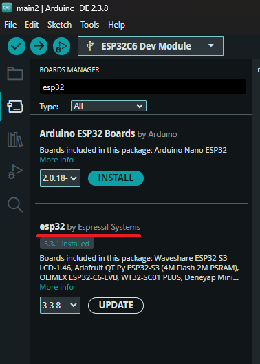
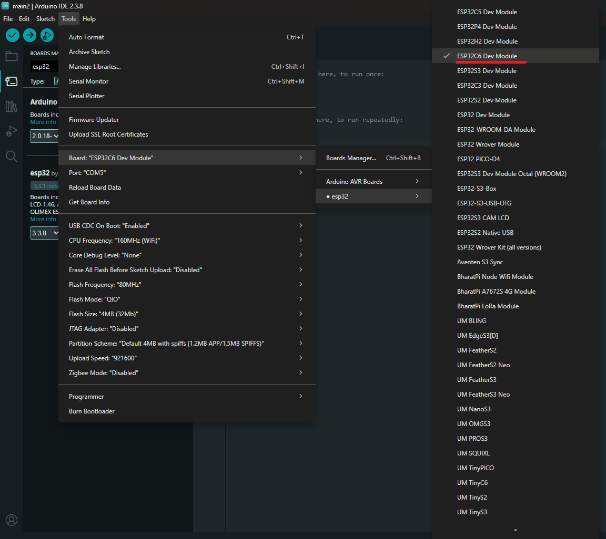
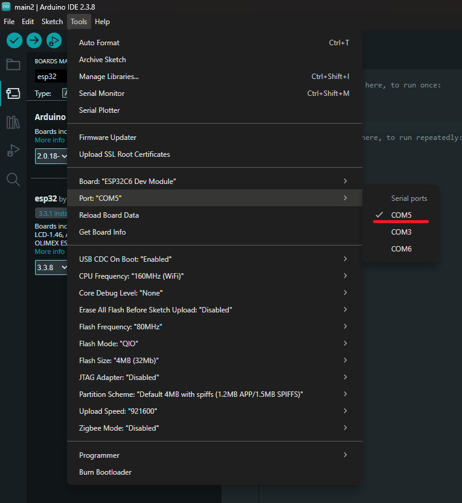
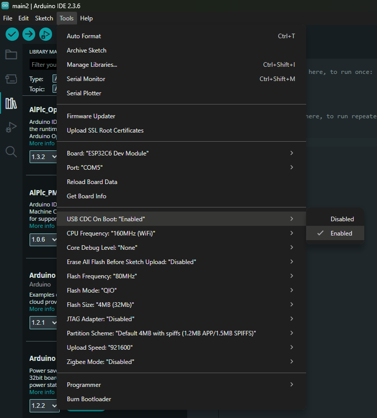
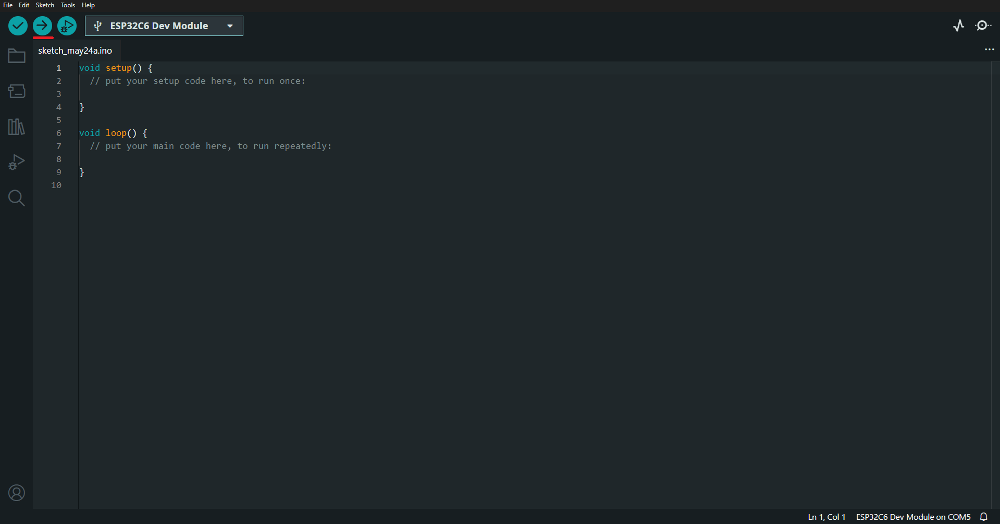
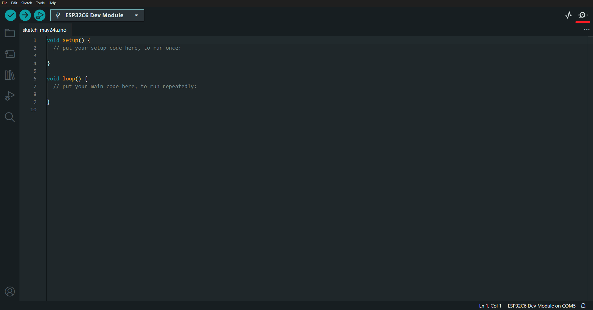
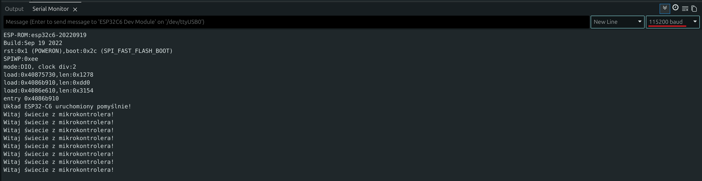

# Konfiguracja środowiska i Wokwi

Gdy znasz już teorię oraz budowę mikrokontrolera ESP32-C6, należy przygotować narzędzia deweloperskie. Kod dla naszej płytki możemy pisać zarówno w środowisku fizycznym (używając darmowego **Arduino IDE**), jak i wirtualnym (za pomocą symulatora **Wokwi**).

---

## 🌐 Narzędzie wirtualne: Symulator Wokwi

Przy większości zadań i ćwiczeń w tym kursie znajdziesz link do gotowego projektu w symulatorze **[Wokwi.com](https://wokwi.com)**. Pozwala to na natychmiastowe testowanie, pisanie i wklejanie kodu bezpośrednio w oknie przeglądarki. 

Mimo tego gorąco zachęcamy do budowania układów w rzeczywistości. Praca z fizycznym sprzętem daje najwięcej satysfakcji i najwięcej uczy.

---

## 💻 Narzędzie fizyczne: Arduino IDE 2.x

Do pracy z rzeczywistym mikrokontrolerem będziemy korzystać z najpopularniejszego środowiska dla hobbystów – **Arduino IDE** w wersji 2.x. Środowisko to automatycznie kompiluje Twój kod (napisany w języku C/C++) do postaci kodu maszynowego i przesyła go za pośrednictwem portu USB do pamięci Flash mikrokontrolera.

> [!NOTE] Ciekawostka: Trzy znaczenia słowa „Arduino”
> Słowo **Arduino** w świecie systemów wbudowanych bywa używane w trzech różnych znaczeniach, co na początku może być mylące:
> 1. **Płytki (Hardware)**: Oryginalne, fizyczne płytki deweloperskie zaprojektowane przez włoską firmę Arduino (np. kultowe Arduino Uno czy Nano). Nasz moduł ESP32-C6 to sprzęt innego producenta (Espressif Systems), ale doskonale współpracuje z oprogramowaniem od Arduino.
> 2. **Środowisko (IDE)**: Program komputerowy (*Arduino Integrated Development Environment*), w którym piszemy kod, kompilujemy go i przesyłamy na mikrokontroler.
> 3. **Framework/Standard (Software)**: Zbiór gotowych funkcji i ułatwień (takich jak `pinMode()`, `digitalWrite()`, `Serial.print()`), które sprawiają, że piszemy kod w ten sam prosty sposób niezależnie od tego, jaki mikrokontroler znajduje się pod maską.


### Krok 1: Instalacja programu

- Wejdź na oficjalną stronę: 🔗 [arduino.cc/en/software](https://www.arduino.cc/en/software)
- Pobierz wersję instalacyjną dla swojego systemu operacyjnego (np. Windows Installer) i przejdź standardowy proces instalacji.


Domyślnie środowisko Arduino IDE obsługuje jedynie oficjalne płytki z rodziny Arduino (np. Uno, Nano). Aby umożliwić programowanie układów firmy Espressif (w tym ESP32-C6), należy zainstalować odpowiedni pakiet obsługi:

- Kliknij w ikonkę płytki po lewej stronie edytora.
- Wyszukaj pakiet o nazwie **`esp32`** (autorstwa *Espressif Systems*)
- Kliknij przycisk **Instaluj**. Instalacja łańcucha narzędziowego i definicji może potrwać kilka minut.

{: .center }


### Krok 2: Wybór płytki i portu komunikacyjnego

1. Podłącz swoją płytkę ESP32-C6 do komputera za pomocą kabla USB. Kabel należy podłączyć do portu oznaczonego na płytce deweloperskiej jako **`USB`**.
2. Upewnij się, że używany przewód obsługuje transmisję danych (niektóre przewody przeznaczone wyłącznie do ładowania nie posiadają linii sygnałowych).
3. W Arduino IDE wejdź w menu **Narzędzia → Płytka → esp32** i wybierz **`ESP32-C6 Dev Module`**.
{: .center }
4. Wejdź w **Narzędzia → Port** i wybierz port, pod którym zgłosiła się Twoja płytka (na Windowsie będzie to np. `COM3` lub `COM4`, na Linuxie np. `/dev/ttyACM0` lub `/dev/ttyUSB0`, na macOS np. `/dev/cu.usbmodem...`).

{: .center }

> [!TIP] Jak najłatwiej sprawdzić, który port odpowiada Twojej płytce?
> Jeśli na liście widzisz wiele portów (np. `COM1`, `COM3`, `COM4`) i nie wiesz, który z nich to podłączone ESP32-C6:
> 1. Odłącz płytkę od portu USB komputera.
> 2. Kliknij w menu **Narzędzia** i zjedź kursorem z zakładki **Port** (lub całkowicie zamknij menu), a następnie najedź na nią ponownie, aby odświeżyć listę portów.
> 3. Zobacz, który port zniknął z listy.
> 4. Podłącz płytkę z powrotem i ponownie rozwiń listę. Nowo dodany port (ten, który zniknął w poprzednim kroku) to Twoje urządzenie!

> [!WARNING] Ważne dla użytkowników systemu Linux: Brak dostępu do portu
> W systemach Linux domyślny użytkownik nie ma uprawnień do zapisu i odczytu z portów szeregowych (takich jak `/dev/ttyACM0` lub `/dev/ttyUSB0`). Uruchomienie Arduino IDE w takiej konfiguracji uniemożliwi wgranie programu i zakończy się błędem braku uprawnień (Permission Denied).
> 
> Aby nadać uprawnienia na stałe, dodaj swojego użytkownika do grupy systemowej `dialout` (w dystrybucjach typu Ubuntu/Debian) lub `uucp` (w dystrybucjach typu Arch). Otwórz terminal i wpisz:
> ```bash
> sudo usermod -a -G dialout $USER
> ```
> Po wykonaniu tej komendy **musisz wylogować się i zalogować ponownie** (lub zrestartować komputer), aby system zaczął respektować Twoje nowe uprawnienia.

---

## ⚠️ Kluczowe ustawienie: USB CDC On Boot

Układ ESP32-C6 posiada wbudowany kontroler USB-JTAG/Serial. Aby Monitor Szeregowy w Arduino IDE mógł odbierać komunikaty wysyłane za pomocą instrukcji `Serial.println()`, konieczne jest włączenie odpowiedniej opcji przekierowania portu szeregowego na port USB.

> [!IMPORTANT] Aktywacja CDC
> W menu Narzędzia odszukaj pozycję **`USB CDC On Boot`** i ustaw jej wartość na **`Enabled`**.
> Bez tego ustawienia program wgra się poprawnie, ale w Monitorze Szeregowym nie zobaczysz żadnych napisów!

{: .center }

---

## 🚀 Pierwsze uruchomienie programu (Test)

Sprawdźmy, czy cały łańcuch narzędziowy działa poprawnie. Spróbujemy wgrać prosty szkic testowy i otworzyć komunikację szeregową. Na razie nie przejmuj się tym, jak ten kod działa ani co oznaczają poszczególne linijki – zrozumiesz to w dalszej części kursu. Na tym etapie chcemy jedynie upewnić się, że program wgrywa się poprawnie do pamięci mikrokontrolera, a połączenie szeregowe działa bez zarzutu.

1. Wklej poniższy kod testowy do okna edytora:
   ```cpp
   void setup() {
     // Uruchamiamy port szeregowy z prędkością 115200 bodów (standard dla ESP32)
     Serial.begin(115200);
     delay(1000); // Czas na ustabilizowanie połączenia
     Serial.println("Środowisko Arduino IDE działa poprawnie!");
   }

   void loop() {
     Serial.println("ESP32-C6 żyje i nadaje...");
     delay(2000); // Wyślij komunikat co 2 sekundy
   }
   ```
2. Kliknij ikonę **Strzałki w prawo (Wgraj)** w lewym górnym rogu (lub użyj skrótu `Ctrl + U`).
{: .center }
3. Poczekaj, aż w dolnej konsoli zobaczysz napisy informujące o kompilacji i procesie wgrywania (zakończonym komunikatem typu *Leaving... Hard resetting via RTS pin...*).
4. Otwórz **Monitor Szeregowy** (ikona lupy w prawym górnym rogu lub skrót `Ctrl + Shift + M`).
{: .center }
5. Upewnij się, że w prawym dolnym rogu okna Monitora wybrana jest poprawna prędkość transmisji: **`115200 baud`**.
{: .center }
6. Jeśli widzisz pojawiające się napisy "ESP32-C6 żyje i nadaje..." – Twoje środowisko jest gotowe do pracy!

> [!WARNING] Rozłączanie Monitora Szeregowego po wgraniu programu
> W momencie wgrywania nowego programu do ESP32-C6 port szeregowy w komputerze na chwilę znika (jest resetowany), co powoduje odłączenie Monitora Szeregowego w Arduino IDE.
> 
> Aby poprawnie odczytać dane po wgraniu:
> 1. Upewnij się, że Monitor Szeregowy połączył się ponownie. Zrobsz to poprzez dwukrotne kliknięcie ikonki lupy w prawym górnym rogu (lub użyj skrótu `Ctrl + Shift + M`). (pierwsze kliknięcie zamyka monitor, drugie otwiera)
> 2. Wciśnij krótko fizyczny przycisk **RST** (lub **EN**) na płytce deweloperskiej. Spowoduje to restart ESP32 i ponowne wysłanie początkowych komunikatów (z funkcji `setup()`), które mogły zostać wysłane zanim komputer zdążył ponownie otworzyć port szeregowy.

Jeśli cokolwiek poszło nie tak, spróbuj rozwiązań opisanych poniżej.

---

## 🛠️ Rozwiązywanie problemów (Troubleshooting)

### 1. Brak portu COM / Serial w menu Narzędzia → Port

* **Przyczyna 1**: Twój kabel USB służy tylko do ładowania telefonu i nie przesyła danych. Wymień kabel na inny.
* **Przyczyna 2 (Linux)**: Twój użytkownik nie ma uprawnień do odczytu urządzenia. Upewnij się, że wykonałeś krok z dodaniem użytkownika do grupy `dialout` i ponownie uruchomiłeś sesję systemową.

### 2. Kompilator zgłasza błąd podczas wgrywania (Timeout / Failed to connect)

* **Rozwiązanie**: Czasami automatyczny reset płytki w tryb programowania zawodzi. Możesz go wymusić ręcznie:

  1. Kliknij przycisk **Wgraj** w Arduino IDE.
  2. Gdy w konsoli pojawi się linijka zaczynająca się od `Connecting...`, **wciśnij i przytrzymaj** przycisk **`BOOT`** na fizycznej płytce ESP32.
  3. W czasie trzymania przycisku BOOT, kliknij raz krótko przycisk **`RST` (Reset)**.
  4. Puść przycisk BOOT. Płytka powinna natychmiast połączyć się i rozpocząć wgrywanie. Kolejne wgrania powinny odbywać się już automatycznie bez tej procedury.
