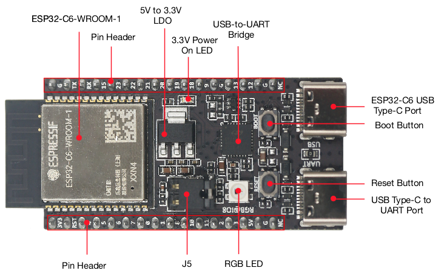
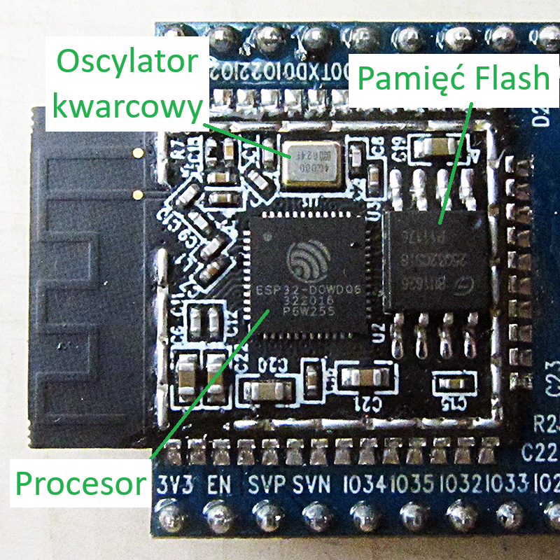
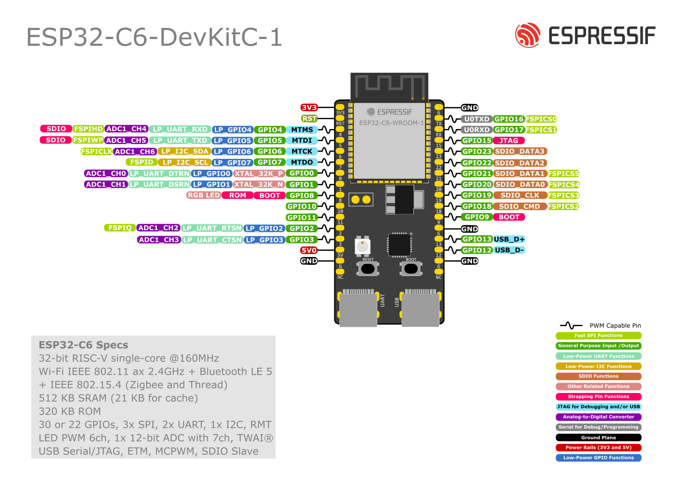

# Płytka ESP32-C6 i sprzęt

W tym kursie będziemy pracować na platformie sprzętowej opartej o mikrokontroler **ESP32-C6** firmy Espressif Systems. Zanim podłączymy go do komputera, przyjrzyjmy się jego możliwościom i zasadom bezpieczeństwa, których musisz przestrzegać aby nie uszkodzić sprzętu.

---

## ⚙️ Układ ESP32-C6

Poniżej możesz zobaczyć fizyczny wygląd płytki deweloperskiej ESP32-C6 (w wersji DevKit):

{: .center}

> [!TIP] Ciekawostka: Srebrna "puszka" to nie tylko procesor!
> Wielu początkujących myśli, że duży srebrny prostokąt z wygrawerowanym logo (widoczny na module WROOM) to sam mikrokontroler. W rzeczywistości jest to metalowy ekran (tzw. EMI shield), który chroni układ przed zewnętrznymi zakłóceniami radiowymi oraz pełni funkcję rozpraszacza ciepła (IHS). Prawdziwy mikrokontroler (krzemowa kostka SoC), zewnętrzna pamięć Flash oraz rezonator kwarcowy są schowane dopiero pod tą osłoną (tak jak widać na poniższym obrazku)!
{: .center}

Seria ESP32 zdobyła ogromną popularność na całym świecie dzięki wbudowanej łączności bezprzewodowej. Model **ESP32-C6** to jeden z przedstawicieli tej rodziny. W przeciwieństwie do starszych wersji, które opierały się na architekturze Xtensa, C6 wykorzystuje nowoczesny, otwarty rdzeń **RISC-V** taktowany zegarem do 160 MHz.

Do dyspozycji mamy bogaty zestaw łączności bezprzewodowej zintegrowany w jednym chipie:

* **Wi-Fi 6** (w pasmie 2.4 GHz) – wspiera najnowszy standard sieciowy, co poprawia stabilność połączenia i zmniejsza pobór prądu.
* **Bluetooth 5 (LE)** – standard idealny do komunikacji ze smartfonami na bliskie odległości.
* **Zigbee & Thread (802.15.4)** – standardy bezprzewodowe dedykowane dla profesjonalnych systemów automatyki domowej (Smart Home).

Płytka posiada również:

* **512 KB pamięci SRAM** (pamięć operacyjna procesora).
* **4 MB pamięci Flash** (pamięć nieulotna na Twój program).
* Sprzętowe wsparcie dla **kryptografii**.

> [!WARNING] Bezpieczne obchodzenie się z płytką (ESD)
> Układy scalone na płytce są bardzo wrażliwe na wyładowania elektrostatyczne. Przypadkowe dotknięcie metalowych elementów lub pinów naelektryzowanym ciałem może doprowadzić do niewidocznego przeskoku ładunku (ESD), który bezpowrotnie uszkodzi delikatną strukturę procesora. 
> 
> Aby zminimalizować to ryzyko:
> * Przed wzięciem płytki do ręki warto rozładować ładunek elektrostatyczny zebrany na ciele, dotykając na chwilę dowolnego uziemionego metalowego przedmiotu (np. metalowej obudowy komputera, kranu czy rury grzejnika).
> * Staraj się zawsze chwytać płytkę za jej boczne krawędzie laminatu, unikając bezpośredniego dotykania metalowych wyprowadzeń oraz ścieżek sygnałowych.

---

## 📍 Schemat wyprowadzeń (Pinout)

Podczas podłączania elementów na płytce stykowej będziesz musiał odnaleźć odpowiednie numery pinów. 

Aby ułatwić lokalizację pinów, skorzystaj z poniższego schematu:

{: .center}

### Jak czytać schemat pinoutu?
* **Piny cyfrowe (GPIO)**: Oznaczone są na schemacie numerami (np. GPIO0, GPIO1...). To te numery wpisujesz w kodzie programu (np. `2` dla GPIO2).
* **Zasilanie (3V3, 5V, GND)**: Piny `GND` to masa (minus). Pin `3V3` to wyjście stabilizowanego napięcia 3.3 V z płytki (nie należy podawać tam napięcia zewnętrznego). Pin `5V` (lub `5V0` / `VIN`) to wejście/wyjście napięcia 5 V bezpośrednio z gniazda USB.
* **Peryferia (TX/RX, SDA/SCL, SCK/MISO/MOSI)**: Piny te mają dodatkowe kolorowe oznaczenia, które informują o ich domyślnych rolach sprzętowych w protokołach komunikacyjnych (poznasz je w dalszych modułach).

> [!WARNING] Oznaczenia na płytce deweloperskiej vs. nóżki chipu
> Piny wyprowadzone na krawędziach Twojej płytki deweloperskiej są podpisane bezpośrednio swoimi numerami GPIO (np. `G2`, `IO2` lub po prostu `2`). W kodzie programu (np. `digitalWrite(2, HIGH)`) zawsze wpisujesz tę cyfrę.
> 
> Nie pomyl ich jednak z numeracją nóżek samego układu scalonego ESP32-C6 (czarnego układu scalonego na środku płytki)! W oficjalnej karcie katalogowej producenta nóżki samego chipu mają inną kolejność (np. GPIO2 może odpowiadać piętnastej nóżce krzemowej kostki). Dla nas liczą się wyłącznie napisy nadrukowane na płytce deweloperskiej i schemat pinoutu!

---

## 📌 Czym są piny GPIO?

Złącza **GPIO** (*General-Purpose Input/Output*) to wejścia i wyjścia ogólnego przeznaczenia. W kodzie programu decydujesz, jak dany pin ma się zachowywać:

* **Wyjście (OUTPUT)**: Mikrokontroler steruje napięciem na pinie. Może podać stan wysoki (3.3 V) lub stan niski (0 V - masa). Pozwala to na włączanie diod LED, sterowanie przekaźnikami czy wysyłanie sygnałów sterujących do silników.
* **Wejście (INPUT)**: Mikrokontroler bada stan napięcia na pinie. Sprawdza, czy napięcie jest bliskie 0 V (stan niski / logiczne `0`), czy bliskie 3.3 V (stan wysoki / logiczna `1`). Służy do odczytywania przycisków, czujników ruchu czy barier optycznych.

Oprócz zwykłych cyfrowych wejść/wyjść, piny ESP32-C6 posiadają alternatywne funkcje sprzętowe:

1. **ADC (Analog-to-Digital Converter)**: Pozwala mierzyć płynne napięcie (np. z potencjometru lub czujnika światła) i zamieniać je na liczby od `0` do `4095` (rozdzielczość 12-bitowa).
2. **PWM (Pulse Width Modulation)**: Pozwala na szybkie pulsowanie napięciem wyjściowym, co symuluje sygnał analogowy i umożliwia np. płynną regulację jasności diody lub prędkości silnika.
3. **Magistrale komunikacyjne (I2C, SPI, UART)**: Dedykowane pary lub grupy pinów służące do szybkiego przesyłania danych między mikrokontrolerem a wyświetlaczami, czujnikami czy komputerem.

> [!NOTE] Ciekawostka: Matryca GPIO (GPIO Matrix)
> W tradycyjnych mikrokontrolerach (np. starszych układach 8-bitowych) bloki peryferyjne były na sztywno przypisane do konkretnych nóżek (np. linia TX interfejsu UART mogła być wyprowadzona wyłącznie na jednym konkretnym pinie).
> Układy ESP32 rozwiązują ten problem za pomocą mechanizmu o nazwie **GPIO Matrix**. Jest to wewnętrzny przełącznik sprzętowy (tzw. multiplekser), który pozwala na przekierowanie sygnału z niemal dowolnego bloku peryferyjnego (np. nadajnika UART, linii I2C czy generatora PWM) na **dowolny fizyczny pin GPIO** mikrokontrolera. Daje to ogromną elastyczność przy projektowaniu płytek drukowanych (PCB) oraz pozwala na wygodną zmianę przypisania pinów w kodzie programu.

> [!CAUTION] Zasady bezpiecznego używania pinów GPIO
> Aby uniknąć trwałego uszkodzenia mikrokontrolera, musisz przestrzegać dwóch kluczowych zasad:
> 1. **Napięcie logiczne (maksymalnie 3.3 V)**: Płytka ESP32-C6 pracuje w standardzie napięciowym 3.3 V (w przeciwieństwie do np. starszych płytek Arduino Uno pracujących na 5 V). Podanie napięcia 5 V na dowolny pin GPIO (poza złączem zasilania `5V`/`VIN` posiadającym dedykowany stabilizator) **nieodwracalnie spali układ**. Zawsze upewnij się, że podłączane czujniki pracują w standardzie 3.3 V.
> 2. **Wydajność prądowa (maksymalnie ~20 mA)**: Piny GPIO mogą dostarczyć jedynie niewielki prąd (wystarczający np. do zasilenia pojedynczej diody LED). **Nigdy nie podłączaj bezpośrednio do pinów GPIO urządzeń o dużym poborze prądu** (silników, głośników, cewek przekaźników). Próba ich zasilenia bezpośrednio z GPIO spali pin lub cały procesor. Do sterowania nimi zawsze używaj układów pośredniczących (np. tranzystorów MOSFET lub sterowników).

---

## 🔄 Proces uruchamiania, Bootloader i Strapping Pins

Mikrokontroler nie rozpoczyna pracy w sposób magiczny. Po włączeniu zasilania lub wciśnięciu przycisku RESET, w pierwszej kolejności uruchamiany jest tzw. **Bootloader** – niewielki, fabrycznie wgrany program systemowy.

Jego zadaniem jest sprawdzenie fizycznych stanów napięć na specjalnych pinach konfiguracyjnych, nazywanych **Strapping Pins** (w układzie ESP32-C6 są to przede wszystkim piny **GPIO8** oraz **GPIO9**), i na ich podstawie podjęcie decyzji o trybie pracy:

1. **Tryb uruchamiania (Execution Mode)**: Jeśli na pinie `GPIO9` panuje stan wysoki (3.3 V), bootloader przekazuje sterowanie do Twojego programu zapisanego w pamięci Flash i mikrokontroler zaczyna normalne działanie.
2. **Tryb programowania (Download Mode)**: Jeśli w momencie startu na pinie `GPIO9` wymuszony jest stan niski (0 V - masa), bootloader ignoruje Twój program i przechodzi w tryb oczekiwania. Pozwala to na wgranie nowego kodu z poziomu komputera (np. Arduino IDE).

> [!IMPORTANT] Wskazówka
> Na wielu płytkach deweloperskich wymuszenie stanu niskiego na GPIO9 następuje automatycznie poprzez dedykowany obwód (tzw. układ auto-resetu) sterowany z portu USB, dlatego podczas wgrywania kodu rzadko musisz ręcznie trzymać fizyczny przycisk "BOOT".

> [!WARNING] Uważaj na piny konfiguracyjne (GPIO8 i GPIO9)!
> Projektując własne układy, musisz unikać podłączania pod piny GPIO8 i GPIO9 elementów, które w momencie włączenia zasilania ściągnęłyby napięcie do zera (np. przekaźników, tranzystorów NPN czy przycisków domyślnie zwartych do masy). Jeśli to zrobisz, mikrokontroler po podłączeniu zasilania wejdzie w tryb Bootloadera i **Twój program nigdy się nie uruchomi**. Na początku nauki najbezpieczniej jest traktować te piny jako zarezerwowane i używać do swoich projektów innych wolnych wyjść.
